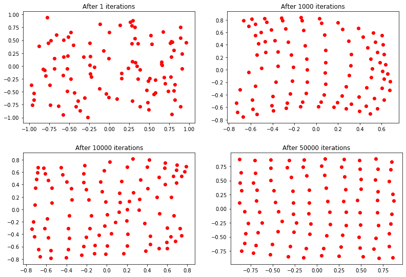
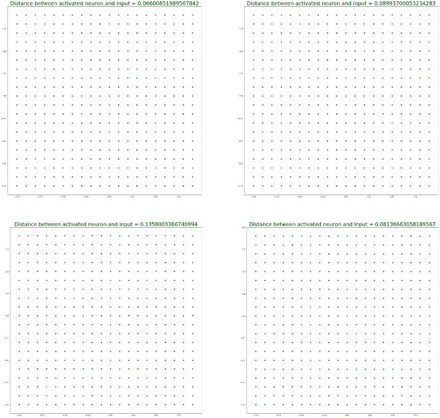

# 人工神经网络——从头开始实现自组织神经网络

> 原文:[https://www . geesforgeks . org/ann-实现-自组织-神经网络-sonn-从头开始/](https://www.geeksforgeeks.org/ann-implementation-of-self-organizing-neural-network-sonn-from-scratch/)

**先决条件:** [ANN |自组织神经网络(SONN)学习算法](https://www.geeksforgeeks.org/ann-self-organizing-neural-network-sonn-learning-algorithm)

为了实现 SONN，这里有一些基本的考虑-

> 1.  Build a self-organizing neural network (SONN) or divide **100 neurons** into **10 rows** and **10 columns**
> 2.  Kohonen network arranged in two-dimensional matrix, using **1500** in **-1 and+1**
> 3.  Two-dimensional input vector training network randomly generated in the interval between, randomly select initial synaptic weights **-1 and+1** in the same interval.
> 4.  Two-dimensional input vectors of learning rate are allocated, so that each neuron in the network should only respond to the input vectors appearing in its region.
> 5.  使用以下输入向量测试自组织神经元的性能:
>     
>     ![\[$\mathbf{X}_{1}=\left[\begin{array}{ll}0.1 & 0.8\end{array}\right]^{\mathrm{T}}, \mathbf{X}_{2}=[0.5-0.2]^{\mathrm{T}}, \\ \mathbf{X}_{3}=[-0.8-0.9]^{\mathrm{T}}, \mathbf{X}_{4}=\left[\begin{array}{lll}-0.0 .6 & 0.9\end{array}\right]^{\mathrm{T}}$\]](img/e5680114aa290e75ffa7b06595cf05cf.png "Rendered by QuickLaTeX.com")

**SONN 的 Python 实现:**

```
# Importing Libraries 
import math
from tqdm.notebook import tqdm
import matplotlib.pyplot as plt
import numpy as np

# Generating Data : using uniform random number generator 
data_ = np.random.uniform(-1, 1, (1500, 2))
# print(data_.shape)

# Hyperparameter Initialization
x, y = 10, 10        # dimensions of Map
sigma = 1.           # spread of neighborhood
learning_rate = 0.5  # learning rate
epochs = 50000       # no of iterations
decay_parameter = epochs / 2   # decay parameter

# Activation map and Assigning Weights
# using random number generation 
activation_map = np.zeros((x, y))
weights = 2 * (np.random.ranf((x, y, data_.shape[1])) - 0.5)
# print(weights.shape)

# Define Neighborhood Region
neighbour_x = np.arange(x)
neighbour_y = np.arange(y)

# Function: decay_learning_rate_sigma
def decay_learning_rate_sigma(iteration):
  learning_rate_ = learning_rate/(1 + iteration / decay_parameter)
  sigma_ = sigma / (1 + iteration / decay_parameter)

  return learning_rate_, sigma_

# Function: to get winner neuron
def get_winner_neuron(x):
  s = np.subtract(x, weights) # x - w
  it = np.nditer(activation_map, flags =['multi_index'])
  while not it.finished:
      # || x - w ||
      activation_map[it.multi_index] = np.linalg.norm(s[it.multi_index])  
      it.iternext()

  return np.unravel_index(activation_map.argmin(), activation_map.shape)

# Update weights
def update_weights(win_neuron, inputx, iteration):
  # decay learning rate and sigma
  learning_rate_, sigma_ = decay_learning_rate_sigma(iteration)

  # get neighborhood about winning neuron (Mexican hat function)
  d = 2 * np.pi * (sigma_**2)
  ax = np.exp(-1 * np.square(neighbour_x - win_neuron[0]) / d)
  ay = np.exp(-1 * np.square(neighbour_y - win_neuron[1]) / d)

  neighborhood = np.outer(ax, ay)

  it = np.nditer(neighborhood, flags = ['multi_index'])
  while not it.finished:
      weights[it.multi_index] += learning_rate_ * neighborhood[it.multi_index]
                                 * (inputx - weights[it.multi_index])
      it.iternext()

# Training model: Learning Phase
for epoch in tqdm(range(1, epochs + 1)):
  np.random.shuffle(data_)
  idx = np.random.randint(0, data_.shape[0])
  win_neuron = get_winner_neuron(data_[idx])
  update_weights(win_neuron, data_[idx], epoch)

  if epoch == 1 or epoch == 100 == 0 or epoch == 1000 or 
     epoch == 10000 or epoch == 50000:
    plot_x = []
    plot_y = []

    for i in range(weights.shape[0]):
      for j in range(weights.shape[1]):
        plot_x.append(weights[i][j][0])
        plot_y.append(weights[i][j][1])

    plt.title('After ' + str(epoch) + ' iterations')
    plt.scatter(plot_x, plot_y, c = 'r')
    plt.show()
    plt.close()
```

**输出:**


```
# Testing the model performance
test_inputs = np.array([[0.1, 0.8], [0.5, -0.2], [-0.8, -0.9], [-0.6, 0.9]]) 
# print(test_inputs.shape) 

# The plots below depict the working of this Kohonen Network on 
# given test inputs [0.1, 0.8], [0.5, -0.2], [-0.8, -0.9], [-0.6, 0.9]
for i in range(test_inputs.shape[0]):
  test_input = test_inputs[i, :]
  win_neuron = get_winner_neuron(test_input)

  plot_x = np.arange(-1, 1, 0.1)
  plot_y = np.arange(-1, 1, 0.1)
  xx, yy = np.meshgrid(plot_x, plot_y)

  coordx, coordy = weights[win_neuron[0]][win_neuron[1]][0], 
                           weights[win_neuron[0]][win_neuron[1]][1]
  dist = math.sqrt((coordx-test_input[0])**2 + (coordy - test_input[1])**2)
  coordx = round(coordx, 1)
  coordy = round(coordy, 1)

  plt.figure(figsize =(20, 20))
  plt.title("Distance between activated neuron and input = " + 
            str(dist), fontsize = 30)
  plt.scatter(xx, yy, c = 'g')
  plt.scatter(coordx, coordy, c = 'r')
  plt.show()
  plt.close()
```

**Output:**

所有 10×10 的神经元都用**绿色**表示。测试输入激活的最近神经元显示为**红色**。这里，激活的神经元和测试输入之间的欧几里德距离也显示在这些图中。各个神经元将对每个测试输入向量样本做出响应。