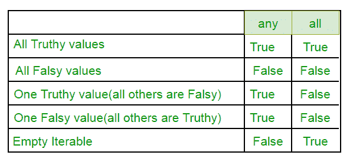

# Python 中的任意 All

> 原文:[https://www.geeksforgeeks.org/any-all-in-python/](https://www.geeksforgeeks.org/any-all-in-python/)

“任意”和“全部”是 python 中提供的两个内置项，用于连续的“与/或”。

**任何**
如果任一项为真，则返回真。如果为空或全部为假，则返回假。任何操作都可以被认为是对所提供的数据项的一系列或操作。
短路执行，即一知道结果就停止执行。

**语法:**任意(可选项列表)

```
# Since all are false, false is returned
print (any([False, False, False, False]))

# Here the method will short-circuit at the
# second item (True) and will return True.
print (any([False, True, False, False]))

# Here the method will short-circuit at the
# first (True) and will return True.
print (any([True, False, False, False]))
```

**输出:**

```
False
True
True

```

**所有**
如果所有项目都为真(或可重复项为空)，则返回真。所有这些都可以看作是对所提供的数据项的一系列“与”操作。它还会短路执行，即一旦知道结果就停止执行。

**语法:**全部(可选项列表)

```
# Here all the iterables are True so all
# will return True and the same will be printed
print (all([True, True, True, True]))

# Here the method will short-circuit at the 
# first item (False) and will return False.
print (all([False, True, True, False]))

# This statement will return False, as no
# True is found in the iterables
print (all([False, False, False]))
```

**输出:**

```
True
False
False

```

**实例**

```
# This code explains how can we 
# use 'any' function on list 
list1 = []
list2 = []

# Index ranges from 1 to 10 to multiply
for i in range(1,11):
    list1.append(4*i) 

# Index to access the list2 is from 0 to 9
for i in range(0,10):
    list2.append(list1[i]%5==0)

print('See whether at least one number is divisible by 5 in list 1=>')
print(any(list2))
```

**输出:**

```
See whether at least one number is divisible by 5 in list 1=>
True

```

```
# Illustration of 'all' function in python 3

# Take two lists 
list1=[]
list2=[]

# All numbers in list1 are in form: 4*i-3
for i  in range(1,21):
    list1.append(4*i-3)

# list2 stores info of odd numbers in list1
for i in range(0,20):
    list2.append(list1[i]%2==1)

print('See whether all numbers in list1 are odd =>')
print(all(list2))
```

**输出:**

```
See whether all numbers in list1 are odd =>
True

```

**真值表:-**


本文由 **Mayank Rawat** 供稿。如果你喜欢 GeeksforGeeks 并想投稿，你也可以使用[contribute.geeksforgeeks.org](http://www.contribute.geeksforgeeks.org)写一篇文章或者把你的文章邮寄到 contribute@geeksforgeeks.org。看到你的文章出现在极客博客主页上，帮助其他极客。

如果你发现任何不正确的地方，或者你想分享更多关于上面讨论的话题的信息，请写评论。