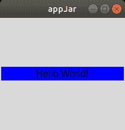
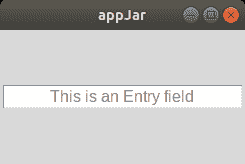
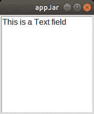
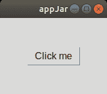
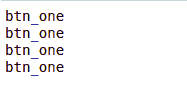
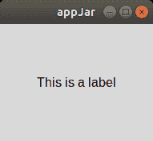
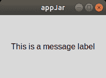

# Python 中的 AppJar 模块

> 原文:[https://www.geeksforgeeks.org/appjar-module-in-python/](https://www.geeksforgeeks.org/appjar-module-in-python/)

`**appJar**`库旨在提供使用 Python 创建图形用户界面的最简单方法。它是 Tkinter 的包装器，允许中学生用 Python 开发简单的图形用户界面。`appJar`的设计使得它可以在许多版本的 Python 上运行，因此与初学者一起工作非常容易。

#### 装置

appJar 库主要用于学校，因此不需要特殊安装。
任何 Python 程序员只需 [**下载**](https://github.com/jarvisteach/appJar/blob/appJar/releases/appJar.zip?raw=true)zip 文件，解压后在源代码文件夹内复制使用库即可。

它还支持使用以下命令进行安装:

```py
pip install appjar

```

## 入门指南

要创建`appJar`应用程序:

1.  从 appJar 库中导入 gui 并创建 gui 变量。
    为此，在源代码文件

    ```py
    # import the library
    from appJar import gui

    # let app be name of gui variable
    app = gui()

    ```

    的开头添加以下一行
2.  使用 app 变量，配置每个小部件的应用外观和逻辑。
    例如，这里我们使用应用程序变量创建了一个显示“Hello World”的窗口。

    ```py
    app.addLabel("title", " Hello World! ")

    app.setLabelBg("title", "blue")

    ```

3.  最后，通过在代码中添加以下命令来运行应用程序:

    ```py
    app.go()

    ```

**完整代码:**

```py
# Python program to demonstrate
# hello world in appjar

# import the library
from appJar import gui

# let app be name of gui 
# variable
app = gui()

# Adding the label
app.addLabel("title", " Hello World! ")

# Setting the background color
app.setLabelBg("title", "blue")
app.go()
```

**输出:**



## 小工具

有两种类型的小部件:输入小部件和输出小部件。小部件通常有三个常见功能:

*   **添加–**该功能用于将小部件添加到应用中
*   **获取–**该功能用于获取小部件的内容
*   **设置–**此功能用于更改内容或配置小部件

对于上面的每个函数，第一个参数总是小部件的标题。下面提到了一些常用的小部件。

#### 输入小部件

这些用于记录用户通过点击、拖动或键入与应用程序的交互。

1.  **Entry:** This widget is used to get the typed input of the user and usually this widget takes a single parameter – title

    **语法:**

    ```py
    app.addEntry("entryTitle")
    ```

    您可以使用以下命令为条目设置默认值:

    ```py
     app.setEntryDefault("entryTitle", "defaultText")
    ```

    要获取特定条目的值，请使用:

    ```py
     app.getEntry("entryTitle") 
    ```

    若要获取所有条目的值，请使用。

    ```py
     app.getAllEntries()
    ```

    **注意:**这将把所有条目的内容作为字典返回。

    **示例:**

    ```py
    # Python program to demonstrate
    # entry widget appjar

    from appJar import gui

    app = gui()

    # Adding the entry
    app.addEntry("entry_1")

    # Setting the default value
    app.setEntryDefault("entry_1", 
                        "This is an Entry field")

    app.go()
    ```

    **输出:**

    

2.  **TextArea:** This widget is used to get the typed input of the user but unlike the Entry field, it supports typing text over multiple lines.

    **语法:**

    ```py
    app.addTextArea("textAreaTitle", text=None)
    ```

    您可以使用以下方法将文本添加到指定的文本区域:

    ```py
     app.setTextArea("textAreaTitle", 
                          "someText", 
                          end = True, 
                          callFunction = True)
    ```

    *   默认情况下，通过在参数中设置 end = False，文本被添加到文本区域的末尾，您可以在文本区域的开头追加文本
    *   如果不想调用任何关联的函数，callFunction 设置为 False

    要获取特定文本区域的值，请使用:

    ```py
    app.getTextArea("textAreaTitle")
    ```

    要获取所有文本区域的内容，请使用。

    ```py
    app.getAllTextAreas()
    ```

    **注意:**这将把所有条目的内容作为字典返回。

    **例**

    ```py
    # Python program to demonstrate
    # textarea widget appjar

    from appJar import gui

    app = gui()

    # Adding text area
    app.addTextArea("TA_1")

    # Setting the default value
    app.setTextArea("TA_1", 
                    "This is a Text field", 
                    end = True, callFunction = False)

    app.go()
    ```

    **输出:**

    

3.  **Button:** Button is used to call specific function and make app more interactive with user.

    **语法:**

    ```py
     app.addButton("buttonTitle", functionName ) 
    ```

    这里，应该指定 functionName，当单击按钮时将调用它，其中标题作为参数传递给被调用的函数。

    您可以更改按钮的名称，但不能更改作为参数传递的值，方法是使用:

    ```py
     app.setButton("buttonTitle", "someText")
    ```

    您也可以在按钮上放置图像，而不是文本，方法是:

    ```py
     app.setButtonImage("buttonTitle", "imagePath", align=None)
    ```

    如果设置了对齐，则图像将相对于文本对齐，否则图像将简单地替换文本。

    **示例:**

    ```py
    # Python program to demonstrate
    # button widget of appjar

    from appJar import gui

    # Function to be passed
    # when the button is clicked
    def clicked(btn):
        print(btn)

    app = gui()

    # Adding the button
    app.addButton("btn_one", clicked)

    # Change the name of the button
    app.setButton("btn_one", "Click me")

    app.go()
    ```

    **输出:**

    

    **点击按钮后:**

    

#### 输出小部件

这些小部件用于向与应用程序交互的用户显示一些信息。

1.  **Label:** Labels are used for displaying texts on the app.

    **语法:**

    ```py
    app.addLabel("labelTitle", text="someText")
    ```

    这里，如果文本设置为无，那么标签的标题将显示在应用程序的标签输出小部件中。

    您可以使用以下命令更改标签的内容:

    ```py
    app.setLabel("labelTitle", "someText")
    ```

    您可以使用以下方法获取标签的内容:

    ```py
    app.getLabel("labelTitle")
    ```

    **示例:**

    ```py
    # Python program to demonstrate
    # label widget of appjar

    from appJar import gui

    app = gui()

    # Adding the label
    app.addLabel("label_1",
                 text ="This is a label")

    app.go()
    ```

    **输出:**

    

2.  **Message:** The Message widget is used for displaying texts over multiple lines on the app.

    **语法:**

    ```py
    app.addMessage("messageTitle", text="someText")
    ```

    这里，如果文本设置为无，那么消息小部件的标题将显示在应用程序的消息输出小部件中。

    您可以使用以下方法更改邮件内容:

    ```py
    app.setMessage("messageTitle", "someText")
    ```

    您可以使用以下方法清除指定消息小部件的内容:

    ```py
    app.clearMessage("messageTitle")
    ```

    **例**

    ```py
    # Python program to demonstrate
    # message widget of appjar

    from appJar import gui

    app = gui()

    # Adding the message label
    app.addLabel("label_1",
                 text ="This is a message label")

    app.go()
    ```

    **输出:**

    