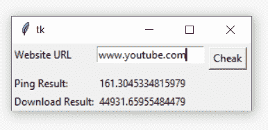

# Python 中使用 pyspeedtest 进行网速测试的应用

> 原文:[https://www . geesforgeks . org/application-for-internet-speed-test-use-pyspeed-test-in-python/](https://www.geeksforgeeks.org/application-for-internet-speed-test-using-pyspeedtest-in-python/)

同时以互联网速度进行故障排除。我们需要首先检查互联网带宽速度。所以， **pyspeedtest** 模块使用 Speedtest.net 服务器测试网络带宽。因此，在开始之前，我们需要将 **pyspeedtest** 安装到您的系统中。将这些代码运行到命令行

```
pip install pyspeedtest
```

**进场:**

*   导入 pyspeedtest 测试
*   为**速度测试()创建对象**
*   用 **ping()检查 ping**
*   用**下载()检查下载速度**
*   用**上传()检查上传速度**

下面是实现。

## 蟒蛇 3

```
import pyspeedtest

test = pyspeedtest.SpeedTest("www.youtube.com")

test.ping()
test.download()
test.upload()
```

**输出:**

```
253.4427046775818
16461.88637373227
19425388.307319913

```

**带 Tkinter 的速度测试应用程序:**这个脚本将上述实现实现到一个 GUI 中。

## 蟒蛇 3

```
import pyspeedtest
from tkinter import *

def Speed_test():
    t = pyspeedtest.SpeedTest(e1.get())
    myping.set(t.ping())
    down.set(t.download())

master = Tk()
myping = StringVar()
down = StringVar()

Label(master, text="Website URL").grid(row=0, sticky=W)
Label(master, text="Ping Result:").grid(row=3, sticky=W)
Label(master, text="Download Result:").grid(row=4, sticky=W)

result = Label(master, text="", textvariable=myping,
               ).grid(row=3, column=1, sticky=W)

result2 = Label(master, text="", textvariable=down,
                ).grid(row=4, column=1, sticky=W)

e1 = Entry(master)
e1.grid(row=0, column=1)
b = Button(master, text="Cheak", command=Speed_test)
b.grid(row=0, column=2, columnspan=2, rowspan=2, padx=5, pady=5)

mainloop()
```

**输出:**

