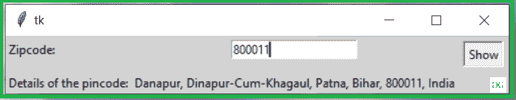

# 使用 Python 从邮政编码获取地址详细信息的应用程序

> 原文:[https://www . geesforgeks . org/application-to-get-address-details-from-zip-code-using-python/](https://www.geeksforgeeks.org/application-to-get-address-details-from-zip-code-using-python/)

**先决条件:**[Tkit](https://www.geeksforgeeks.org/python-gui-tkinter/)

在本文中，我们将使用 python 中的[*【tkinter】*](https://www.geeksforgeeks.org/python-gui-tkinter/)*和 *geopy* 模块编写脚本，从给定的 Zip 代码或 Pincode 中获取地址详细信息，Tkinter 是 python 中最常用的 GUI 模块，用于说明图形对象， *geopy* 是一个 python 模块，用于定位地址、城市、国家、地标和邮政编码的坐标。*

***安装:***

**tkinter* 模块是 Python 中的内置模块，但是我们需要安装*地质*模块:*

```
*pip install geopy* 
```

***进场:***

1.  *导入*地质*模块。*
2.  *使用 *Nominatim* API 访问一组坐标对应的，n *ominatim* 使用 OpenStreetMap 数据通过名称和地址(地理编码)查找地球上的位置。*
3.  *使用*地理编码()*获取给定*邮编*的位置并显示出来*。**

***以下是上述方法的实现:***

## *蟒蛇 3*

```
*# Importing required module
from geopy.geocoders import Nominatim

# Using Nominatim Api
geolocator = Nominatim(user_agent="geoapiExercises")

# Zipocde input
zipcode = "800011"

# Using geocode()
location = geolocator.geocode(zipcode)

# Displaying address details
print("Zipcode:",zipcode)
print("Details of the Zipcode:")
print(location)*
```

***输出:***

```
*Zipcode: 800011
Details of the Zipcode:
Danapur, Dinapur-Cum-Khagaul, Patna, Bihar, 800011, India* 
```

***下面是使用** ***tkinter*** **模块的上述程序的 GUI 实现:***

## *蟒蛇 3*

```
*# Importing required modules
from geopy.geocoders import Nominatim
from tkinter import *

# Funtion to get zipcode input
def zip_code():
    try:        
        geolocator = Nominatim(user_agent="geoapiExercises")
        zipcode = str(e.get())
        location = geolocator.geocode(zipcode)
        res.set(location.address)

    except:
        location = "Oops! something went wrong"
        res.set(location)

# Creating tkinter object
# and background set for light grey
master = Tk()
master.configure(bg='light grey')

# Variable Classes in tkinter
res = StringVar();

# Creating label for each information 
Label(master, text="Zipcode: " , bg = "light grey").grid(row=0, sticky=W)
Label(master, text="Details of the pincode:", bg = "light grey").grid(row=3, sticky=W)

# Creating label for class variable
Label(master, text="", textvariable=res,bg = "light grey").grid(row=3,column=1, sticky=W)

e = Entry(master)
e.grid(row=0, column=1)

# Creating a button using the widget  
# Button that will call the submit function 
b = Button(master, text="Show", command=zip_code )
b.grid(row=0, column=2,columnspan=2, rowspan=2,padx=5, pady=5)

mainloop()

# this code belongs to Satyam kumar (ksatyam858)*
```

***输出:***

**