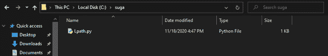
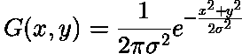
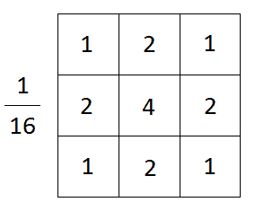
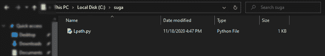

# 使用 Python 对图像应用高斯滤镜

> 原文:[https://www . geesforgeks . org/apply-a-gauss-filter-to-a-image-with-python/](https://www.geeksforgeeks.org/apply-a-gauss-filter-to-an-image-with-python/)

高斯滤波器是一种低通滤波器，用于降低噪声(高频分量)和模糊图像区域。滤波器被实现为奇数大小的对称核(矩阵的 DIP 版本)，它通过感兴趣区域的每个像素来获得期望的效果。内核对剧烈的颜色变化(边缘)并不困难，因为内核中心的像素比外围的像素对最终值更有权重。高斯滤波器可以被认为是高斯函数(数学)的近似。在本文中，我们将学习使用 Python 编程语言利用高斯滤波器降低图像噪声的方法。

我们将使用以下图像进行演示:



一段 windows 资源管理器的屏幕截图

## 应用高斯滤波器的过程

在对图像使用高斯滤波器的过程中，我们首先定义用于分层图像的核/矩阵的大小。大小通常是奇数，即可以在中心像素上计算总结果。内核也是对称的&因此具有相同的行数和列数。内核中的值由高斯函数计算，如下所示:



二维高斯函数

> 哪里，
> 
> x → X 坐标值
> 
> y → Y 坐标值
> 
> ？？？？→数学常数 PI(值= 3.13)
> 
> σ →标准偏差

使用上面的函数，通过提供适当的值，可以计算任何大小的高斯核。标准差= 1 的 3×3 高斯核近似(二维)如下所示



## 高斯核在 Python 中的实现

我们将使用名为*过滤器()*的 PIL (Python 图像库)函数，通过预定义的高斯核传递我们的整个图像。功能帮助页面如下:

> **语法:**过滤器(内核)
> 
> 采用内核(预定义的或自定义的)和图像的每个像素(内核卷积)。
> 
> **参数:**过滤内核
> 
> **返回:**图像对象

**在下面的例子中，我们将模糊前面提到的图像。**

## 蟒蛇 3

```
# ImageFilter for using filter() function
from PIL import Image, ImageFilter

# Opening the image 
# (R prefixed to string in order to deal with '\' in paths)
image = Image.open(r"IMAGE_PATH")

# Blurring image by sending the ImageFilter.
# GaussianBlur predefined kernel argument
image = image.filter(ImageFilter.GaussianBlur)

# Displaying the image
image.show()
```

**输出:**


模糊图象

**说明:**

首先我们导入了 PIL 库的 Image 和 ImageFilter(用于使用 *filter()* )模块。然后我们通过在路径*打开图像来创建一个图像对象。之后我们通过滤镜功能对图像进行过滤，并提供*图像滤镜。gaussianbull*(在 ImageFilter 模块中预定义)作为它的参数。ImageFilter 的内核维度。GaussianBlur 为 5×5。最后我们展示了图像。*

> **注意:**内核的大小可以通过将内核的半径作为参数(可选)传递来控制。这将下面一行从。
> 
> image = image.filter(图像过滤器。GaussianBlur)
> 
> **至**
> 
> image = image.filter(图像过滤器。GaussianBlur(半径=x))
> 
> 其中 ***x*** = >模糊半径(从中心像素开始一个方向的内核大小)

### 模糊图像中的小区域:

代替整个图像，它的某些部分也可以选择性地模糊。这可以通过首先裁剪图像的所需区域，然后通过 filter()函数来实现。其输出(模糊的子图像)将粘贴在原始图像的顶部。这将给我们想要的输出。

**其代码如下:**

## 蟒蛇 3

```
from PIL import Image, ImageFilter

image = Image.open(r"FILE_PATH")

# Cropping the image 
smol_image = image.crop((0, 0, 150, 150))

# Blurring on the cropped image
blurred_image = smol_image.filter(ImageFilter.GaussianBlur)

# Pasting the blurred image on the original image
image.paste(blurred_image, (0,0))

# Displaying the image
image.save('output.png')
```

**输出:**



只有图像的左上角区域模糊不清