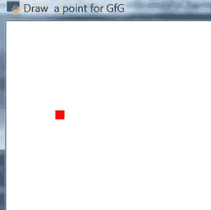
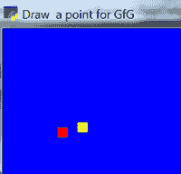
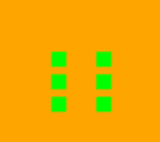

# 街机内置函数，用于在 Python3 中绘制点

> 原文:[https://www . geeksforgeeks . org/arcade-内置-函数-绘制点入 python3/](https://www.geeksforgeeks.org/arcade-inbuilt-functions-to-draw-points-in-python3/)

[街机库](https://www.geeksforgeeks.org/arcade-library-in-python/)是一个现代 Python 模块，广泛用于开发具有引人注目的图形和声音的 2D 视频游戏。街机是一个面向对象的库。它可以像任何其他 Python 包一样安装。

在这篇文章中，我们将学习什么是街机的内置功能来画点。

街机图书馆是一个现代化的框架，通过其内置的功能可以非常容易地绘制插图。在街机里，我们有两个内置的功能来画点。


**1。arcade.draw_point( ):** 用来画一个点，你甚至可以通过调用这个函数任意多次来画多个点。

> **语法:** arcade.draw_point(x，y，颜色，大小)
> 
> **参数:**
> 
> *   **x–**是点的位置。
> *   **y**-是点的位置。
> *   **颜色**–使用 arcade.color.COLOR NAME 指定颜色。(注意颜色名称应该用大写字母。)
> *   **大小–**以像素为单位的点的大小。

**使用 arcade 绘制点的方法。绘制点:**

1.  导入街机模块
2.  打开窗口并设置窗口参数。
3.  设置输出窗口的背景颜色。(可选)
4.  开始渲染过程
5.  用它指定的参数实现 arcade.draw_point()。
6.  完成渲染
7.  让窗户一直开着，直到你关上为止。

**程序 1:** (绘制单点的程序)

## 蟒蛇 3

```py
import arcade

# Open the window. Set the window title and dimensions (width and height)
arcade.open_window(600, 600, "Draw  a point for GfG ")

arcade.set_background_color(arcade.color.WHITE)

# Start the render process.
arcade.start_render()

# Draw a point
arcade.draw_point(60, 495, arcade.color.RED, 10)

# Finish the render.
arcade.finish_render()

# Keep the window up until someone closes it.
arcade.run()
```

**输出:**



**程序 2:** (绘制多个点的程序)

## 蟒蛇 3

```py
import arcade

# Open the window
arcade.open_window(600, 600, "Draw  a point for GfG ")
arcade.set_background_color(arcade.color.BLUE)

# Start the render process
arcade.start_render()

# Draw a point
arcade.draw_point(60, 495, arcade.color.RED, 10)

# Draw a point
arcade.draw_point(80, 500, arcade.color.YELLOW, 10)

# Finish the render.
arcade.finish_render()

# Keep the window up until someone closes it.
arcade.run()
```

**输出:**



**2。arcade.draw_points ( ):** 使用该功能，可以更容易地以特定的模式绘制多个指向的点。

> **语法:**arcade . draw _ points(point _ list，颜色，大小)
> 
> **参数:**
> 
> *   **point _ list–**它基本上是点的列表，其中每个点都在一个列表中。这是一个列表。
> *   **颜色**-使用 arcade . Color . Color . NAME 指定颜色。(注意颜色名称应该用大写字母。)
> *   **大小**–以像素为单位的点的大小。

**程序:**

## 蟒蛇 3

```py
import arcade

# Open the window
arcade.open_window(600, 600, "Draw  a point for GfG ")

arcade.set_background_color(arcade.color.ORANGE)

# Start the render process.
arcade.start_render()

# Draw a points
point_list = ((165, 495),
              (165, 480),
              (165, 465),
              (195, 495),
              (195, 480),
              (195, 465))
arcade.draw_points(point_list, arcade.color.GREEN , 10)

# Finish the render.
arcade.finish_render()

# Keep the window up until someone closes it.
arcade.run()
```

**输出:**

