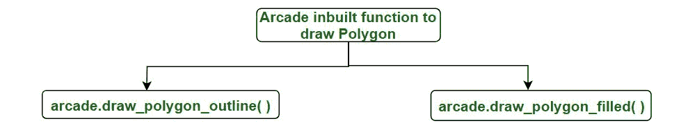

# 街机内置函数在 Python3 中绘制多边形

> 原文:[https://www . geeksforgeeks . org/arcade-内置-函数-绘制多边形-在 python3/](https://www.geeksforgeeks.org/arcade-inbuilt-functions-to-draw-polygon-in-python3/)

[街机库](https://www.geeksforgeeks.org/arcade-library-in-python/)是一个高科技 Python 包，拥有一套高级工具，用于制作具有引人入胜的图形和声音的 2D 游戏。它是面向对象的，特别是为 Python 3.6 和更高版本构建的。

Arcade 有两个用于绘制多边形的内置功能:



**1。arcade . draw _ polygon _ outline():**此功能用于绘制多边形的轮廓。

> **语法:** arcade.draw_polygon_outline(点 _ 列表，颜色，线宽)
> 
> **参数:**
> 
> *   **点 _ 列表:**组成线的点列表。每个点都在一个列表中。这是一个列表。
> *   **颜色(Color):** 使用 arcade . Color . Color . NAME 指定颜色。(注意颜色名称应该用大写字母。)
> *   **线宽:-** 以像素为单位的线宽。

**示例:**

## 蟒蛇 3

```py
import arcade

# Open the window. Set the window title and dimensions (width and height)
arcade.open_window(600, 600, "Draw  a polygon for GfG ")

arcade.set_background_color(arcade.color.ORANGE)

# Start the render process.
arcade.start_render()

point_list = ((30, 240),
              (45, 240),
              (60, 255),
              (60, 285),
              (45, 300),
              (30, 300))
arcade.draw_polygon_outline(point_list, arcade.color.SPANISH_VIOLET, 3)

arcade.finish_render()

arcade.run()
```

**输出:**


**2。arcade . draw _ polygon _ filled():**arcade 的这个内置功能是用来绘制填充了颜色的多边形。

> **语法:** arcade.draw_polygon_filled(点 _ 列表，颜色)
> 
> **参数:**
> 
> *   **点 _ 列表-** 基本上是点列表，每个点都在一个列表中。这是一个列表。
> *   **颜色–**使用 arcade.color.COLOR NAME 指定颜色。(注意颜色名称应该用大写字母。)

**示例:**

## 蟒蛇 3

```py
import arcade

# Open the window. Set the window title and dimensions (width and height)
arcade.open_window(600, 600, "Draw  a polygon for GfG ")

arcade.set_background_color(arcade.color.ORANGE)

# Start the render process.
arcade.start_render()

point_list = ((150, 240),
              (165, 240),
              (180, 255),
              (180, 285),
              (165, 300),
              (150, 300))
arcade.draw_polygon_filled(point_list, arcade.color.SPANISH_VIOLET)

arcade.finish_render()

arcade.run()
```

**输出:**

