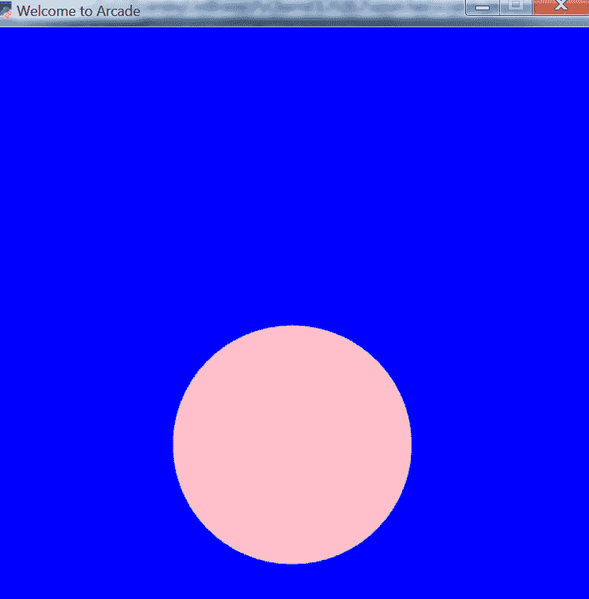
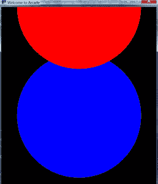

# Python 中的街机库

> 原文:[https://www.geeksforgeeks.org/arcade-library-in-python/](https://www.geeksforgeeks.org/arcade-library-in-python/)

多年来，Python 游戏程序员仅限于 [Pygame](https://www.geeksforgeeks.org/introduction-to-pygame/) 模块。但是，现在我们也有其他选择，即街机 Python 库。**街机库**是一个现代 Python 模块，广泛用于开发具有引人注目的图形和声音的 2D 视频游戏。街机是一个面向对象的库。它可以像任何其他 Python 包一样安装。这是美国爱荷华州辛普森学院的计算机科学教授保罗·文森特·克雷文写的。

### 装置

要安装此模块，只需在命令提示符下运行以下命令:

```
pip install arcade

```

### 履行

以下步骤说明了如何使用 arcade 模块创建基本图形:

*   导入模块。
*   指定输出屏幕的参数，如宽度、高度等。
*   使用街机中内置的 open_window()打开窗户。该命令打开一个给定大小的窗口，即宽度和高度以及屏幕标题。

**语法-**

> 街机。打开 _ 窗口(宽度、高度、标题)

*   设置背景颜色(可选)。这可以使用街机内置的 set_background_color()方法来完成

**语法-**

> arcade . set _ background _ color(arcade . color . color _ name)

*   告诉您的模块使用 start_render()命令开始绘图，该命令再次内置于 arcade 中。

**语法-**

> arcade.start_render()

*   开始设计，你可以使用街机已经有的功能来完成。
*   告诉 arcade 模块，您已经使用 finish_render()完成了绘图。

**语法-**

> arcade.finish_render()

*   使用 Run()运行代码。

**语法-**

> arcade.run()

**例 1** :使用街机画圆的 Python 程序。

## 蟒蛇 3

```
# Import module
import arcade

# Specify Parameters
Width = 500
Height = 700
Title = "Welcome to Arcade"
Radius = 100

# Open the window
arcade.open_window(Width, Height, Title)

# Set the background color
arcade.set_background_color(arcade.color.BLUE)

# start drawing
arcade.start_render()

# Draw a Pink circle
arcade.draw_circle_filled(
    Width/2 , Height/2 , Radius , arcade.color.PINK
)
# Finish drawing
arcade.finish_render()

# Display everything
arcade.run()
```

**输出:**



**示例 2:** 使用街机创建圆形图案的 Python 程序

## 蟒蛇 3

```
# Import module
import arcade

#Specify Parameters
Width = 500
Height = 700
Title = "Welcome to Arcade"
Radius = 200

# Open the window
arcade.open_window(Width, Height, Title)

# Set the background color
arcade.set_background_color(arcade.color.BLACK)

# start drawing
arcade.start_render()

# Draw a BLUE circle
arcade.draw_circle_filled(
    Width/2 , Height/2 , Radius , arcade.color.BLUE
)

# Draw a Red circle
arcade.draw_circle_filled(
    Width/2 , Height , Radius , arcade.color.RED
)

# Finish drawing
arcade.finish_render()
# Display everything
arcade.run()
```

**输出:**



街机是一套 python 模块，这是一个用于设计 2D 视频游戏的现代 Python 框架。在 Arcade 中，我们有扣人心弦的计算机图形和声音库，以设计高质量和用户友好的游戏。街机是由保罗·文森特·克雷文开发的。街机需要 OpenGL 3.3+的支持。

### 关于街机图书馆的有趣事实:

*   街机是建立在 Pyglet 和 OpenGL 之上的。
*   为了取代 Pygame，街机应运而生。
*   街机在 Windows、Mac OS X 和 Linux 上运行。
*   街机需要 Python 3.6 或更新版本。它不在 Python 2.x 上运行。
*   街机需要 OpenGL 3.3+的支持。它不运行在树莓皮或韦兰。如果在 Linux 上，声音支持至少需要 GLIB 2.29+。
*   街机使用 SoLoud。支持平移和音量。
*   使用它可以创建开源的免费共享软件和商业游戏。
*   支持 Python 3 类型提示。
*   基础绘图不需要关于如何定义函数或类或如何做循环的知识。
*   使用您在数学中学习的标准坐标系。(0，0)位于左下角，而不是左上角。y 坐标不反转。
*   命令的 API 文档更好。

### **街机 2 版开发活动路线图:**

1.  2.4.3 版于 2020-09-30 发布。这是街机的最新版本，增加了 PyInstalled 钩子和教程，形状列表不再在实例之间共享位置，并且有了图形用户界面的改进。
2.  2.4.2 版发布于 2020-09-08。它有带鼠标的图形处理器转换和可下载的更新。platformer 示例代码的 zip，以匹配文档中的当前代码等等。
3.  街机 2.4.1 发布于 2020-07-13。支持定义自己的帧缓冲区、着色器，以及更高级的 OpenGL 编程、平台的 PyMunk 引擎等。