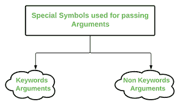

# * Python 中的 args 和* * kwargs

> 哎哎哎:# t0]https://www . geeksforgeeks . org/args-kwargs-python/

在 Python 中，我们可以使用特殊符号向函数传递可变数量的参数。有两种特殊的符号:



用于传递参数的特殊符号:-

1.)*参数(非关键字参数)

2.)**kwargs(关键字参数)

> **注意:**“当我们对应该在函数中传递的参数数量有疑问时，我们使用像这样的“通配符”或“*”符号–* args 或**kwargs 作为函数的参数。”

**1 .)* args**

python 中函数定义中的特殊语法 **args* 用于向函数传递可变数量的参数。它用于传递非关键字的可变长度参数列表。

*   语法是使用符号*接受可变数量的参数；按照惯例，它经常与 args 一词连用。
*   **args* 允许您接受的参数比您之前定义的形式参数的数量更多。使用 **args* ，任何数量的额外参数都可以附加到您当前的形式参数上(包括零个额外参数)。
*   例如:我们想做一个乘法函数，它接受任意数量的参数，并且能够将它们相乘。可以使用*args 来完成。
*   使用*，我们与*相关联的变量变成了可迭代的，这意味着您可以对它进行迭代，运行一些更高阶的函数，如 map 和 filter 等。

## 蟒蛇 3

```
# Python program to illustrate 
# *args for variable number of arguments
def myFun(*argv):
    for arg in argv:
        print (arg)

myFun('Hello', 'Welcome', 'to', 'GeeksforGeeks')
```

**Output:** 

```
Hello
Welcome
to
GeeksforGeeks
```

## 蟒蛇 3

```
# Python program to illustrate
# *args with first extra argument
def myFun(arg1, *argv):
    print ("First argument :", arg1)
    for arg in argv:
        print("Next argument through *argv :", arg)

myFun('Hello', 'Welcome', 'to', 'GeeksforGeeks')
```

**Output:** 

```
First argument : Hello
Next argument through *argv : Welcome
Next argument through *argv : to
Next argument through *argv : GeeksforGeeks
```

**2.**

python 中函数定义中的特殊语法 ***kwargs* 用于传递关键字化的可变长度参数列表。我们把*夸格斯*这个名字和双星一起使用。原因是因为双星允许我们传递关键字参数(以及任意数量的参数)。

*   关键字参数是在将变量传递给函数时为其提供名称的地方。
*   人们可以把 *kwargs* 看作是一个字典，它把每个关键词映射到我们与之一起传递的值。这就是为什么当我们遍历 *kwargs* 时，它们似乎没有任何打印顺序。

**使用**kwargs 的示例:**

## 大蟒

```
# Python program to illustrate 
# *kwargs for variable number of keyword arguments

def myFun(**kwargs):
    for key, value in kwargs.items():
        print ("%s == %s" %(key, value))

# Driver code
myFun(first ='Geeks', mid ='for', last='Geeks')   
```

**Output:** 

```
last == Geeks
mid == for
first == Geeks
```

## 大蟒

```
# Python program to illustrate  **kwargs for
# variable number of keyword arguments with
# one extra argument.

def myFun(arg1, **kwargs):
    for key, value in kwargs.items():
        print ("%s == %s" %(key, value))

# Driver code
myFun("Hi", first ='Geeks', mid ='for', last='Geeks')   
```

**Output:** 

```
last == Geeks
mid == for
first == Geeks
```

### **使用*args 和**kwargs 调用函数**

**例:**

## 蟒蛇 3

```
def myFun(arg1, arg2, arg3):
    print("arg1:", arg1)
    print("arg2:", arg2)
    print("arg3:", arg3)

# Now we can use *args or **kwargs to
# pass arguments to this function :
args = ("Geeks", "for", "Geeks")
myFun(*args)

kwargs = {"arg1" : "Geeks", "arg2" : "for", "arg3" : "Geeks"}
myFun(**kwargs)
```

**Output:** 

```
arg1: Geeks
arg2: for
arg3: Geeks
arg1: Geeks
arg2: for
arg3: Geeks
```

### **用*args 和**kwargs 在同一行调用一个函数**

**例:**

## 蟒蛇 3

```
def myFun(*args,**kwargs):
    print("args: ", args)
    print("kwargs: ", kwargs)

# Now we can use both *args ,**kwargs
# to pass arguments to this function :
myFun('geeks','for','geeks',first="Geeks",mid="for",last="Geeks")
```

**Output:** 

```
args: ('geeks', 'for', 'geeks')
kwargs {'first': 'Geeks', 'mid': 'for', 'last': 'Geeks'}
```

本文由 [**基什莱·维尔马**](https://www.linkedin.com/in/kishlayverma/) 供稿。如果你喜欢 GeeksforGeeks 并想投稿，你也可以使用[contribute.geeksforgeeks.org](http://contribute.geeksforgeeks.org)写一篇文章或者把你的文章邮寄到 review-team@geeksforgeeks.org。看到你的文章出现在极客博客主页上，帮助其他极客。
如果发现有不正确的地方，或者想分享更多关于上述话题的信息，请写评论。