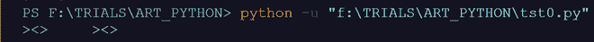
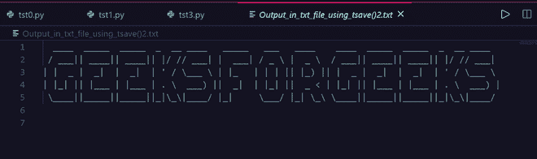

# Python 中的艺术模块

> 原文:[https://www.geeksforgeeks.org/art-module-in-python/](https://www.geeksforgeeks.org/art-module-in-python/)

艺术包用于在终端上打印装饰艺术以及保存在文件中，并且一个单词可以用“|”表示并且可以保存在文件中

### **安装**

这个模块没有内置 Python。要安装此软件，请在终端中键入以下命令。

```py
 pip install art 

```

**功能:**

1.  在终端和 aprint()函数上打印普通和随机艺术
2.  以|和 tprint()函数的形式打印单词，并将其保存在文本/pdf 文件中

**终端上的印刷艺术:**

> **语法:**艺术(艺术名称，数字是表示字符串中艺术数量的整数)

## 蟒蛇 3

```py
# import module
from art import *

# return multiple art as str
art__0=art("woman",number=10)

print(art__0)
```

**输出:**


艺术的随机生成:

## 蟒蛇 3

```py
from art import *

print(art("random"))
```

**输出:**



**使用 aprint()函数**

在这里，你可以直接打印艺术就像打印功能你打印的东西

## 蟒蛇 3

```py
from art import *

print("Buttterfly by art :  ",end=" ")

aprint("butterfly")
print()
```

**输出:**


**现在让我们向 python 文本到艺术的能力前进**

## 蟒蛇 3

```py
# import module
from art import *

# Return ASCII text with block font
# If font=None then there is no block
Art = text2art("GFG", font='block', chr_ignore=True)

print(Art)
```

**输出:**


**tprint()函数与 print()函数相同，它将文本打印成 ASCII 格式**

## 蟒蛇 3

```py
# import module
from art import *

# random large text to art representation 
# This art will be random every time
tprint("GFG","rnd-xlarge")
```

**输出:**


**我们也可以使用 tsave()函数将它保存到一个 txt 文件中。**

> **语法:**t 保存(“字符串”，输出文件名或路径)

## 蟒蛇 3

```py
# import module
from art import *

Filename = tsave(
    "GEEKSFORGEEKS", filename="Output_in_txt_file_using_tsave().txt")
```

**输出:**

