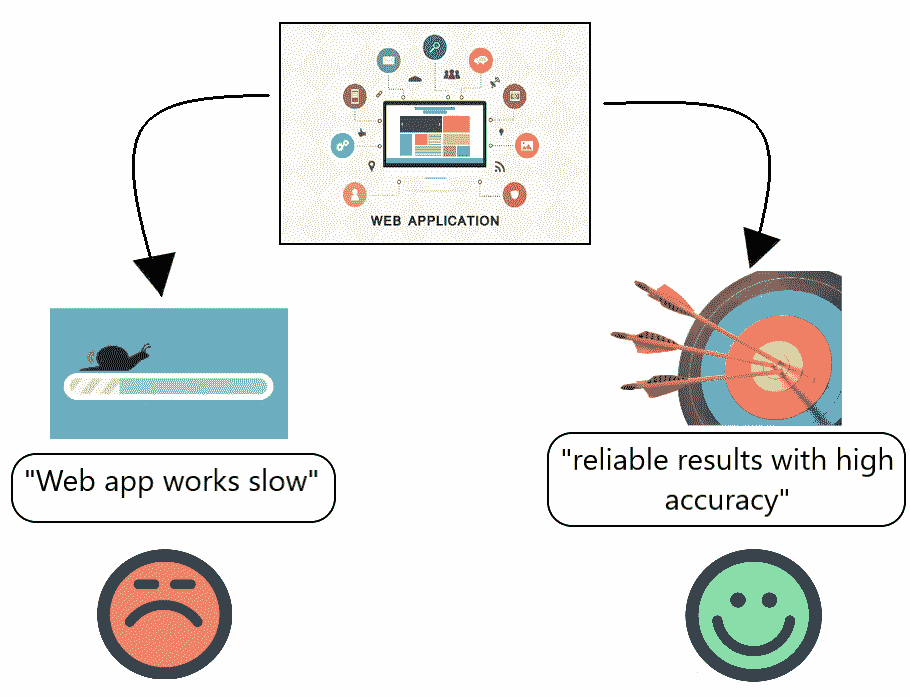
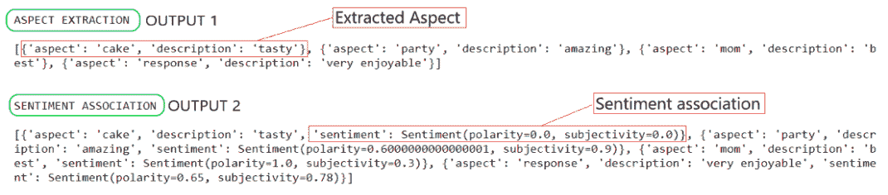

# 情感分析中的方面建模

> 原文:[https://www . geesforgeks . org/aspect-modeling-in-more-analysis/](https://www.geeksforgeeks.org/aspect-modelling-in-sentiment-analysis/)

前提:[情绪分析](https://www.geeksforgeeks.org/twitter-sentiment-analysis-using-python/)

在进入方面建模的细节之前，让我们先用一个真实的例子简单了解一下情绪分析是什么。

### **情绪分析(SA):**

这是一种根据一段文字来区分一个人对某事或某人的感觉的技术。它可以是积极的、消极的或中立的。让我们考虑一个现实生活中的例子。

我们每天在推特上看到数百万条推文。在这里，我们可以建立一个情绪分析模型，来确定他们对某个特定主题的态度是快乐、悲伤、愤怒还是中立。这种技术目前的局限性是检测讽刺。

### **情感分析中的方面建模(ABSA):**

方面建模是一种高级文本分析技术，指的是将文本输入分解为方面类别及其方面术语，然后识别整个文本输入中每个方面背后的情感的过程。该模型中的两个关键术语是:

*   **情绪:**对某一特定方面的正面或负面评价
*   **方面:**正在观察的范畴、特征或话题。

### **要求**

在商业世界中，总是有一个主要的需求来识别和观察人们对特定产品或服务的情绪，以确保他们对其商业产品的持续兴趣。ABSA 通过识别每个方面类别(如食物、位置、环境等)背后的情感来实现这一目的。

这有助于企业*跟踪客户在其业务各个领域的情绪变化*。

### **ABSA 建筑**

为了获得期望的输出，ABSA 模型包括以下步骤。

```py
Step 1 -   Consider the input text corpus and pre-process the dataset. 

Step 2 -   Create Word Embeddings of the text input. (i.e. vectorize the text input 
           and create tokens.)

Step 3.a - Aspect Terms Extraction -> Aspect Categories Model 

Step 3.b - Sentiment Extraction -> Sentiment Model 

Step 4 -   Combine 3.a and 3.b to create to get Aspect Based Sentiment.(OUTPUT)
```

### **直觉:**

**方面:**它被定义为一个观点或情绪所基于的概念。让我们举个例子，以便更好地理解。

假设一家公司开发了一个网络应用程序，它运行缓慢，但提供了高精度的可靠结果。在这里，我们把这段文字分成两个方面。“ *Web app 工作缓慢*”、“*结果可靠准确率高*”。观察这两个方面类别，你很容易得出结论，它们有不同的情感关联。(如图 1 所示)

<center>


**图 1:不同方面不同感悟**

</center>

### **代码实现:**

下面的代码实现执行方面提取的过程，并将其与特定的情感相关联，以使其模型为训练做好准备。

## 蟒蛇 3

```py
# Importing the required libraries
import spacy
sp = spacy.load("en_core_web_sm")
from textblob import TextBlob

# Creating a list of positive and negative sentences.
mixed_sen = [
  'This chocolate truffle cake is really tasty',
  'This party is amazing!',
  'My mom is the best!',
  'App response is very slow!'
  'The trip to India was very enjoyable'
]

# An empty list for obtaining the extracted aspects
# from sentences. 
ext_aspects = []

# Performing Aspect Extraction
for sen in mixed_sen:
  important = sp(sentence)
  descriptive_item = ''
  target = ''
  for token in important:
    if token.dep_ == 'nsubj' and token.pos_ == 'NOUN':
      target = token.text
    if token.pos_ == 'ADJ':
      added_terms = ''
      for mini_token in token.children:
        if mini_token.pos_ != 'ADV':
          continue
        added_terms += mini_token.text + ' '
      descriptive_item = added_terms + token.text
  ext_aspects.append({'aspect': target,
    'description': descriptive_item})

print("ASPECT EXTRACTION\n")
print(ext_aspects)

for aspect in ext_aspects:
  aspect['sentiment'] = TextBlob(aspect['description']).sentiment

print("\n")
print("SENTIMENT ASSOCIATION\n")
print(ext_aspects)
```

### **输出:**



**获得的输出**