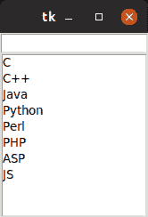
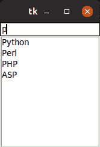

# python-tkinter

中的自填入 ComboBox

> 哎哎哎:# t0]https://www . geeksforgeeks . org/auto mple-combobox-in-python-tkinter/

**先决条件:**[Python GUI–tkinter](https://www.geeksforgeeks.org/python-gui-tkinter/)

列表框小部件用于显示项目列表，用户可以从中选择多个项目。但是你有没有想过，当一个键被按下时，如何返回可能结果的列表？让我们看看下面的方法。

**程序工作**

*   由单词组成的列表被初始化。
*   创建输入框和列表框，并将其添加到根窗口。
*   Bind 函数用于事件处理。键释放事件是为条目字段处理的。
*   当按下输入中的任意键时，将调用`checkkey()`功能。
*   `checkkey()`函数然后将输入的字符串与现有的列表关键字进行比较，并用匹配的关键字填充列表框。
*   然后这些数据被发送到更新函数，该函数更新列表框。

下面是方法。

```py
from tkinter import *

# Function for checking the
# key pressed and updating
# the listbox
def checkkey(event):

    value = event.widget.get()
    print(value)

    # get data from l
    if value == '':
        data = l
    else:
        data = []
        for item in l:
            if value.lower() in item.lower():
                data.append(item)                

    # update data in listbox
    update(data)

def update(data):

    # clear previous data
    lb.delete(0, 'end')

    # put new data
    for item in data:
        lb.insert('end', item)

# Driver code
l = ('C','C++','Java',
     'Python','Perl',
     'PHP','ASP','JS' )

root = Tk()

#creating text box 
e = Entry(root)
e.pack()
e.bind('<KeyRelease>', checkkey)

#creating list box
lb = Listbox(root)
lb.pack()
update(l)

root.mainloop()
```

**输出:**



