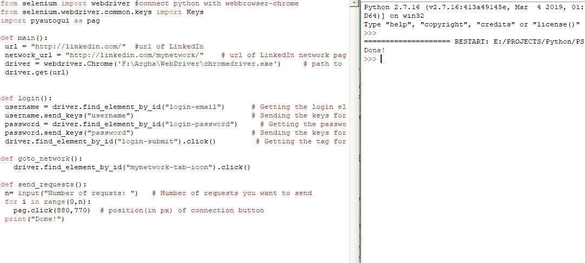

# 使用 Python 自动进行 linkedin 连接

> 原文:[https://www . geesforgeks . org/automate-LinkedIn-connections-use-python/](https://www.geeksforgeeks.org/automate-linkedin-connections-using-python/)

对于一个 IT 专业人士来说，LinkedIn 连接是一件非常重要的事情，所以我们需要向很多对我们有用的人发送连接请求。但是有时一次发送一个连接请求会有点烦人和忙乱。自动化这项工作会很好，但是怎么做呢？
巨蟒来救援！
在本文中，我们将学习如何使用 Python 自动接受 LinkedIn 连接。
**所需模块**–

*   **硒**–硒没有内置 python。要安装 selenium，请在终端中键入以下命令。

```py
pip install selenium
```

*   **Pyautogui**–Pyautogui 也没有内置 python。要安装 pyautogui，请在终端中键入以下命令。

```py
pip install pyautogui
```

*   **Chrome 网络驱动**–要下载 Chrome 网络驱动[请点击此处](https://chromedriver.chromium.org/downloads)。

下面是实现。
首先，让我们导入所有重要的东西。

```py
# connect python with webbrowser-chrome
from selenium import webdriver
from selenium.webdriver.common.keys import Keys
import pyautogui as pag
```

现在，让我们编写主函数-

```py
def main():
    # url of LinkedIn
    url = “http://linkedin.com/"  
    # url of LinkedIn network page
    network_url = “http://linkedin.com / mynetwork/" 
    # path to browser web driver
    driver = webdriver.Chrome('C:\\Program Files\\Web Driver\\chromedriver.exe'')
    driver.get(url)

# Driver's code
if __name__ == __main__:
    main()
```

我们需要转到认证页面，然后我们需要登录。这里是代码-

```py
def login():
    # Getting the login element
    username = driver.find_element_by_id(“login-email”)  
    # Sending the keys for username     
    username.send_keys(“username”)       
    # Getting the password element                            
    password = driver.find_element_by_id(“login-password”) 
    # Sending the keys for password   
    password.send_keys(“password”)               
    # Getting the tag for submit button           
    driver.find_element_by_id(“login-submit”).click()         
```

find_element_by_id 用于查找 HTML 标记‘登录-电子邮件’和‘登录-密码’，然后我们发送了这些的密钥。
接下来，我们转到网络部分-

```py
def goto_network():
    driver.find_element_by_id(“mynetwork-tab-icon”).click()
```

现在，LinkedIn 试图防止刮擦，所以找到连接按钮可能有点棘手。所以你需要努力找到连接按钮的位置(你可以使用一些技术，比如 Xpath)。
发送请求的代码-

```py
def send_requests():
    # Number of requests you want to send
    n = input(“Number of requests: ”)   

    for i in range(0, n):
        # position(in px) of connection button 
        # will be different for different user
        pag.click(880, 770)  
    print(“Done !”)
```

要点击所需位置，我们使用 pyautogui，即 pag.click(，)。这就是我们如何自动发送 LinkedIn 连接。
这里是完整的代码-

## 蟒蛇 3

```py
# connect python with webbrowser-chrome
from selenium import webdriver
from selenium.webdriver.common.keys import Keys
import pyautogui as pag

def login():

    # Getting the login element
    username = driver.find_element_by_id("login-email")

    # Sending the keys for username     
    username.send_keys("username")

    # Getting the password element                                 
    password = driver.find_element_by_id("login-password")

    # Sending the keys for password   
    password.send_keys("password")     

    # Getting the tag for submit button                    
    driver.find_element_by_id("login-submit").click()        

def goto_network():
    driver.find_element_by_id("mynetwork-tab-icon").click()

def send_requests():

    # Number of requests you want to send
    n = input("Number of requests: ")

    for i in range(0, n):
        # position(in px) of connection button
        pag.click(880, 770) 
    print("Done !")

def main():

    # url of LinkedIn
    url = "http://linkedin.com/" 

    # url of LinkedIn network page
    network_url = "http://linkedin.com / mynetwork/"  

    # path to browser web driver
    driver = webdriver.Chrome('C:\\Program Files\\Web Driver\\chromedriver.exe')    
    driver.get(url)

# Driver's code
if __name__ == __main__:
    main()
```

**输出画面:**



所有，连接发送！