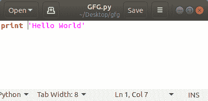
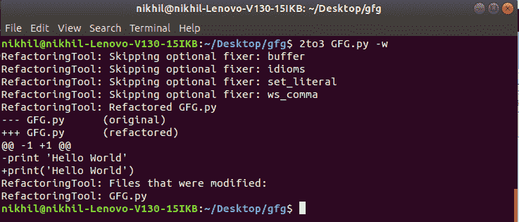
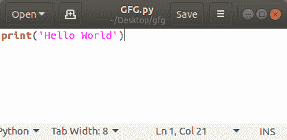

# 自动完成从蟒 2 到蟒 3 的转换

> 原文:[https://www . geeksforgeeks . org/自动化从 python2 到 python3 的转换/](https://www.geeksforgeeks.org/automate-the-conversion-from-python2-to-python3/)

我们可以使用 **2to3** 模块将 Python2 脚本转换为 Python3 脚本。它将 Python2 语法更改为 Python3 语法。我们可以将特定文件夹中的所有文件从 python2 更改为 python3。

#### 装置

这个模块没有内置 Python。要安装此软件，请在终端中键入以下命令。

```py
pip install 2to3
```

**语法:**

```py
2to3 [file or folder] -w
```

如果我们想将当前打开的文件夹中的所有文件和子文件夹中的所有文件从 Python2 更改为 Python3，请键入以下命令。

```py
2to3.-w
```

如果我们想将当前文件夹中的特定文件从 Python2 更改为 Python3，请输入以下命令。

```py
2to3 gfg.py -w
```

**示例:**考虑一个简单的 Python2 文件。



要将此文件从 Python2 转换为 Python3，请在包含该文件的目录中打开终端，并键入以下命令。



Python 文件现在将转换为 Python3。让我们看看文件。

