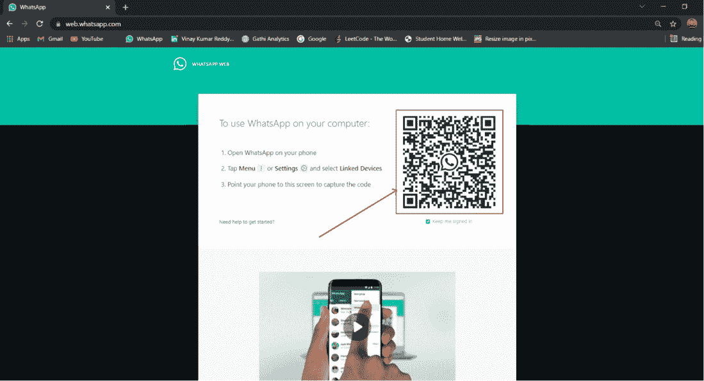

# 使用 Pywhatkit 模块使用 Python 自动处理 WhatsApp 消息

> 原文:[https://www . geesforgeks . org/automate-whatsapp-messages-with-python-use-pywhatkit-module/](https://www.geeksforgeeks.org/automate-whatsapp-messages-with-python-using-pywhatkit-module/)

我们可以自动化一个 Python 脚本来发送 WhatsApp 消息。在本文中，我们将学习使用 pywhatkit 模块的最简单方法，web.whatsapp.com 网站使用该模块自动向任何 WhatsApp 号码发送消息。

## **安装 pywhatkit 模块:**

pywhatkit 是一个 python 模块，用于在某个时间发送 Whatsapp 消息。要安装 pywhatkit 模块，请在集成开发环境/编译器中键入以下命令:

```py
pip install pywhatkit
```

该命令将下载 pywhatkit 模块。它会导致一些延迟，因为它也会下载一些相关的模块。

## **使用 pywhatkit 模块:**

要使用这个 python 库在特定时间在 WhatsApp 上自动发送消息，我们需要一个 chrome 浏览器，并且您必须让您的 WhatsApp 登录到 web.whatsapp.com 网站。

如果您没有 chrome 浏览器，则可以按照以下步骤操作:

*   从这里(https://chrome driver . chrome . org/)下载并解压当前稳定发布的 chrome 驱动程序。
*   打开下载的文件，搜索一个名为 chrome drive 的应用程序，复制它的路径，对于 windows，它应该是这样的——C:/Users/…/chrome driver . exe。
*   然后调用函数 pywhatkit.add_driver_path(path)并将复制的路径作为参数传递，如果路径有效，一个黑色窗口连同 chrome 将会打开和关闭。
*   接下来调用函数 pywhatkit.load_QRcode()并扫描 QR 码。

### **下面是实现:**

## 计算机编程语言

```py
import pywhatkit

pywhatkit.sendwhatmsg("+919xxxxxxxxx",
                      "Geeks For Geeks!",
                      18, 30)
```

**输出:**

<video class="wp-video-shortcode" id="video-700347-1" width="640" height="360" preload="metadata" controls=""><source type="video/mp4" src="https://media.geeksforgeeks.org/wp-content/uploads/20211020132917/auto_whatapps.mp4?_=1">[https://media.geeksforgeeks.org/wp-content/uploads/20211020132917/auto_whatapps.mp4](https://media.geeksforgeeks.org/wp-content/uploads/20211020132917/auto_whatapps.mp4)</video>

### 解释:

*   在上面的脚本中，我们指定了要发送消息的收件人电话号码，然后是要发送的消息，然后是必须发送消息的时间。该功能遵循 24 小时时间格式，因此时间 18:30 是下午 06:30。
*   此外，在运行脚本时，您应该提供当前时间的至少 2-3 分钟的未来时间，因为如果您将时间设置为当前时间的 1-2 分钟，则模块会给出一个错误。
*   在运行脚本之前，请确保您已经登录到谷歌 chrome 中的 WhatsApp 网站。登录 WhatsApp 网站，进入[这个](https://web.whatsapp.com/)链接，用你使用 WhatsApp 的手机扫描二维码。



现在只需运行最后的脚本来发送一条 WhatsApp 消息。运行脚本后，它会让你知道你的 WhatsApp 将在几秒钟后打开，以及你的消息将在什么特定时间发送。几秒钟后，这个脚本将自动打开 WhatsApp，并将消息发送给指定的收件人。

例如，

> 51 秒后，web.whatsapp.com 将开放，20 秒后将传递信息

### 执行过程中可能会遇到的一些错误消息:

1.安装 Pywhatkit 模块时，您可能会遇到以下错误消息:

> 找不到 zlib 的头文件或库文件，这是从源编译枕头时必需的依赖项

**解决方法:**升级 pip 和抱枕。分别运行以下代码:

2.从 0 开始指定分钟参数。例如下午 6:08 作为 18，08。您将得到一个语法错误:

> "语法错误:不允许在十进制整数文本中使用前导零；对八进制整数使用 0o 前缀。

**解决方案:**用 0 以外的数字开始你的分钟辩论。

3.如果您要向其发送消息的收件人电话号码没有国家/地区代码。您会得到这个错误:

> "国家代码异常(“电话号码中缺少国家代码”)"
> 
> " pywhatkit . main functions . Country code 异常:电话号码中缺少国家代码"

**解决方案:**包括每个电话号码的国家代码。例如+234、+44、+1。

4.当你上网速度慢的时候，你的信息不会被发送。您将收到以下错误消息:

> 发出警告(“互联网速度慢，提取信息可能需要更长时间”)
> 
> 警告:互联网速度很慢，提取信息可能需要更长时间

**解决方案:**使用强大的互联网连接。