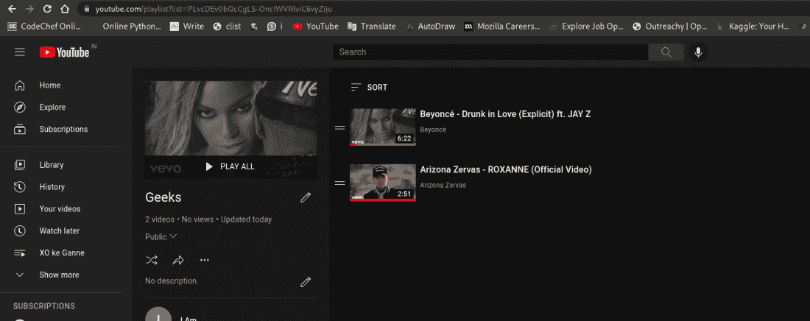
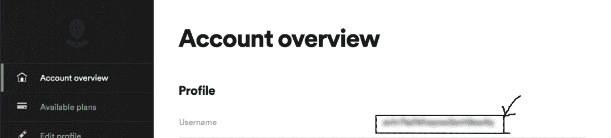
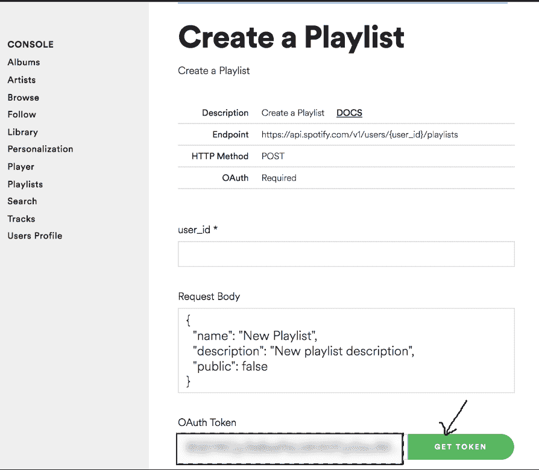
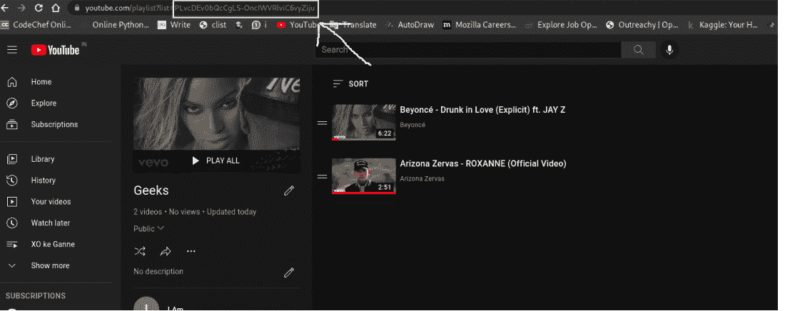

# 使用 Python 自动将 YouTube 音乐转换为 Spotify】

> 原文:[https://www . geesforgeks . org/automate-YouTube-music-to-Spotify-with-python/](https://www.geeksforgeeks.org/automate-youtube-music-to-spotify-with-python/)

有时我们在 YouTube 音乐上听一首歌，我们真的发现那首歌很有趣，你想把它添加到你的 Spotify 播放列表中。然后您手动搜索该歌曲，将其添加到 Spotify 播放列表中。但是我们可以自动化搜索 YouTube 歌曲的过程，并使用 python 编程将它们添加到 Spotify 播放列表中。在本文中，我们将学习如何使用 Python 将 YouTube 音乐添加到 Spotify 播放列表的过程自动化。

## **要求:**

*   系统上应该安装 Python 3 或更高版本。
*   Youtube 数据应用编程接口凭据
*   Spotify API 凭据
*   用于提取曲目名称和艺术家姓名的 Youtube dl

## **进场:**

*   首先，我们将使用这个 [**YouTube API 搜索并列出用户 **YouTube 播放列表**中的歌曲。**](https://developers.google.com/youtube/v3/docs/playlistItems/list)
*   保存歌曲信息即歌曲名称和艺人名称后，我们将使用此[**Spotify API**](https://developer.spotify.com/console/get-search-item/?q=tania+bowra&type=artist)**在 Spotify 上搜索此信息，并将数据保存到列表**中。****
*   **在第三步中，我们将使用这个 Spotify 应用编程接口在用户帐户中创建一个播放列表。**
*   **在第四步也是最后一步**、**中，我们将遍历我们在步骤 2 中创建的歌曲列表，并使用 Spotify API 将这些歌曲添加到在步骤 3 中创建的播放列表中。**

****注意:**我们将需要一个谷歌账户和一个 Spotify 账户来生成凭证，以自动将音乐从 YouTube 传输到 Spotify。**

****这是我们将要同步到 Spotify 音乐中的 YouTube 播放列表:****

**

优酷播放列表** 

## ****分步实施:****

****步骤 1:** 为 Spotify API 和 YouTube API 生成凭证。浏览以下链接并按照说明进行操作。**

**生成 Spotify 凭据并保存您的用户 ID 以备将来使用，转到[此链接](https://www.spotify.com/us/account/overview/)，系统可能会提示您使用您的 Spotify 帐户详细信息登录并登录。而你的用户名就是你的用户标识。将此用户标识保存在您的桌面上。**

**

用户标识** 

**转到[此链接](https://developer.spotify.com/console/post-playlists/)以生成用于身份验证的令牌，然后单击生成令牌并将此令牌保存在您桌面上的某个位置:**

**

正在保存 OAuth 令牌** 

**同样，我们也必须生成一个 YouTube OAuth 令牌，只需按照[这些指令](https://developers.google.com/youtube/v3/getting-started/)来生成令牌。**

****步骤 2:** 列出播放列表中用户想要与 **S** potify 播放列表同步的所有歌曲。为此，我们需要将特定播放列表的播放列表**标识**与 **S** potify 播放列表同步。**

**

播放列表编号** 

**这里突出显示的是**播放列表** ID。现在，我们只需要使用这个[你搜索应用编程接口](https://developers.google.com/youtube/v3/docs/playlistItems/list)列出我们在这个播放列表中的所有歌曲。**

****代码:****

## **蟒蛇 3**

```
import os
import google_auth_oauthlib.flow
import googleapiclient.discovery
import googleapiclient.errors

scopes = ["https://www.googleapis.com/auth/youtube.readonly"]

def main():

    # Disable OAuthlib's HTTPS
    # verification when running locally.
    # *DO NOT* leave this option
    # enabled in production.
    os.environ["OAUTHLIB_INSECURE_TRANSPORT"] = "1"

    api_service_name = "youtube"
    api_version = "v3"
    client_secrets_file = "YOUR_CLIENT_SECRET_FILE.json"

    # Get credentials and create an API client
    flow = google_auth_oauthlib.flow.InstalledAppFlow.from_client_secrets_file(
        client_secrets_file, scopes)
    credentials = flow.run_console()
    youtube = googleapiclient.discovery.build(api_service_name,
                                              api_version,
                                              credentials=credentials)

    request = youtube.playlistItems().list(
        part="snippet",
        playlistId="PLvcDEv0bQcCgLS-OncIWVRlviC6vyZiju"
    )
    response = request.execute()

    print(response)

if __name__ == "__main__":
    main()
```