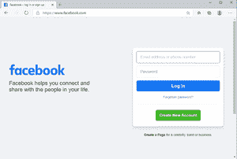

# Python 中边缘和硒的自动化浏览器测试

> 原文:[https://www . geesforgeks . org/automatic-browser-testing-with-edge-and-selenium-in-python/](https://www.geeksforgeeks.org/automated-browser-testing-with-edge-and-selenium-in-python/)

在软件行业，跨浏览器测试是强制性的。我们都知道有很多浏览器，像火狐、Chrome、Edge、Opera 等。，都是可用的。与其为每一个浏览器编写单独的代码，倒不如走向自动化测试。让我们看看如何在 Python 中使用 Selenium for Edge 浏览器来实现这一点。这里使用边缘网络驱动程序，以便通过边缘浏览器运行我们的硒自动化测试脚本。

### 要求:

为了使用 Python 中的边缘和硒执行浏览器自动化，我们需要执行以下步骤:

*   **边缘浏览器:**微软边缘浏览器可从[https://www.microsoft.com/en-us/edge](https://www.microsoft.com/en-us/edge)下载。如果已经安装，我们可以使用 edge://version/
*   **Selenium 框架:** Selenium 是通过程序控制网页浏览器的强大工具。它适用于所有浏览器，适用于所有主要操作系统。可以使用以下命令安装:

```py
pip install selenium
```

*   **边缘网络驱动:**硒边缘网络驱动可以从这个[网址](https://developer.microsoft.com/en-us/microsoft-edge/tools/webdriver/#downloads)下载。使用这个驱动程序，自动测试将在边缘浏览器中完成。根据操作系统下载 edge 网络驱动，解压文件得到*msedgedriver.exe。*
*   **微软 Edge 的 Selenium 工具:**该模块具备自动化浏览器测试所需的功能，可以使用以下命令进行安装:

```py
pip install msedge-selenium-tools selenium==3.141
```

下面是一个执行简单的自动化浏览器测试脚本的程序:

## 蟒蛇 3

```py
# import required modules
from selenium import webdriver

# Driver Code
if __name__ == '__main__':

    # create object
    edgeBrowser = webdriver.Edge(r"msedgedriver.exe")

    # open browser and navigate to facebook
    edgeBrowser.get('https://www.facebook.com')
```

**输出:**



边缘打开 facebook 页面

在执行脚本时，我们可以看到，edge 浏览器已经打开了如图所示的脸书页面。您可以打开任何有效的网页，它会自动在边缘浏览器中打开所提到的网页。

### **分步方法:**

*   边缘浏览器打开。
*   它变得最大化。
*   它打开一个网页(这里是 www.lambdatest.com)。
*   它将用户电子邮件视为*gfg@lambdatest.com。*
*   点击提交按钮，开始免费测试表单中的按钮，它将导航到下一页，网址为*https://accounts.lambdatest.com/register?email=gfg@lambdatest.com。*

如果我们想知道一个网页的每个组件的 *id* ，我们可以通过*查看页面源*或者*查看*相应的部分来获取。

### **实施:**

## 蟒蛇 3

```py
# Import required module
from selenium.webdriver.opera.options import Options
from selenium.webdriver.chrome.options import Options
from selenium.webdriver.support.ui import WebDriverWait
from selenium.webdriver.common.by import By
from selenium.webdriver.support.wait import WebDriverWait
from selenium.webdriver.support import expected_conditions as EC
from selenium.common.exceptions import TimeoutException
from selenium import webdriver
from time import sleep

# Driver Code
if __name__ == '__main__':

    # Instantiate the webdriver with the executable location of MS Edge
    # Provide the full location of the path to recognise correctly
    edgeBrowser = webdriver.Edge(r"msedgedriver.exe")

    # This is the step for maximizing browser window
    edgeBrowser.maximize_window()

    # Browser will get navigated to the given URL
    edgeBrowser.get('https://www.lambdatest.com')
    try:
        # We need to insert Email in order to proceed further. 
        # So it is given by using 'useremail'
        sampleElement = WebDriverWait(browser, 10).until(
            EC.presence_of_element_located((By.ID, 'useremail')))

        # We can give a valid email address and since 
        # this page carries the email id alone, it just 
        # appends the email id at the end
        sampleElement.send_keys("gfg@lambdatest.com")

        # A click is happening to move to next page
        sampleElement.click()

        # A Submit button is searched to click and start 
        # free testing. Actually "testing_form" is the id 
        # of the form, which needs to get tested
        sampleElement2 = WebDriverWait(browser, 10).until(
            EC.element_to_be_clickable((By.CSS_SELECTOR, 
                                        "#testing_form > div")))

        # Starting free testing on LambdaTest
        sampleElement2.click()

        # Just to show the set of actions happening, we can 
        # give sleep, U can change the values as per requirement
        sleep(20)
    except TimeoutException:
        print("Trying to find the given element but unfortunately no element is found")
    sleep(20)
    # Once all operations over, we can close browser too
    # edgeBrowser.close()
```

**输出:**

<video class="wp-video-shortcode" id="video-539380-1" width="640" height="360" preload="metadata" controls=""><source type="video/mp4" src="https://media.geeksforgeeks.org/wp-content/uploads/20210108180343/explanation-of-steps.mp4?_=1">[https://media.geeksforgeeks.org/wp-content/uploads/20210108180343/explanation-of-steps.mp4](https://media.geeksforgeeks.org/wp-content/uploads/20210108180343/explanation-of-steps.mp4)</video>

自动化浏览器测试非常方便，因为每个浏览器都有单独的驱动程序，所以我们可以轻松地进行测试，不需要手动操作。甚至自动化测试也更快，可以非常快速地测试多个测试页面，并提供成功的测试结果。