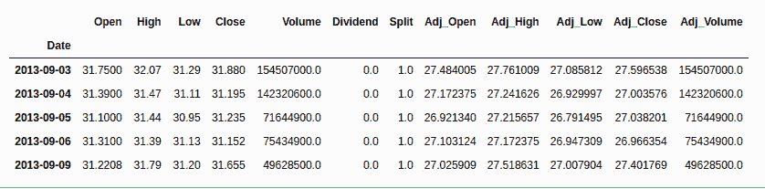
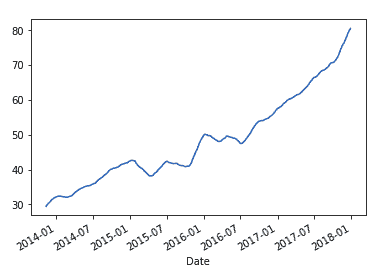
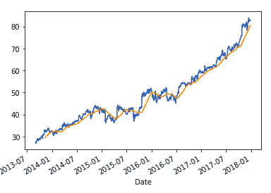

# 使用 Python 的自动交易

> 原文:[https://www . geesforgeks . org/automatic-trading-use-python/](https://www.geeksforgeeks.org/automated-trading-using-python/)

使用 Python 加快了交易过程，因此它也被称为自动交易/定量交易。Python 的使用归功于其功能强大的库，如 TA-Lib、Zipline、Scipy、Pyplot、Matplotlib、NumPy、Pandas 等。探索手头的数据叫做数据分析。从 Python 开始。我们将首先学习使用 Quandl API 提取数据。


使用以前的数据将是我们回溯测试策略的关键。一个策略在特定环境下如何运作只能通过历史数据来理解。我们使用历史数据是因为随着时间的推移，股票市场的趋势往往会重演。

## 设置工作环境

最简单的入门方法是安装 Anaconda。Anaconda 是 Python 的一个发行版，它提供了不同的 ide，如 Spyder、Jupyter、__、___ 等。

### 安装 Quandl

Quandl 将帮助我们检索股票的历史数据。要安装 quandl，请在终端中键入以下命令–

```py
pip install quandl
```

**注意:**Quandl Python 模块是免费的，但是你必须有一个 Quandl API 密钥才能下载数据。要获得您自己的应用编程接口密钥，您需要创建一个免费的 [Quandl 帐户](https://www.quandl.com/users/login)并设置您的应用编程接口密钥。

### 导入包

一旦安装了 Quandl，下一步就是导入包。我们将在本教程中严格使用熊猫，因为回溯测试需要大量的数据操作。

```py
import pandas as pd
import quandl as qd

```

导入包后，我们将使用 API 键从 Quandl 中提取数据。

```py
qd.ApiConfig.api_key = "<API key>”

```

## 使用 Quandl 提取数据

## 蟒蛇 3

```py
import pandas as pd
import quandl as qd

qd.ApiConfig.api_key = "API KEY"

msft_data = qd.get("EOD/MSFT",
                   start_date="2010-01-01",
                   end_date="2020-01-01")
msft_data.head()
```

**输出:**



上述代码将提取 2010 年 1 月 1 日至 2020 年 1 月 1 日的 MSFT 股票数据。data.head()将显示前 5 行数据。

**重要术语:**一个人应该了解数据所代表和描绘的是什么。

*   **开盘价/收盘价–**股票的开盘价和收盘价。
*   **高/低–**股票在某一天达到的最高和最低价格。
*   **Adj _ High/Adj _ Close–**当前股息分配、股票拆分或其他公司行为对历史数据的影响。

### 计算回报

回报只是交易者/投资者使用多头或空头头寸后股票获得的利润或遭受的损失。我们只需使用函数 pct_change()

## 蟒蛇 3

```py
# Import numpy package
import numpy as np

# assign `Adj Close` to `close_price`
close_price = msft_data[['Adj_Close']]

# returns as fractional change
daily_return = close_price.pct_change()

# replacing NA values with 0
daily_return.fillna(0, inplace=True)

print(daily_return)
```

**输出:**

```py
            Adj_Close
Date                 
2013-09-03   0.000000
2013-09-04  -0.021487
2013-09-05   0.001282
2013-09-06  -0.002657
2013-09-09   0.016147
...               ...
2017-12-21  -0.000234
2017-12-22   0.000117
2017-12-26  -0.001286
2017-12-27   0.003630
2017-12-28   0.000117

[1090 rows x 1 columns]
```

**日回报中使用的公式**=(t 时价格–1 时价格)/1 时价格(任何给定时间 t 时价格–开盘价)/开盘价

### 移动平均线

移动平均线的概念将为我们基于动量的贸易策略奠定基础。对于金融而言，分析师还需要在一个称为移动周期计算的滑动时间段内不断测试统计指标。让我们看看滚动平均值是如何在 50 天的窗口内计算出来的，然后将窗口滑动 1 天。

## 蟒蛇 3

```py
# assigning adjusted closing prices 
# to adj_prices
adj_price = msft_data['Adj_Close']

# calculate the moving average
mav = adj_price.rolling(window=50).mean()

# print the result
print(mav[-10:])
```

```py
Date
2017-12-14    78.769754
2017-12-15    78.987478
2017-12-18    79.195540
2017-12-19    79.387391
2017-12-20    79.573250
2017-12-21    79.756221
2017-12-22    79.925922
2017-12-26    80.086379
2017-12-27    80.249752
2017-12-28    80.414472
Name: Adj_Close, dtype: float64

```

移动平均线有助于消除任何数据异常或峰值，并为您提供公司业绩的平滑曲线。

**作图，看区别:**

## 蟒蛇 3

```py
# import the matplotlib package 
# to see the plot
import matplotlib.pyplot as plt

adj_price.plot()
```

**输出:**


**观察差异:**

## 蟒蛇 3

```py
mav.plot()
```

**输出:**



**将它们绘制在一起:**

## 蟒蛇 3

```py
# import the matplotlib package 
# to see the plot
import matplotlib.pyplot as plt

adj_price.plot()
mav.plot()
```

**输出:**

