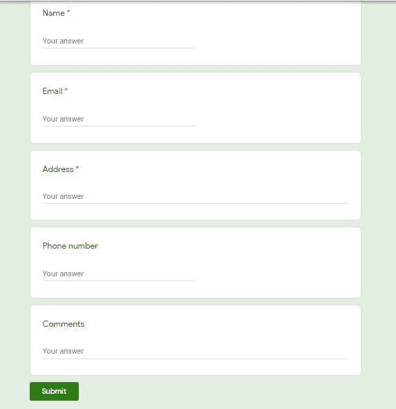

# 使用 Selenium 和 Python 自动将多个响应填充到谷歌表单中

> 原文:[https://www . geesforgeks . org/automatic-filling-multi-respons-in-a-Google-form-with-selenium-and-python/](https://www.geeksforgeeks.org/automatically-filling-multiple-responses-into-a-google-form-with-selenium-and-python/)

**先决条件:** [硒](https://www.geeksforgeeks.org/selenium-python-basics/)

Selenium 是通过程序控制网络浏览器和执行浏览器自动化的强大工具。它适用于所有浏览器，在所有主要操作系统上工作，其脚本是用各种语言编写的，即 [Python](https://www.geeksforgeeks.org/python-programming-language/) 、 [Java](https://www.geeksforgeeks.org/java/) 、 [C#](https://www.geeksforgeeks.org/csharp-programming-language/) 等..我们将使用 Python。硒教程涵盖了所有主题，如-网络驱动程序，网络元素，单元测试与硒。

这里的任务是使用 python 中的 selenium 用相同的谷歌表单填充多个响应。本例中使用的谷歌表单链接如下:

**表格链接–**[点击此处](https://forms.gle/vWVmojtWdfFvEj8V6)



**谷歌表单**

该表单有五个条目:

*   名字
*   电子邮件
*   地址
*   电话号码
*   评论

姓名、电子邮件和电话号码具有相同的类名*quantumwiztextinputapeinput*和地址& Comments 具有相同的类名*quantumwiztextinputapetextareinput。*数据以列表形式出现。

给定的程序还使用计数，原因是文本框包含一个列表，其类名为“quantumWizTextinputPaperinputInput”，而 textareaboxes 包含一个列表，其类名为“quantumwiztextinputapertextareinput”，当这两个类被添加时，它会生成一个列表。数据也以列表的形式提供，因此计数变量将随着每个数据变量而增加。

**示例:**

> #数据值
> 
> [姓名、电子邮件、电话号码、地址、评论]
> 数据= [
> ['Mary D Joiner '，' MaryDJoiner@gmail.com '，' 4079025063 '，' Maitland 麦当劳大道 2474 号'，' NA '，
> ['Karen B Johnson '，' KarenBJohnson @ gmail.com '，' 3153437575 '，' GRAND ISLE 橡树街 2143 号'，' NA '，
> ]

### 方法

为了实现我们所需的功能，需要按照完美的顺序执行给定的步骤:

*   导入硒和时间模块
*   添加 chrome 驱动程序路径和表单网址
*   添加一些延迟，直到页面完全加载
*   以列表的形式添加数据
*   迭代每个数据并填充细节
*   关窗

**程序:**

## 蟒蛇 3

```
# Import Module
from selenium import webdriver
from selenium.webdriver.common.keys import Keys
import time

# open Chrome
driver = webdriver.Chrome(
    'C:/Users/HP/Desktop/Drivers/chromedriver_win32/chromedriver.exe')

# Open URL
driver.get('https://forms.gle/vWVmojtWdfFvEj8V6')

# wait for one second, until page gets fully loaded
time.sleep(1)

# Data
datas = [
    ['Mary D Joiner', 'MaryDJoiner@gmail.com', '4079025063',
        '2474  McDonald Avenue,Maitland', 'NA'],
    ['Karen B Johnson', 'KarenBJohnson@gmail.com',
        '3153437575', '2143  Oak Street,GRAND ISLE', 'NA'],
]

# Iterate through each data
for data in datas:
    # Initialize count is zero
    count = 0

    # contain input boxes
    textboxes = driver.find_elements_by_class_name(
        "quantumWizTextinputPaperinputInput")

    # contain textareas
    textareaboxes = driver.find_elements_by_class_name(
        "quantumWizTextinputPapertextareaInput")

    # Iterate through all input boxes
    for value in textboxes:
        # enter value
        value.send_keys(data[count])
        # increment count value
        count += 1

    # Iterate through all textareas
    for value in textareaboxes:
        # enter value
        value.send_keys(data[count])
        # increment count value
        count += 1

    # click on submit button
    submit = driver.find_element_by_xpath(
        '//*[@id="mG61Hd"]/div[2]/div/div[3]/div[1]/div/div/span/span')
    submit.click()

    # fill another response
    another_response = driver.find_element_by_xpath(
        '/html/body/div[1]/div[2]/div[1]/div/div[4]/a')
    another_response.click()

# close the window
driver.close()
```

**输出:**

<video class="wp-video-shortcode" id="video-522262-1" width="640" height="360" preload="metadata" controls=""><source type="video/mp4" src="https://media.geeksforgeeks.org/wp-content/uploads/20201129172534/FreeOnlineScreenRecorderProject4.mp4?_=1">[https://media.geeksforgeeks.org/wp-content/uploads/20201129172534/FreeOnlineScreenRecorderProject4.mp4](https://media.geeksforgeeks.org/wp-content/uploads/20201129172534/FreeOnlineScreenRecorderProject4.mp4)</video>