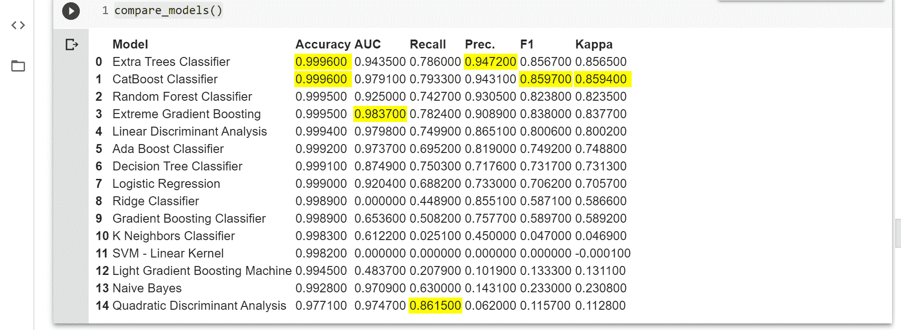
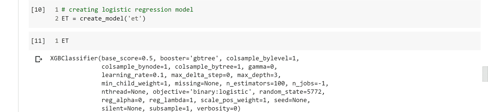
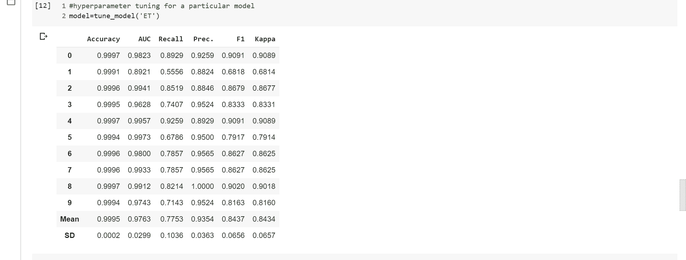
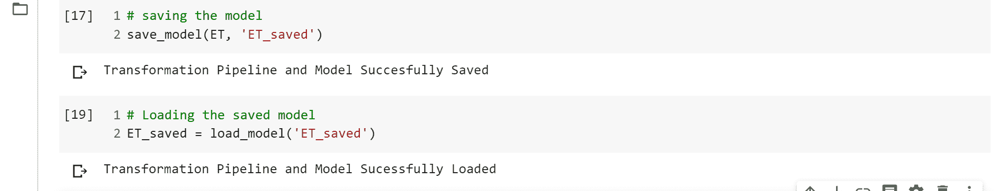

# 信用卡欺诈检测的机器学习管道自动化

> 原文:[https://www . geeksforgeeks . org/自动化机器学习-信用卡欺诈检测管道/](https://www.geeksforgeeks.org/automating-the-machine-learning-pipeline-for-credit-card-fraud-detection/)

在进入代码之前，需要在 Jupyter 笔记本或 ipython 笔记本上工作。如果没有安装在你的机器上，你可以使用[谷歌 Collab](https://colab.research.google.com/) 。这是处理 python 脚本处理机器学习问题的最佳方式之一，也是我个人最喜欢的方式
**数据集链接:**
您可以从这个[链接](https://www.kaggle.com/mlg-ulb/creditcardfraud/download)下载数据集
如果链接不工作，请转到这个链接并登录 Kaggle 下载数据集。

**上一篇文章:** [使用 Python 进行信用卡欺诈检测](https://www.geeksforgeeks.org/ml-credit-card-fraud-detection/)

现在，我考虑到你已经阅读了前面的文章，没有作弊，所以让我们继续。在本文中，我将使用一个名为 [Pycaret](https://pycaret.org/) 的库，它为我完成了所有繁重的工作，让我用几行代码并排比较最好的模型，如果你还记得的话，第一篇文章花了我们大量的代码和永恒来比较。除了保持 75%的出席率和超参数调整之外，我们还能够在这个星系中做最麻烦的工作，这需要几天时间和大量代码，只需几分钟，几行代码。如果你说这篇文章将是你一会儿就会读到的一篇简短而最有效的文章，那就不会错。所以坐下来放松一下，让乐趣开始吧。

首先安装您在本文中需要的最重要的东西，Pycaret 库。这个图书馆会为你节省一大笔钱，因为你知道时间就是金钱，对吧。

要在您的 Ipython 笔记本中安装 lib，请使用–

> pip 安装 pycaret

**Code: Importing the necessary files**

```py
# importing all necessary libraries
# linear algebra
import numpy as np 
# data processing, CSV file I / O (e.g. pd.read_csv)
import pandas as pd 
```

**代码:加载数据集**

```py
# Load the dataset from the csv file using pandas 
# best way is to mount the drive on colab and  
# copy the path for the csv file 
path ="credit.csv"
data = pd.read_csv(path) 
data.head()
```

**代码:知道数据集**

```py
# checking for the imbalance 
len(df[df['Class']== 0])
```

```py
len(df[df['Class']== 1])
```

**代码:设置 pycaret 分类**

```py
# Importing module and initializing setup
from pycaret.classification import * clf1 = setup(data = df, target = 'Class')
```

之后，需要确认才能继续。按**进入**继续编码。
检查库是否正确识别了所有参数类型。
告诉分类器将要进行的训练和验证分割的百分比。我拿了 80%的训练数据，这在机器学习中很常见。

来到下一个单元，这是图书馆最重要的特色。它允许对训练数据进行拟合，并与库中的所有算法进行比较，以选择最佳算法。它显示哪个模型是最好的，在什么评估矩阵中。当数据不平衡时，准确性并不总是告诉你真实的故事。我查了精度，但 AUC、F1、Kappa 评分对分析车型也能有很大帮助。但这将是一篇文章。

**代码:对比模型**

```py
# command used for comparing all the models available in the library
compare_models()
```

**输出:**



黄色部分是对应型号的最高分。

取一个在比较中表现良好的算法，并为其创建一个模型。算法的名称可以在创建模型下的 [pycaret 库的文档中找到](https://pycaret.org/create-model/)

**代码:创建最佳模型**

```py
# creating logistic regression model
ET = create_model('et')
```

**代码:显示模型参数**

```py
# displaying the model parameters
ET
```

**输出:**

**代码:超参数调谐**

```py
# hyperparameter tuning for a particular model
model = tune_model('ET')
```

**输出:**


**代码:保存模型**

经过一个又一个小时的模型训练和超级调整，最糟糕的事情可能会发生在你身上，模型会随着会话超时的发生而消失。为了把你从这场噩梦中拯救出来，让我给你一个你永远不会忘记的诀窍。

```py
# saving the model
save_model(ET, 'ET_saved')
```

**代码:加载模型**

```py
# Loading the saved model
ET_saved = load_model('ET_saved')
```

**输出:**


**编码:定型**

部署前的一个步骤，在所有可用数据上合并训练和验证数据以及训练模型。

```py
# finalize a model
final_rf = finalize_model(rf)
```

**部署**模型部署在 AWS 上。如需相同的设置，请访问[文档](https://pycaret.org/deploy-model/)

```py
# Deploy a model
deploy_model(final_lr, model_name = 'lr_aws', platform = 'aws', authentication = { 'bucket'  : 'pycaret-test' })
```