# 复仇者联盟游戏和深度学习|使用复仇者联盟游戏角色生成图像标题

> 原文:[https://www . geesforgeks . org/复仇者联盟-endgame-and-deep-learning/](https://www.geeksforgeeks.org/avengers-endgame-and-deep-learning/)

看，漫威球迷。复仇者联盟在那里拯救多元宇宙，我们也是，准备不惜一切代价*支持他们*。
在本文中，我们将使用深度学习和计算机视觉来生成复仇者联盟游戏角色的字幕。我们将从基础开始，解释概念，并使用预先训练的模型来实施项目。

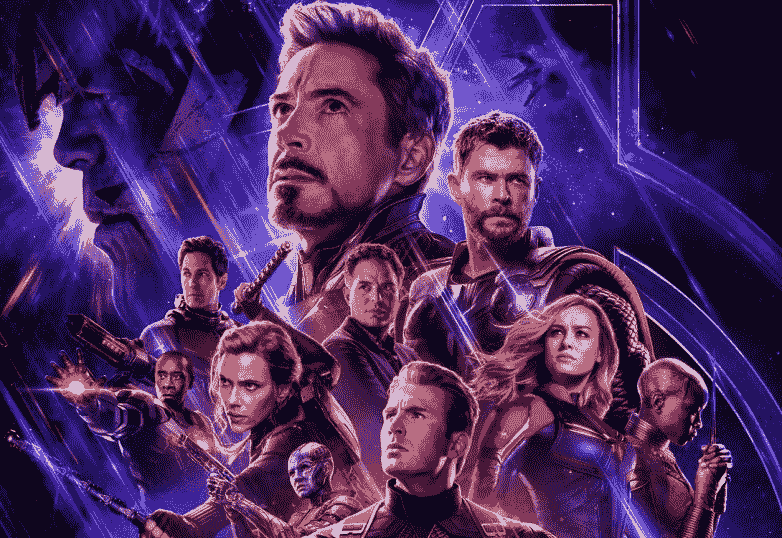

### 概述:

图像标题生成是人工智能中一个具有挑战性的问题，它将计算机视觉和自然语言处理联系在一起，必须为给定的照片生成文本描述。一般来说，对于给定的图像作为输入，我们的模型描述了图像的精确描述。它既需要卷积神经网络这一计算机视觉领域的图像理解，又需要自然语言处理领域的语言模型。
假设并测试多种方法来框定给定的预测建模问题是很重要的，并且确实有许多方法来框定为照片生成标题的问题。我们坚持一个我们将在本文末尾解释的观点，所以坚持一段时间。你能握住**雷神锤吗！！！**T3【不】T4！！但你可以留在这里，开个玩笑。

因此，基本上我们的模型所做的是，当我们将一幅图像传递给我们的 CNN 和 RNN 组合架构时，它将使用自然语言处理生成图像的自然描述。

> 我们展示了一个基于深度递归神经架构的生成模型，它与机器翻译相结合，可以用来生成描述图像的自然句子。该模型被训练来最大化给定训练图像的目标描述句子的可能性。在各种数据集上的实验显示了模型的准确性和语言的流畅性，它仅从图像描述中学习。

**例:**
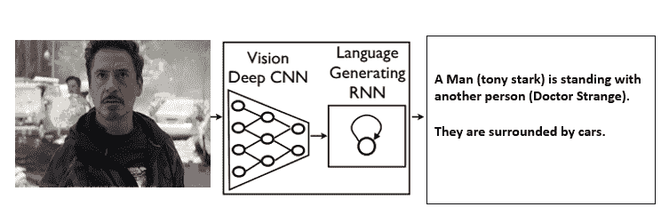

在深入讨论之前，让我们先了解理解该算法所需的基本术语。

它们基本上是两种类型:

**基于图像的模型:**从图像中提取特征。
**基于语言的模型:**它将我们基于图像的模型给出的特征和对象翻译成自然的句子。

压缩特征向量由**卷积神经网络**形成。一般来说，这个特征向量被称为 ***嵌入*** ，而 CNN 模型被称为 ***编码器*** ，该编码器对给定的一组字进行编码，并生成传递给解码器网络的序列。在下一步中，我们将使用这些来自 CNN 层的嵌入作为输入到 ***LSTM 网络*** 中，这是一个解码器，它对输入序列进行解码并生成输出。

**例如:**像法语到英语这样的语言翻译。

在一个**句子语言模型**中，LSTM 正在预测一个句子中的下一个单词。给定图像的初始嵌入，训练 LSTM 来预测序列的最可能的下一个值。这就像给一个人看一堆图像，让他们记住图像的细节，然后给他们看一个新的图像，这个图像的内容和之前的图像相似，让他们回忆一下内容。这个“回忆”和“记住”的工作是由我们的 LSTM 网络完成的，它在这里要有用得多。稍后当我谈到实现部分时，我将向您展示它实际上是如何工作的。

在本文中，我们将使用在 ImageNet 数据集上训练的预训练卷积神经网络。图像被转换为标准分辨率 **224 X 224 X 3** (nh x hw x nc)，这将使任何给定图像的模型的输入恒定。

技术上，我们还插入**开始**和**停止**来表示字幕结束。

**示例:**

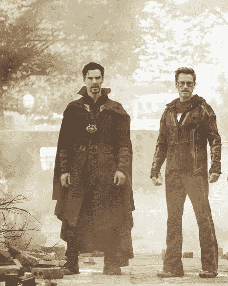

> 如果图像描述为**“托尼·斯塔克与奇异博士站在一起”**，则源序列为包含**【】*(开始)*、【托尼】、【斯塔克】、【是】、【站着】、【跟着】、【医生】、【奇怪】**的列表，目标序列为包含**【【托尼】、【斯塔克】、【是】、【站着】、【跟着】、【医生】、【奇怪】、*(结束)*】**。使用这些源和目标序列以及特征向量， **LSTM 解码器**被训练为以特征向量为条件的语言模型。

下图更好地解释了–

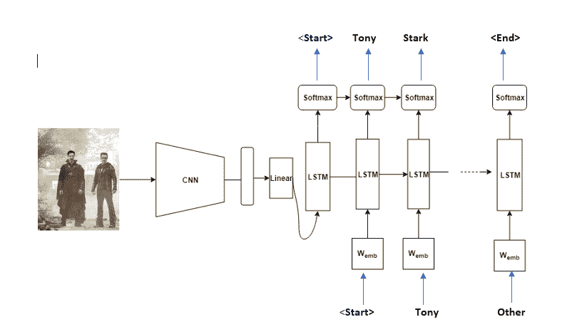

**测试阶段:**
在测试阶段，**编码器部分**与训练阶段几乎相同。唯一不同的是 **[批处理图层](https://keras.io/layers/normalization/)** 使用的是方差和平均值，而不是小批量统计。这可以使用 **encoder.eval()** 功能轻松实现。对于**解码器部分**，训练阶段和测试阶段有着至关重要的区别。在测试阶段，LSTM 解码器无法观察到图像描述。为了处理这种情况，LSTM 解码器将先前生成的字反馈给下一个输入。这可以使用 for 循环来实现。

**基本有两种字幕生成模型:**

### 模型 1:

**生成整个序列:**第一种方法包括为给定图像的对象生成整个文本描述。

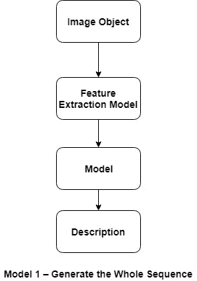

```
 Input: Photograph 
 Output: Complete textual description.

```

这是一个一对多序列预测模型，以一次性方式生成整个输出。

*   这种模型给语言模型带来了沉重的负担，要以正确的顺序生成正确的单词。
*   图像通过特征提取模型，例如在图像网数据集上预先训练的模型。
*   一种热编码用于输出序列，这允许模型预测序列中每个单词在整个词汇表上的概率分布。
*   所有序列都被填充到相同的长度，这意味着模型被迫在输出序列中生成多个“无词”时间步长。
*   测试这种方法时，我们发现需要一个非常大的语言模型，即使这样也很难通过生成持久性的 NLP 等价物的模型，**示例:**生成整个序列长度重复的相同单词作为输出。

### 模型 2:

**从单词生成单词:**这是一种不同的方法，其中 LSTM 给定一个图像和一个单词作为输入，生成一个单词的预测。

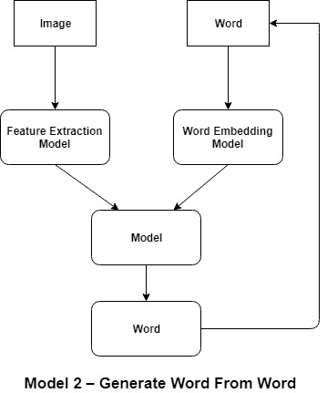

```
 Input 1: Image 
 Input 2: Previously generated word or start of sequence token. 
 Output:  Next word in sequence.

```

这是一个一对一的序列预测模型，它通过递归调用模型来生成文本描述。

*   一个单词输入或者是在第一次调用模型的情况下指示序列开始的标记，或者是从上一次调用模型时生成的单词。
*   图像通过一个特征提取模型，就像在 ImageNet 数据集上预先训练的模型一样，输入的单词通过单词嵌入进行整数编码。
*   输出单词是一种热编码，它允许模型预测整个词汇中单词的概率。
*   递归单词生成过程不断重复，直到生成序列结束标记。
*   通过测试这种方法，我们发现模型确实生成了一些好的 n-gram 序列，但是陷入了一个循环中，对于长描述重复相同的单词序列，这是一个开销，因为模型内存不足，无法记住之前生成的内容。

**让我们通过一个图像字幕的例子来获得更深层次的直觉。**

> **为了开发一个图像字幕模型，我们将其分解为三个部分:**
> 
> 1)提取要在模型中使用的图像特征。
> 2)在我们从图像中提取的那些特征上训练模型。
> 3)当我们将输入图像的特征传递给网络时，使用训练好的模型生成字幕文本。

**我们有两种不同的技术来做到这一点–**

**1。**用于图像特征提取的视觉几何群神经网络(VGG)。
T3】2。递归神经网络(RNN)，用于通过模型训练和生成字幕文本。

**步骤#1:**
使用预先训练的 VGG 模型，图像被读入并调整大小为 224*224*3，该图像具有三个颜色通道，然后被馈送到 VGG 神经网络，在那里特征被提取为 Numpy 阵列。由于这里使用 VGG 网络来进行图像分类，所以我们不是从最后一层获得输出，而是从包含图像特征数据的全连接(FC-2)层获得输出。

**步骤#2:**
对于字幕图像，使用 Keras，创建一个具有 256 个神经元的单个 LSTM(长期短期记忆)细胞。对于这个单元，我们有四个输入:**图像特征、字幕、遮罩和当前位置**首先字幕输入和位置输入被连接(合并)，然后它通过一个单词**嵌入层**，然后图像特征和嵌入的单词也与遮罩输入被合并(使用连接)。它们一起通过 LSTM 单元，然后 LSTM 单元的输出通过 Dropout 和 Batch Normalization 层，以防止模型 **[过度拟合](https://www.geeksforgeeks.org/underfitting-and-overfitting-in-machine-learning/)** 。最后，应用软最大非线性，得到了预期的结果。

[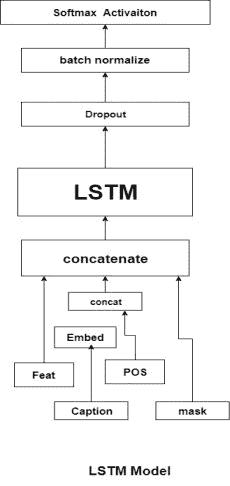](https://media.geeksforgeeks.org/wp-content/uploads/20190422135728/Untitled-Diagram-41-2.jpg)

我们得到的结果是一个向量，每个条目代表字典中每个单词的可能性。最有可能的单词将是我们当前的“最佳单词”。连同预先构建的字典，这个向量被用来“解释”下一个生成的单词，该单词可以被认为是一种用于训练真实字幕的基本事实。掩码在这一切中起着重要的作用，“记录”字幕中使用的前一个单词，以便模型知道当前单词之前的单词，并用句子的当前位置输入模型，这样它就不会陷入循环。

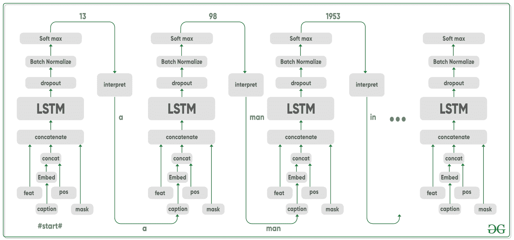

类似于训练，我们还需要获取每个待预测图像的特征。因此，图像首先经过 VGG-16 网络架构，以生成特征。对于字幕，我们使用了相同的 LSTM 模式。这个模型的第一个单词输入是“#start#”标记，后面的输入是前一次迭代的预测结果。

**模型架构:**

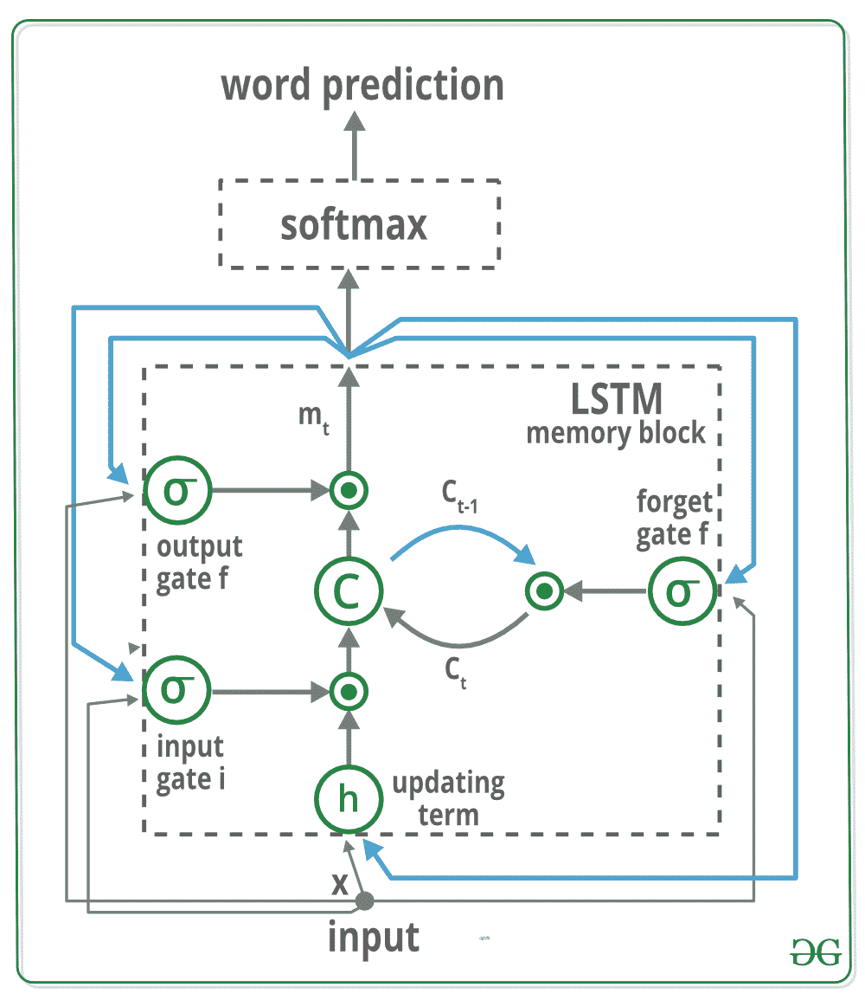

我们鼓励您看一看这篇[研究论文](https://arxiv.org/abs/1411.4555)，以获得关于到底发生了什么的清晰直觉。

存储块包含由三个门控制的单元“C”。在蓝色中，我们显示了反复出现的连接，时间“t-1”的输出“m”通过三个门反馈到时间“t”的存储器，单元值通过忘记门反馈，时间“t-1”的预测字除了时间“t”的存储器输出“m”之外，还反馈到用于字预测的 Softmax 函数。读取其输入门“I”以及是否输出新的单元值(输出门 o)。

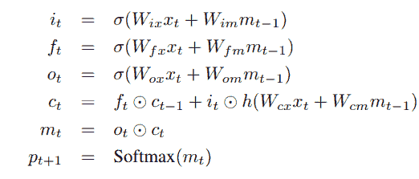

*   **编码器-解码器架构:**通常，生成序列的模型将使用编码器将输入编码为固定形式，使用解码器将其逐字解码为序列。
*   **注意力:**注意力网络的使用在深度学习中广泛存在，并且理由充分。这是一种模型只选择它认为与手头任务相关的编码部分的方法。您在这里看到的相同机制可以用于任何模型，其中编码器的输出在空间或时间上有多个点。在图像字幕中，我们认为某些像素比其他像素更重要。为了给机器翻译这样的任务排序，你会考虑一些词比其他词更重要。
*   **Transfer Learning:** 就是当你通过在新模型中使用现有模型的一部分来借用它时，这几乎总是比从头开始训练一个新模型更好(即一无所知)正如你将看到的，我们总是可以将这些二手知识微调到手头的特定任务，使用预先训练好的单词嵌入是一个无效但有效的例子。我们将使用预训练的编码器，然后根据需要对其进行微调。
*   **Beam Search:** 是我们不让您的 Decoder 偷懒的地方，只需在每个解码步骤中选择得分最高的单词，Beam Search 对于任何语言建模问题都很有用，因为它可以找到最佳序列。

### 让我们通过代码来理解:

### 先决条件-

```
Anaconda
Pytorch
MSCOCO Dataset    

```

要复制本文的结果，请确保安装了先决条件。现在让我们从头开始训练一个模型，按照下面的步骤。

**数据集**

```
git clone https://github.com/pdollar/coco.git
cd coco/PythonAPI/
make
python setup.py build
python setup.py install
cd ../../
git clone https://github.com/yunjey/pytorch-tutorial.git
cd pytorch-tutorial/tutorials/03-advanced/image_captioning/
pip install -r requirements.txt 

```

**注意:**我们建议你使用谷歌[T3【ColabT5](https://colab.research.google.com/drive/1VjGl0OJsZbcGiwy9u1NQoAr-YhgzNHu2#scrollTo=RDf1X0EfBYED) 

**预训练模型–**
我们先从 **[这里](https://drive.google.com/drive/folders/1SrJZm3Teg1IOC1ZIbr0tQLkLir0skwnx?usp=sharing)** 下载预训练模型和词汇文件，然后把**预训练 _model.zip** 解压到**。/车型/** 和 **vocab.pkl** 至**。/data/** 使用解压缩命令。

**现在模型准备好了，可以使用**来预测字幕

```
$ python sample.py --image='/example.png'
```

### 让我们开始表演吧！

导入所有库，并确保笔记本位于存储库的根文件夹中:

```
import torch
import matplotlib.pyplot as plt
import numpy as np 
import argparse
import pickle 
import os
from torchvision import transforms 
from PIL import Image

# this file is located in pytorch tutorial/image 
# captioning which we pull from git remember
from build_vocab import Vocabulary   
from model import EncoderCNN, DecoderRNN
```

**硬编码模型不能修改:**

```
# Model path 

# make sure path must correct 
ENCODER_PATH = 'content/encoder-5-3000.pkl' 
DECODER_PATH = 'content/decoder-5-3000.pkl'
VOCAB_PATH =   'content/vocab.pkl'

# CONSTANTS because of architecture what we are using
EMBED_SIZE = 256
HIDDEN_SIZE = 512
NUM_LAYERS = 1
```

**要加载 _image，添加此配置代码:**

```
# Device configuration snippet
device = torch.cuda.device(0) # 0 represent default device

# Function to Load and Resize the image
def load_image(image_path, transform=None): 
  image = Image.open(image_path)
  image = image.resize([224, 224], Image.LANCZOS)
  if transform is not None:
    image = transform(image).unsqueeze(0)
  return image
```

**现在，让我们编写一个 PyTorch 函数，它使用预处理的数据文件来预测输出:**

```
def PretrainedResNet(image_path, encoder_path=ENCODER_PATH, 
                     decoder_path=DECODER_PATH,
                     vocab_path=VOCAB_PATH,
                     embed_size=EMBED_SIZE,
                     hidden_size=HIDDEN_SIZE,
                     num_layers=NUM_LAYERS):

    # Image preprocessing
    transform = transforms.Compose([
                transforms.ToTensor(), 
                transforms.Normalize((0.485, 0.456, 0.406), 
                                     (0.229, 0.224, 0.225))])

    # Load vocabulary wrapper
    with open(vocab_path, 'rb') as f:
        vocab = pickle.load(f)

    # Build models

    # eval mode (batchnorm uses moving mean/variance)
    encoder = EncoderCNN(embed_size).eval()  
    decoder = DecoderRNN(embed_size, hidden_size,
                          len(vocab), num_layers)

    encoder = encoder.to(device)
    decoder = decoder.to(device)

    # Load the trained model parameters
    encoder.load_state_dict(torch.load(encoder_path))
    decoder.load_state_dict(torch.load(decoder_path))

    # Prepare an image
    image = load_image(image_path, transform)
    image_tensor = image.to(device)

    # Generate a caption from the image
    feature = encoder(image_tensor)
    sampled_ids = decoder.sample(feature)

    # (1, max_seq_length) -> (max_seq_length)
    sampled_ids = sampled_ids[0].cpu().numpy()         

    # Convert word_ids to words
    sampled_caption = []
    for word_id in sampled_ids:
        word = vocab.idx2word[word_id]
        sampled_caption.append(word)
        if word == '<end>':
            break
    sentence = ' '.join(sampled_caption)[8:-5].title() 

    # Print out the image and the generated caption
    image = Image.open(image_path)
    return sentence, image
```

让我们从《复仇者联盟》的一些场景开始制作字幕，看看它概括得有多好，别忘了欣赏。

**使用以下代码预测标签:**

```
plt.figure(figsize=(24,24))
predicted_label, image = PretrainedResNet(image_path='IMAGE_PATH')
plt.imshow(image)
print(predicted_label)
```

### 我们有绿巨人，现在我们有深度学习。😀

**测试图像:雷神标记 I**

*我们来看看这个形象*
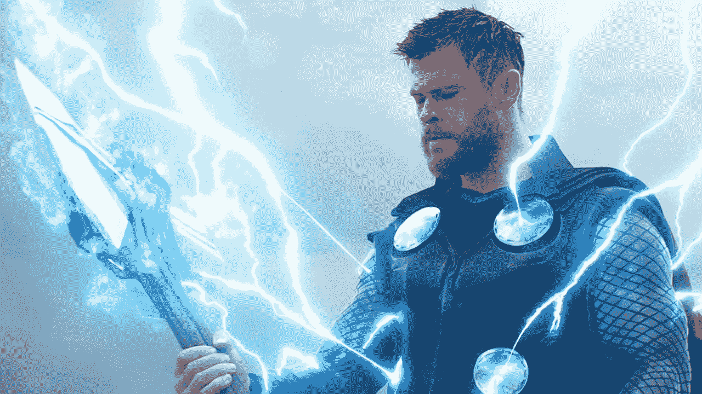
*现在你怎么看这个形象？在脑海中保留一个标题，不要向下滚动。*

```
plt.figure(figsize=(17,19))
predicted_label, img = PretrainedResNet(image_path='./image/AVENGERENDGAME1.png')
plt.imshow(img)
print(predicted_label)
```

**输出:**
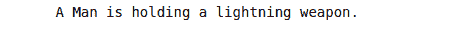

```
Thor 
```

**测试图片:托尼-马克 2 号**
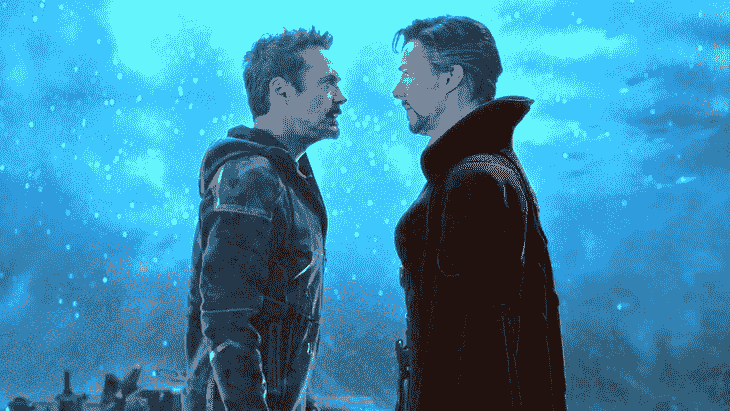

*现在你怎么看这张图片？在脑海中保留一个标题，不要向下滚动。*

```
plt.figure(figsize=(22,22))
predicted_label, img = PretrainedResNet(image_path='./image/AVENGERENDGAME2.png')
plt.imshow(img)
print(predicted_label)
```

**输出:**
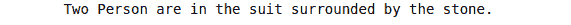

```
(tony and doctor strange)
```

**测试图像:绿巨人-马克三世**
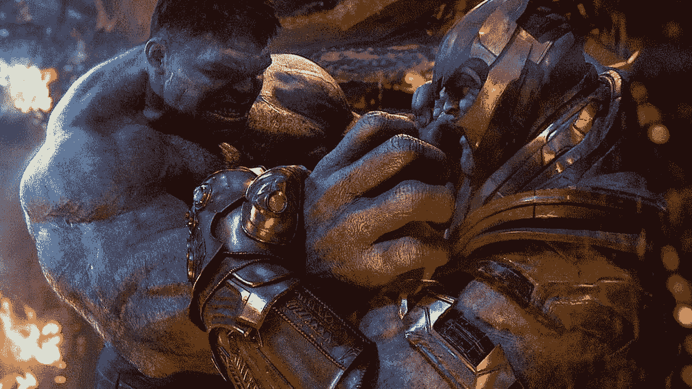

*现在你怎么看这张图片？在脑海中保留一个标题，不要向下滚动。*

```
plt.figure(figsize=(42,49))
predicted_label, img = PretrainedResNet(image_path='./image/AVENGERENDGAME3.png')
plt.imshow(img)
print(predicted_label)
```

**输出:**
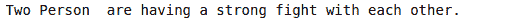

```
(thanos and Hulk)
```

**注意:**我们这里使用的是图片名称`AVENGERENDGAME*.png`，其中*从 1，2，3 …等变化，但是你可以放自己的图片，记住一个可能会得到不同的标题，另一个可能会得到不同的标题。