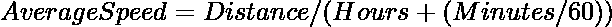

# 平均速度计算器–Tkinter

> 原文:[https://www . geesforgeks . org/average-speed-calculator-tkinter/](https://www.geeksforgeeks.org/average-speed-calculator-tkinter/)

**先决条件:**[**Python GUI–tkinter**](https://www.geeksforgeeks.org/python-gui-tkinter/)

Python 为开发图形用户界面提供了多个选项。在所有的 GUI 方法中，tkinter 是最常用的方法。它是 Python 附带的 Tk 图形用户界面工具包的标准 Python 接口。在本文中，我们将讨论如何使用 Tkinter 创建一个平均速度计算器。

这里的想法是使用 tkinter 窗口从用户那里获得时间和距离作为输入，然后点击一个按钮，计算出的平均速度将显示给用户。

**使用的配方:**



**示例:**

> **输入:**
> 
> 小时= 10
> 
> 分钟= 20
> 
> 距离= 200
> 
> **输出:**
> 
> 平均速度= 19.35

**进场:**

*   导入模块
*   创建对象
*   创建窗口和框架
*   创建按钮以获取输入值
*   通过将分钟除以 60，将分钟转换为小时
*   然后将转换后的小时值添加到小时中
*   将总距离值除以总小时值
*   显示如此获得的值
*   执行代码

**下面是实现:**

## 蟒蛇 3

```py
# Import Module
from tkinter import *

# Create Object
root = Tk()

# Set height and width
width = 450
height = 300

# Set Geometry and min, max size
root.geometry(f"{width}x{height}")
root.maxsize(width, height)
root.minsize(width, height)

# Create Label
Label(root, text="Average Speed Calculator", font=(
    "Helvetica", 18, "bold"), fg="blue").pack()

# Calculate Average Speed

def average_speed_calculator():
        # Get the value of spinbox using get() method
        # Hours
    hrs = int(hours.get())
    # minutes
    mins = int(minutes.get())
    # distance
    dist = int(distance.get())

    # Formula Used
    value = dist/(hrs+(mins/60))

    # change the text of label using config method
    average_speed.config(text=f"{value} Km/Hr")

# Create Multiple Frames
frame = Frame(root)
frame.pack()

frame1 = Frame(root)
frame1.pack()

frame2 = Frame(root)
frame2.pack()

# Create Labels and Spin Boxes
Label(frame, text="Hours", width=15, font=("Helvetica", 14, "bold"),
      borderwidth=2, relief="solid").pack(side=LEFT, padx=10, pady=10)
hours = Spinbox(frame, from_=0, to=10000000, width=5,
                font=("Helvetica", 14, "bold"))
hours.pack(side=LEFT, pady=10)

Label(frame1, text="Minutes", width=15, font=("Helvetica", 14, "bold"),
      borderwidth=2, relief="solid").pack(side=LEFT, padx=10, pady=10)
minutes = Spinbox(frame1, from_=0, to=10000000, width=5,
                  font=("Helvetica", 14, "bold"))
minutes.pack(side=LEFT, pady=10)

Label(frame2, text="Distance (Km)", width=15, font=("Helvetica", 14, "bold"),
      borderwidth=2, relief="solid").pack(side=LEFT, padx=10, pady=10)
distance = Spinbox(frame2, from_=0, to=10000000, width=5,
                   font=("Helvetica", 14, "bold"))
distance.pack(side=LEFT, pady=10)

Button(root, text="Average Speed", width=15, font=("Helvetica", 14, "bold"),
       command=average_speed_calculator, fg="red", bg="black").pack(pady=20)
average_speed = Label(root, text="", width=20, font=(
    "Helvetica", 14, "bold"), relief="solid")
average_speed.pack()

# Execute Tkinter
root.mainloop()
```

**输出:**

<video class="wp-video-shortcode" id="video-538129-1" width="640" height="360" preload="metadata" controls=""><source type="video/mp4" src="https://media.geeksforgeeks.org/wp-content/uploads/20210106113039/FreeOnlineScreenRecorderProject7.mp4?_=1">[https://media.geeksforgeeks.org/wp-content/uploads/20210106113039/FreeOnlineScreenRecorderProject7.mp4](https://media.geeksforgeeks.org/wp-content/uploads/20210106113039/FreeOnlineScreenRecorderProject7.mp4)</video>