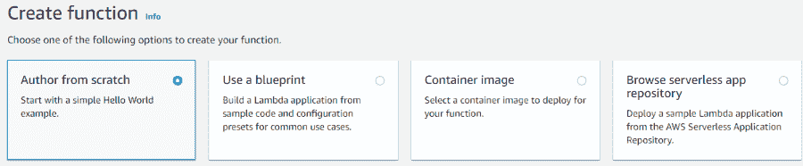
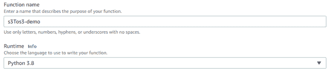
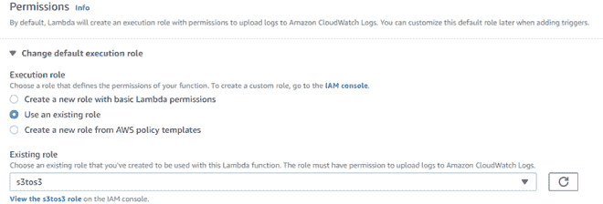
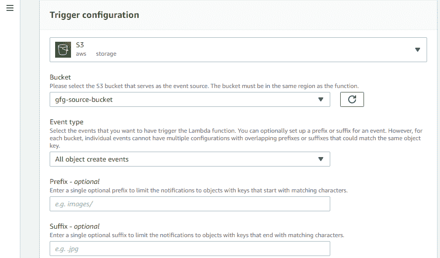
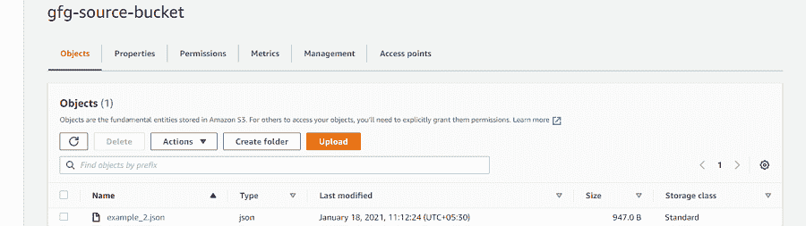
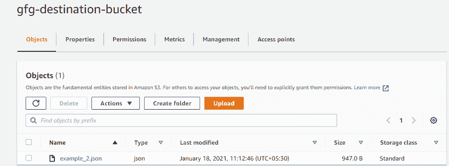
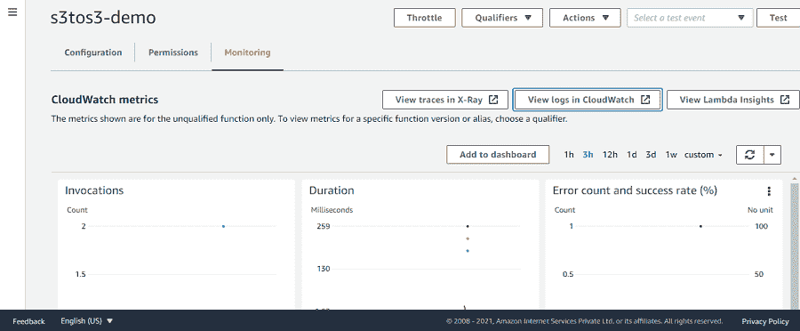

# AWS Lambda–基于事件在 S3 之间复制对象

> 原文:[https://www . geesforgeks . org/AWS-lambda-copy-object-in-S3-based-on-events/](https://www.geeksforgeeks.org/aws-lambda-copy-object-among-s3-based-on-events/)

在本文中，我们将使 [**AWS Lambda**](https://www.geeksforgeeks.org/introduction-to-aws-lambda/) 功能将文件从一个 s3 存储桶复制到另一个 s3 存储桶。lambda 函数将在收到源桶中的文件时被触发。我们将利用亚马逊 S3 活动。每个文件上传到源桶时都是一个事件，这需要触发一个 Lambda 函数，然后该函数可以处理这个文件并将其复制到目标桶。

下面给出了配置 Lambda 功能的步骤:

*   从头开始选择**作者**模板。在这种情况下，我们需要从头开始编写代码。



*   提供**功能名称**。
*   选择**运行时间**。AWS 提供了几种运行时，如 Java、Python、NodeJS、Ruby 等。



*   选择**执行角色**。执行角色是提供给 Lambda 函数的权限。



**注意:** Lambda 必须能够访问 S3 源桶和目标桶。因此，创建一个附加了 AmazonS3FullAccess 策略的 IAM 角色。在这种情况下，s3tos3 可以完全访问 s3 存储桶。

一旦函数被创建，我们需要添加一个触发器来调用 lambda 函数。添加触发器的步骤如下。

1.  在**选择触发**中，选择 **S3。**有许多 AWS 服务可以充当触发器。由于本文的重点是将物体从一个桶移动到另一个桶，因此我们选择了 S3。
2.  在时段中，选择源时段。这个桶将作为一个触发器。我们将指定与这个桶相关联的事件类型，这将进一步调用我们的 lambda 函数。
3.  选择**事件类型**作为**所有对象创建事件**。所有对象创建事件包括上传、复制、发布和多部分上传。任何一个动作都会调用我们的 lambda 函数。在我们的例子中，当我们上传一个文件到源桶时，事件类型是 PUT。
4.  **前缀**和**后缀**可选。前缀和后缀用于将文件名与预定义的前缀和后缀相匹配。



设置 Lambda S3 触发器最值得注意的一点是，每当上传文件时，它都会触发我们的函数。我们利用事件对象来收集所有需要的信息。

示例事件对象如下所示。这个对象被传递给我们的 Lambda 函数。

```
{
  "Records": [
    {
      "eventVersion": "2.0",
      "eventSource": "aws:s3",
      "awsRegion": "ap-south-1",
      "eventTime": "1970-01-01T00:00:00.000Z",
      "eventName": "ObjectCreated:Put",
      "userIdentity": {
        "principalId": "GeeksforGeeks"
      },
      "requestParameters": {
        "sourceIPAddress": "XXX.X.X.X"
      },
      "responseElements": {
        "x-amz-request-id": "EXAMPLE123456789",
        "x-amz-id-2": "EXAMPLE123/5678abcdefghijklambdaisawesome/mnopqrstuvwxyzABCDEFGH"
      },
      "s3": {
        "s3SchemaVersion": "1.0",
        "configurationId": "testConfigRule",
        "bucket": {
          "name": "gfg-source-bucket",
          "ownerIdentity": {
            "principalId": "GeeksforGeeks"
          },
          "arn": "arn:aws:s3:::gfg-source-bucket"
        },
        "object": {
          "key": "geeksforgeeks.txt",
          "size": 1024,
          "eTag": "0123456789abcdef0123456789abcdef",
          "sequencer": "0A1B2C3D4E5F678901"
        }
      }
    }
  ]
}
```

您的 Lambda 函数利用这个事件字典来识别文件上传的位置。λ代码如下所示:

```
import json
import boto3
s3_client=boto3.client('s3')

# lambda function to copy file from 1 s3 to another s3
def lambda_handler(event, context):
    #specify source bucket
    source_bucket_name=event['Records'][0]['s3']['bucket']['name']
    #get object that has been uploaded
    file_name=event['Records'][0]['s3']['object']['key']
    #specify destination bucket
    destination_bucket_name='gfg-destination-bucket'
    #specify from where file needs to be copied
    copy_object={'Bucket':source_bucket_name,'Key':file_name}
    #write copy statement 
    s3_client.copy_object(CopySource=copy_object,Bucket=destination_bucket_name,Key=file_name)

    return {
        'statusCode': 3000,
        'body': json.dumps('File has been Successfully Copied')
    }
```

**注意:**写完代码后，别忘了点击**部署。**

现在当我们在源桶*‘gfg-源-桶’*中上传文件时，这将触发*‘s3tos 3-demo’*lambda 功能，该功能会将上传的文件复制到目标桶*‘gfg-目标-桶’*。图像如下所示:

**源桶中上传的文件**



**文件复制到目标存储桶**



目标时段

在 lambda 功能中点击**监控选项卡**，然后在 Cloudwatch 中点击**查看日志，也可以验证结果。**



云观察日志