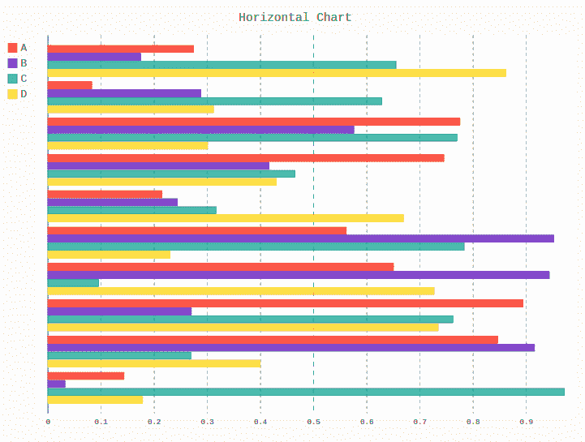
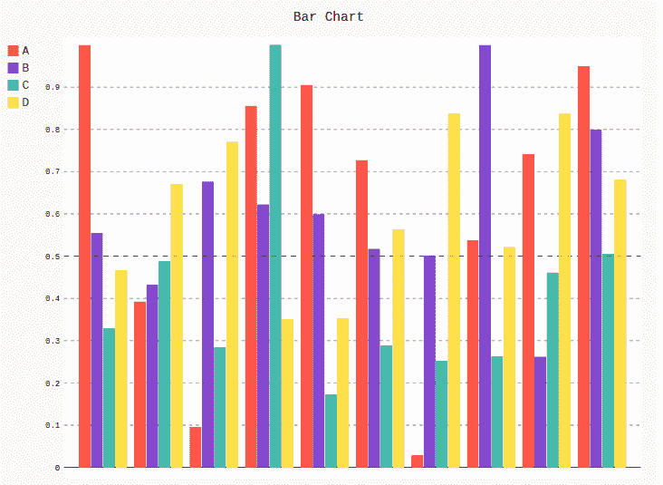

# Pygal 中的条形图

> 原文:[https://www.geeksforgeeks.org/bar-chart-in-pygal/](https://www.geeksforgeeks.org/bar-chart-in-pygal/)

**Pygal** 是一个 Python 模块，主要用于构建 SVG(标量矢量图形)图形和图表。SVG 是一种基于矢量的 XML 格式的图形，可以在任何编辑器中编辑。Pygal 可以用最少的代码行创建图表，这些代码行易于理解和编写。

## 条形图

**条形图**或图表是用矩形条以分类形式表示数据，矩形条的高度或长度与图表中表示的值成比例。条形图可以垂直或水平绘制。垂直条形图有时也称为柱形图。图表的一个轴显示正在比较的特定类别，另一个轴表示测量值。

*   **Horizontal bar graph** is a graph which represents the data horizontally. All the data values in the horizontal graph are shown in the horizontal axis. This type of column graph helps to understand the data more effectively as the data is parallel to each other. It can be created using the `HorizontalBar()` method.

    **语法:**

    ```
    line_chart = pygal.HorizontalBar()
    ```

    **Example :**

    ```
    # importing pygal
    import pygal
    import numpy

    # creating the chart object
    horizontal_chart = pygal.HorizontalBar()

    # naming the title
    horizontal_chart.title = 'Horizontal Chart'        

    # Random data
    horizontal_chart.add('A', numpy.random.rand(10))
    horizontal_chart.add('B', numpy.random.rand(10))
    horizontal_chart.add('C', numpy.random.rand(10))
    horizontal_chart.add('D', numpy.random.rand(10))

    horizontal_chart
    ```

    **输出:**

    

*   **Vertical bar graph** displays the data by using vertical bars going up from the the bottom, whose lengths are proportional to the quantities they represent. It can be used when one axis cannot have a numerical scale. A basic simple bar graph is very useful when presenting the series of data over time. It can be created using the Bar() method.

    **语法:**

    ```
    line_chart = pygal.Bar()
    ```

    **示例:**

    ```
    # importing pygal
    import pygal
    import numpy

    # creating the chart object
    bar_chart = pygal.Bar()

    # naming the title
    bar_chart.title = 'Bar Chart'        

    # Random data
    bar_chart.add('A', numpy.random.rand(10))
    bar_chart.add('B', numpy.random.rand(10))
    bar_chart.add('C', numpy.random.rand(10))
    bar_chart.add('D', numpy.random.rand(10))

    bar_chart
    ```

    **输出:**

    