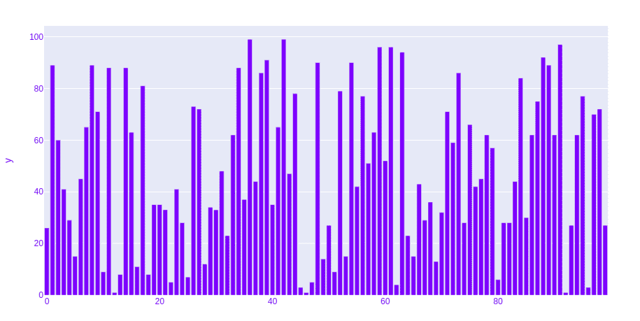

# 在 Python 中使用 Plotly 的条形图

> 原文:[https://www . geesforgeks . org/条形图-使用-plotly-in-python/](https://www.geeksforgeeks.org/bar-chart-using-plotly-in-python/)

**Plotly** 是一个 Python 库，用来设计图形，尤其是交互图形。它可以绘制各种图形和图表，如直方图、条形图、箱线图、展开图等。它主要用于数据分析以及财务分析。Plotly 是一个交互式可视化库。

## 条形图

在条形图中，数据类别显示在纵轴上，数据值显示在横轴上。标签更容易显示，有了大数据集，它们可以在狭窄的布局(如移动视图)中更好地工作。

> **语法:**plot . express . bar(data _ frame =无，x =无，y =无，color =无，facet _ row =无，facet _ col =无，facet_col_wrap=0，hover _ name =无，hover _ data =无，custom _ data =无，text =无，error _ x =无，error _ x _ 减号=无，error _ y =无，error _ y _ 减号=无，animation _ frame =无，animation _ group =无，category_orders={}，labels={}

**参数:**

<figure class="table">

| 名字 | 描述 |
| --- | --- |
| 数据帧 | 需要传递此参数才能使用列名(而不是关键字名)。类数组和字典在内部被转换成熊猫数据帧。可选:如果缺少，则使用其他参数在头罩下构造一个数据帧。 |
| x | 数据框中的列名，熊猫系列或类似数组的对象。此列或 array_like 中的值用于在笛卡尔坐标中沿 x 轴定位标记。x 或 y 可以选择是列引用或 array _ likes 的列表，在这种情况下，数据将被视为“宽”而不是“长”。 |
| y | 数据框中的列名，熊猫系列或类似数组的对象。此列或 array_like 中的值用于在笛卡尔坐标中沿 y 轴定位标记。x 或 y 可以选择是列引用或 array _ likes 的列表，在这种情况下，数据将被视为“宽”而不是“长”。 |
| 颜色 | 数据框中的列名，熊猫系列或类似数组的对象。此列或 array_like 中的值用于为标记指定颜色。 |

</figure>

### 带 Plotly Express 的条形图

在本例中，我们将使用 Plotly express 绘制条形图。

## 蟒蛇 3

```
import plotly.express as px
import numpy

# creating random data through randomint
# function of numpy.random
np.random.seed(42)

random_x= np.random.randint(1, 101, 100)
random_y= np.random.randint(1, 101, 100)

fig = px.bar(random_x, y = random_y)
fig.show()
```

**输出:**



### 长格式和宽格式数据的条形图

**示例 1:** 在本例中，我们将使用虹膜数据集，并将其转换为数据帧以绘制条形图。

## 蟒蛇 3

```
import plotly.express as px

df = px.data.iris()

fig = px.bar(df, x = "sepal_width", y = "sepal_length")
fig.show()
```