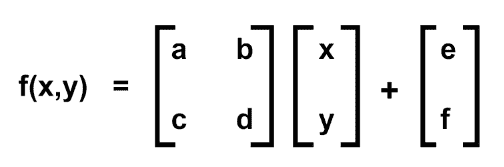
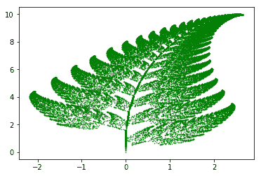

# 蟒蛇体内的巴恩斯利蕨

> 原文:[https://www.geeksforgeeks.org/barnsley-fern-in-python/](https://www.geeksforgeeks.org/barnsley-fern-in-python/)

巴恩斯利蕨是数学家迈克尔·巴恩斯利创造的分形形状。这种分形的几何特征类似天然蕨类植物，因此得名。巴恩斯利蕨是通过对四个数学方程进行大量迭代而产生的，由巴恩斯利引入，被称为**迭代函数系统(IFS)** 。

巴恩斯利使用的转换公式为:

，其中字母具有以下值:

| **一** | **b** | **c** | **d** | **e** | **f** | **p** | **零件** |
| --- | --- | --- | --- | --- | --- | --- | --- |
| Zero | Zero | Zero | Zero point one six | Zero | Zero | Zero point zero one | 阻止 |
| Zero point eight five | Zero point zero four | -0.04 | Zero point eight five | Zero | One point six | Zero point eight five | 小传单 |
| Zero point two | -0.26 | Zero point two three | Zero point two two | Zero | One point six | Zero point zero seven | 大传单(左) |
| -0.15 | Zero point two eight | Zero point two six | Zero point two four | Zero | Zero point four four | Zero point zero seven | 大传单(右) |

而“p”是概率。

于是这四个方程是:

借助于上面的方程，蕨类植物就产生了。现在让我们看看 Python3 的实现。

```py
# importing necessary modules
import matplotlib.pyplot as plt
from random import randint

# initializing the list
x = []
y = []

# setting first element to 0
x.append(0)
y.append(0)

current = 0

for i in range(1, 50000):

    # generates a random integer between 1 and 100
    z = randint(1, 100)

    # the x and y coordinates of the equations
    # are appended in the lists respectively.

    # for the probability 0.01
    if z == 1:
        x.append(0)
        y.append(0.16*(y[current]))

    # for the probability 0.85    
    if z>= 2 and z<= 86:
        x.append(0.85*(x[current]) + 0.04*(y[current]))
        y.append(-0.04*(x[current]) + 0.85*(y[current])+1.6)

    # for the probability 0.07    
    if z>= 87 and z<= 93:
        x.append(0.2*(x[current]) - 0.26*(y[current]))
        y.append(0.23*(x[current]) + 0.22*(y[current])+1.6)

    # for the probability 0.07    
    if z>= 94 and z<= 100:
        x.append(-0.15*(x[current]) + 0.28*(y[current]))
        y.append(0.26*(x[current]) + 0.24*(y[current])+0.44)

    current = current + 1

plt.scatter(x, y, s = 0.2, edgecolor ='green')

plt.show()        
```

**输出:**


**注:**整个输出取决于方程的系数。一个实验可能是改变系数，每次得到一个新的模式。