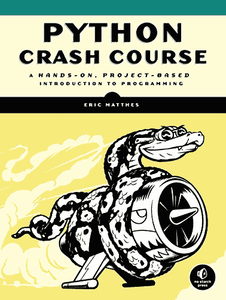
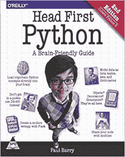
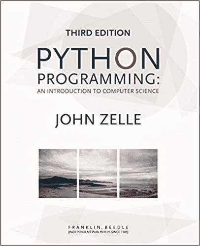
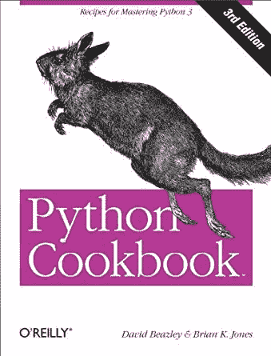
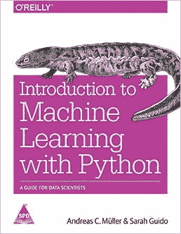
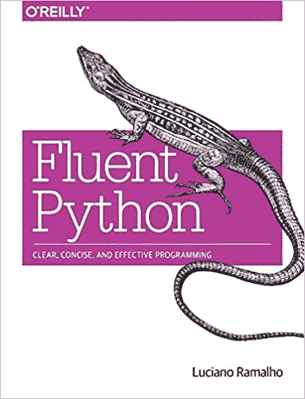
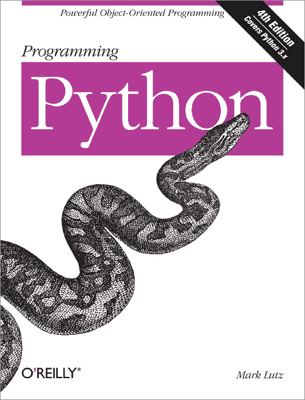
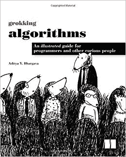

# 2019 年初学者和专家学习 Python 最佳书籍

> 原文:[https://www . geesforgeks . org/2019 年初学者和专家学习 python 的最佳书籍/](https://www.geeksforgeeks.org/best-books-to-learn-python-for-beginners-and-experts-in-2019/)

一些程序员说 Python 是一门很好的第一语言，而另一些人声称它是一门很好的最后一门语言！！！！无论如何，Python 是一门非常受欢迎的学习语言，这是无可争议的。根据 [TIOBE 索引](https://www.tiobe.com/tiobe-index/)，它是目前世界上第三受欢迎的编程语言，这种非凡的增长只会增加。

记住这一点，如果你想学习 [Python](https://www.geeksforgeeks.org/python-programming-language/) ，市场上有很多资源。这些可以包括书籍甚至 [**在线课程**](https://practice.geeksforgeeks.org/courses/fork-python) 。在本文中，我们为 Python 编写了最好的书籍，既适合业余爱好者，也适合编程天才！！！每本书都非常受欢迎，所以你可以根据自己的学习感受选择你喜欢的书。所以二话没说，让我们看看他们！

首先，让我们从简单开始，专注于适合初学者的最佳 Python 书籍，然后我们将转向更复杂的书籍！

### 初学者最佳 Python 书籍

**1。Python 速成课程:基于项目的实践编程入门(第二版)**

作者:埃里克·马蒂斯

如果你想要一个 Python 速成班，不用担心！！！《Python 速成教程》是一本优秀的书，它提供了对 Python 的全面介绍，这将使您能够立即编写程序和解决问题！当你完成这本书的时候，你会学到各种[*【Python 库】*](https://www.geeksforgeeks.org/best-python-libraries-for-machine-learning/) 和工具(NumPy，Pygal 等)。)，制作基本的 Python 2-D 游戏，创建可定制的 web 应用等等……
Python 速成课程基本上分为两部分，第一部分侧重于编写正确的程序并将其添加到项目中。第二部分就好玩多了！它通过三个实质性的项目专注于 Python 更实际的应用:一个太空入侵者类型的街机游戏、使用 Python 库的数据可视化和一个基本的网络应用程序。 [**购买 Python 速成教程**](https://amzn.to/2l8MOh0)

**2。头部优先的蟒蛇:大脑友好指南(第二版)**

作者:保罗·巴里

如果你厌倦了苦读 Python 操作手册，那么 Head-First Python 是一个不错的选择！这本书是一本对大脑友好的指南(顾名思义！)而且，它提供了一种更直观的形式来吸引你的大脑，而不是一种可能很快变得无聊的大量文本的方法。

Head-First Python 以[内置数据结构](https://www.geeksforgeeks.org/inbuilt-data-structures-python/)和功能开始了 Python 之旅，并转向 Python 网络应用、数据库管理、异常处理、数据争论等。有趣的主题，如理解、上下文管理器、装饰器和生成器都可供您学习。Head-First Python 基本上是一个多感官的学习体验，将帮助你成为一个真正的 Python 程序员！ [**买首款蟒蛇书**](https://amzn.to/2lF90Q0)

**3。艰难地学习 Python:第三版**

作者:泽德·肖

努力学习 Python 是非常值得的！这本书将使用 52 个精心制作的练习来教你 Python。你必须准确地输入这些练习的代码(不要复制粘贴！)然后修复您所犯的错误并运行代码。这将教你如何写好代码，以及专业程序员使用的修复错误的技巧。
艰难地学习 Python 从帮助您安装完整的 Python 环境开始，然后进入基础数学、变量、字符串、数据结构、 [*【面向对象编程】*](https://www.geeksforgeeks.org/object-oriented-programming-in-python-set-1-class-and-its-members/) 和其他重要主题。这本书声称奖励你投入的每一分钟，最终的结果是你会知道世界上最强大和最受欢迎的编程语言之一！！！ [**购买《学习 Python 硬道书》**](https://amzn.to/2n6ZxRL)

**4。Python 编程:计算机科学导论(第三版)**

作者:约翰·泽勒

Python 编程:如果你想用一种非常非标准的语言——Python 来理解标准的计算机科学概念，那么《计算机科学导论》是理想的选择！！！这本书试图尽可能简单地解释基本的计算机科学概念，而不会让人觉得过于简单。它也可以作为你大学第一门计算课程的标准教科书，因为它侧重于计算机科学的核心技能，如设计、编程，最重要的是解决问题。 [**购买 Python 编程书**](https://amzn.to/2nbz6dU)

### 中级/专家最佳 Python 书籍

**1。Python 食谱:掌握 Python 3 的食谱(第三版)**

作者:布莱恩·琼斯，大卫·比兹利

Python 食谱提供了 Python 食谱的美味组合，将允许您学习用 Python 3 编程或更新您在 Python 2 上的知识。这些美味的食谱将让你成为 Python 烹饪专家，专注于核心 Python 语言以及与 Python 应用程序相关的常见任务。
Python 食谱包含数据结构和算法、迭代器和生成器、数据编码和处理、函数、类和对象、并发性等主题的食谱。这些方法中的每一个都包含一个问题和该问题的解决方案以及代码示例，以便更好地理解。这还不够，我的朋友们！还提供了一个重点讨论解决方案及其工作原理的讨论。 [**买蟒蛇食谱**](https://amzn.to/2ndaOAd)

**2。Python 机器学习入门:数据科学家指南(第一版)**

作者:安德烈亚斯·穆勒、萨拉·吉多

[机器学习](https://www.geeksforgeeks.org/machine-learning/#mup)目前是一个热门话题，有多个应用，只是受限于你的想象力！因此，《Python 机器学习入门》试图通过教你使用 Python 和 scikit-learn 库创建自己的机器学习解决方案的方法来扩展你的想象力。这本书从机器学习的基础开始，然后讨论各种机器学习算法的优缺点。然后处理各种高级主题，如数据处理、模型评估、管道等。简而言之，您将基本上使用 Python 来提高您的机器学习技能。 [**购买 Python 书籍《机器学习入门》**](https://amzn.to/2l70dpR)

**3。流畅的 Python:清晰、简洁、有效的编程(第一版)**

作者:卢西亚诺·拉马霍

如果你想精通 Python，我的朋友们，流利的 Python 是适合你的书！！！这是一个实践指南，将彻底指导您使用最好的(也是最被忽视的)编写最高效的 Python 代码！)Python 的特性。这是必要的，因为大多数程序员试图将他们从其他语言中学到的模式应用到 Python 中，因此永远学不到它最好的特性。
流畅的 Python 首先覆盖了 Python 数据模型，然后进入数据结构、函数、面向对象习惯用法、控制流、元编程等。这是一个完整的 Python 核心特性和库的旅程，最终将教会你让你的代码更短、更快、更易读。 [**购买流利的蟒蛇书**](https://amzn.to/2lERMlP)

**4。编程 Python:强大的面向对象编程(第四版)**

作者:马克·卢茨

如果你已经理解了 Python 的基本原理，并且现在想要完成一些真正的工作，那么编程 Python 就是适合你的书！它将帮助您深入了解 Python 的主要应用领域，如系统管理、图形用户界面、网络应用程序、数据库、网络等。借助大量的例子。
编程 Python 中包含的主题从快速 Python 之旅开始，然后探索系统编程、GUI 编程、互联网编程等。所有这些概念都以清晰简洁的方式用许多例子来解释，以确保你理解正确。 [**购买编程 Python 书籍**](https://amzn.to/2lHKeyy)

**5。摸索算法:程序员和其他好奇者的图解指南(第一版)**

作者:阿迪蒂亚·巴尔加瓦

用 Python 学习算法不一定要枯燥！Grokking Algorithms 恰当地证明了这一点，因为它摆脱了阅读大多数算法教科书中的密集多页证明的单调。这本书通过大量的插图，以一种有趣且引人入胜的方式讲述了算法教学。
Grokking Algorithms 从排序和搜索等更简单的主题开始，最终转向数据压缩、人工智能等复杂得多的主题。所有这些主题都使用了有用的插图以及 Python 中的代码示例。 [**购买 Grokking 算法书**](https://amzn.to/2n8dKhm)