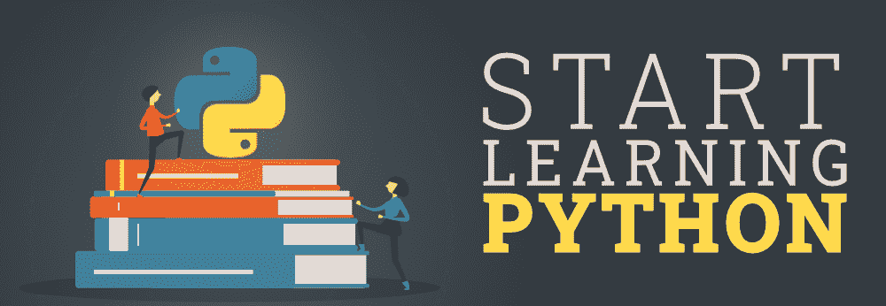

# 开始学习 Python 的最佳方式-完整的路线图

> 原文:[https://www . geesforgeks . org/最佳入门学习方式-python-a-complete-roadmap/](https://www.geeksforgeeks.org/best-way-to-start-learning-python-a-complete-roadmap/)

**Python……**世界上发展最快、最受欢迎的编程语言，不仅在软件工程师中如此，在数学家、数据分析师、科学家、会计师、网络工程师甚至孩子中也是如此！因为它是一种非常适合初学者的编程语言。不同学科的人使用 Python 进行各种不同的任务，比如数据分析和可视化、人工智能和[机器学习](https://www.geeksforgeeks.org/machine-learning/)、自动化等。您可以编写 Python 脚本来自动化许多无聊的任务，例如复制文件和文件夹、重命名它们、将它们上传到服务器。所以 Python 不仅仅被软件开发人员使用，它也被其他专业人士用来自动化他们的任务，让他们的生活更轻松。Python 是一种多用途语言，你可以使用 Python 构建网络应用、移动应用、桌面应用以及软件测试甚至黑客攻击。

以上所有的理由足以告诉你为什么 Python 是程序员中最流行的语言，为什么你应该学习它。现在的问题是 ***从哪里开始？学习这门语言需要多长时间？你应该涵盖哪些主题？有哪些 Python 库或框架？*** 作为初学者，你会困惑我应该先选择什么。我应该从一本书里学习所有的概念，还是应该去网上学习教程？让我们讨论一下成为 Python 开发人员的整个路线图。

### 为什么是 Python？(决定你的最终目标)

在开始学习这门语言之前，你应该有一个清晰的目标，那就是为什么你想学习 Python？你到底想用这种语言做什么？你想自动化一些枯燥或无聊的任务，还是想做一些网络应用？
大多数初学者都会犯一个常见的错误，他们开始学习一门语言只是为了学习它，而没有一个目标。请记住，学习一门语言是不同的事情，使用它来构建一些现实世界的应用程序是不同的，作为一名程序员，你的目的应该是能够构建东西，而不仅仅是学习一门语言。所以首先探索每个领域，找出你的兴趣所在。
我们已经讨论了可以使用 Python 的各个领域。所以，首先，决定你到底想要建立什么，一旦你的目标确定了，坚持下去，进入下一步，即寻找资源。

### 学习资源

网上有大量的文档和视频，所以从哪里开始学习这门语言非常令人困惑，尤其是当 Python 可以用于各种领域的时候。要明白，一本书或一个视频课程不足以教会你 Python 的一切，最初作为初学者，你也会被如此多的概念淹没，但要有耐心、探索并坚持下去。下面是一些我们已经筛选出来的资源，可以开始学习 Python，但是要确保无论你喜欢什么资源，你的代码都要和它在一起。

*   如果您已经有编程经验，那么可以从[官方文档中学习:3.8.1](https://docs.python.org/3/) 。或者向 [**Python 教程极客学习**](https://www.geeksforgeeks.org/python-programming-language/) 。你也可以去上一些在线视频教程或课程，但大多数课程都是从初学者水平开始的(那只是浪费时间)，这仍然取决于你和你以前的编码经验。
*   如果您是初学者，阅读文档对您来说很无聊，那么请选择一门全面的 Python 在线课程。对初学者有好处的课程之一是[完整的 Python 大师课:从零开始学习 Python](https://www.udemy.com/course/python-masterclass-course/?couponCode=PYNEWQS)。

不管你喜欢什么资源，决定一个完成课程的最后期限。如果你是初学者，每天花 2-3 个小时学习，你可以在**10-11 周**内完成课程。现在让我们进入下一步，检查 Python 中您应该涵盖的重要主题。请记住，要学习的东西太多了，所以一旦你完成了主题，就开始自己探索 Python 语言。

### Python 中的重要主题

**1。学习语法和基础知识**

首先从系统中安装 Python 开始。只需访问 Python 的官方网站，下载最新版本，就可以开始了。安装完成后，您可以使用 IDLE 来编写和运行 Python 代码。现在我们将列出一些主题，从学习 Python 开始。几乎需要*1–1.5 周*才能涵盖所有基本内容，这仍然取决于您的学习过程。

*   Python 外壳，基本算术。
*   控制结构。
*   接受用户输入、字符串和类型转换。
*   Python 中的循环:For & While 循环。
*   异常处理。
*   功能、模块和导入。

**2。糟糕的概念、内置数据结构和其他东西**

这一部分会有点难，尤其是如果你不了解面向对象编程概念的话。借助我们提到的一些资源，通过一些练习，你将能够理解这些概念。这些概念将被广泛用于制作复杂的应用程序，所以要很好地理解这些主题。学习可能需要*1–1.5*周。

*   Python 中的面向对象编程
*   列表和列表功能
*   正则表达式
*   列表理解
*   列表切片
*   字符串格式
*   希腊字母的第 11 个
*   列表、字典和元组

一旦你掌握了上面的主题，并且对每个主题都进行了足够的练习，那么是时候从它里面构建一些东西了。Python 有一个很好的模块、包、库和框架集合，您可以将其用于各种应用程序。因此，与其从头开始构建一切，不如使用这种语言提供的框架和库。使用这些框架和库来构建一些东西会更容易。根据您的最终目标(网络开发、基于桌面的应用程序等)选择框架或库。)

**3。网络开发框架**

Python 中有太多的网络应用框架，其中一些是 Django、Flask、Bottle、Tornado 和金字塔。

*   **Django:** 一个高级 web 框架，主要用于初创公司和企业进行 web 开发。它遵循 MVC 模式，您可以使用多个数据库，如 PostgreSQL、MySQL、SQLite 和 Oracle。如果你是一个完全的初学者，不知道术语认证，网址路由，应用编程接口和模型，那么你会在学习 Django 的时候感到很多痛苦，但是慢慢来，有耐心，浏览更多的资源，理解每一行代码。慢慢地，渐渐地，你会明白一切。学习姜戈可能需要*2-2.5 周*。
*   **Flask:** Flask 是 Python 中最容易学习的微框架之一。如果你想开发一个简单而轻量级的网络应用程序，那么 Flask 是合适的。它不像 Django 那样强大和广泛，仍然提供诸如支持单元测试和构建 REST APIs 之类的功能。学习烧瓶需要*1-1.5 周*。

**4。用于构建桌面应用程序**

Tkinter、PyQT、Kivy、WxPython 或 PyGUI 库非常适合构建基于桌面的应用程序。

*   **Tkinter:** Tkinter 是开源库，它允许你使用 Python 构建桌面 GUI 应用程序。学习 Tkinter 很简单，提供了一个图形化的界面。学习 Tkinter 大约需要 1 周时间。
*   **PyQT:** PyQt 是诺基亚旗下最强大的跨平台 GUI 库之一。它结合了 Python 编程和 Qt 库。它可以用来为桌面应用程序设计图形用户界面。
*   **Kivy:** 它可以用来创建桌面应用程序，也支持安卓、iOS、Linux 等平台&树莓皮。

**5。用于数据分析**

Numpy、Pandas、Seaborn、Bokeh、SciPy、Matplotlib 这些库对数据分析都有好处。这些库对那些想成为数据分析师/数据科学家的人很有帮助。学习熊猫或熊猫需要大约 1 周的时间。

*   **Numpy:** 是一个数组处理包，提供高性能的数组对象。它被广泛用于 Python 的科学计算，并提供了基本功能。
*   **Pandas:** Pandas 也是一个非常好的开源库，用于数据分析。它提供了高级数据结构(如数据框架)和各种各样的分析工具。它还可以用几个命令翻译复杂的操作。使用这个库，数据操作变得更加容易。

**6。对于机器学习:**

*   **TensorFlow:** 谷歌开发的最受欢迎的深度学习库。这是一个计算框架，用于表达涉及大量张量运算的算法。
*   **Scikit-Learn:**Python 的机器学习库，旨在与 SciPy & NumPy 等数值库配合使用。
*   **PyTorch:** 可以随时处理动态计算图。它还提供了易于使用的 API。

### 构建项目

到目前为止，我们已经用 Python 覆盖了几乎所有内容，现在最后阶段是构建项目。Python 中的所有学习只有在你能构建一些项目时才有意义。请记住，测试编程技能的最好方法是通过处理一个复杂的项目来解决问题。对于初学者来说，构建一个复杂的项目并不是一件容易的事情，所以从小事做起。先做一个简单的项目，然后逐步推进。如果你想构建一个复杂的项目，从一个小而简单的模块开始，然后不断向其中添加功能。您将看到您的项目进展，并了解程序员如何解决现实世界的复杂问题。

项目确实有助于提高你的技能。在做一个项目的时候，你会面临挫折、多重障碍、挑战和困难。当你面对这些挑战和困难时，你会获得大量的技能。解决这些挑战可以让您在使用 Python 解决问题时获得足够的经验。

现在使用 Python 可以制作多个项目。**简单兴趣/ EMI 计算器、天气应用、简单爬虫**这些都是你可以制作的简单项目。如果我们谈论一些复杂的项目，那么你可以制作一个功能齐全的**电子商务网站，基于网络的爬虫**动态抓取特定的网页，**在线简历生成器**从原始文本生成 PDF 格式的简历。

### 提示:

*   要有耐心，这不仅仅是学习 Python 的情况，也是学习另一种语言的情况。学习一门第一语言总是需要更多的努力和时间，所以要明白把一切都沉下去是需要时间的。
*   坚持你的目标和语言。不要只学习语法，跳到一种新的编程语言。
*   挫折和痛苦是学习过程的一部分，拥抱它而不是逃避它。
*   由于一些复杂的术语、错误和问题，你会想放弃。别这样，编程中的每个人都会这样。给自己一些时间，用其他资源和专注的头脑来理解这个话题。
*   保持一致，如果你在学习上不一致，那将需要更多的时间和努力。
*   建立项目总是有助于建立信心，所以不要忽视它的重要性。