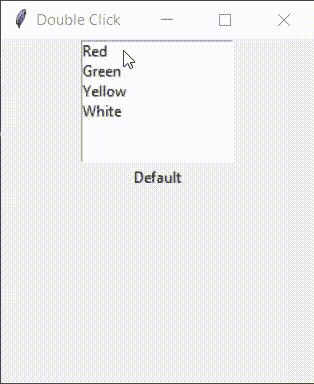

# 通过 Tkinter 列表框双击绑定功能

> 原文:[https://www . geesforgeks . org/binding-function-with-双击-with-tkinter-listbox/](https://www.geeksforgeeks.org/binding-function-with-double-click-with-tkinter-listbox/)

**先决条件:**[Python GUI–Tkinter](http://geeksforgeeks.org/python-gui-tkinter/)、[Python | Tkinter 中的绑定功能](http://geeksforgeeks.org/python-binding-function-in-tkinter/)

[Python 中的 Tkinter](https://www.geeksforgeeks.org/python-gui-tkinter/) 是 GUI(图形用户界面)模块，广泛用于创建桌面应用程序。它提供了各种基本的小部件来构建图形用户界面程序。

为了绑定双击和列表框，我们使用 Python 中的[绑定函数](https://www.geeksforgeeks.org/python-binding-function-in-tkinter/)，然后根据列表框中选择的项目执行所需的操作。
以下是执行情况:

```py
from tkinter import *

def go(event):
    cs = Lb.curselection()

    # Updating label text to selected option
    w.config(text=Lb.get(cs))

    # Setting Background Colour
    for list in cs:

        if list == 0:
            top.configure(background='red')
        elif list == 1:
            top.configure(background='green')
        elif list == 2:
            top.configure(background='yellow')
        elif list == 3:
            top.configure(background='white')

top = Tk()
top.geometry('250x275')
top.title('Double Click')

# Creating Listbox
Lb = Listbox(top, height=6)
# Inserting items in Listbox
Lb.insert(0, 'Red')
Lb.insert(1, 'Green')
Lb.insert(2, 'Yellow')
Lb.insert(3, 'White')

# Binding double click with left mouse
# button with go function
Lb.bind('<Double-1>', go)
Lb.pack()

# Creating Edit box to show selected option
w = Label(top, text='Default')
w.pack()
top.mainloop()
```

**输出:**
[](https://media.geeksforgeeks.org/wp-content/uploads/20200331203718/Doubl-Click-in-tkintr.gif)