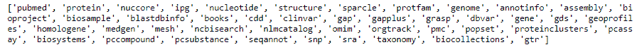

# biophyston–Entrez 数据库连接

> 原文:[https://www . geesforgeks . org/bio Tyson-entrez-database-connection/](https://www.geeksforgeeks.org/biopython-entrez-database-connection/)

NCBI 提供一个名为 Entrez 的在线搜索系统。这提供了对广泛的分子生物学数据库的访问，并且还提供了支持布尔运算符和字段搜索的集成的全局查询系统。结果是从所有数据库返回的，这些数据库包含诸如点击次数、到原始数据库的链接等来自每个数据库的信息。

Biopython 有一个名为 *Bio 的 Entrez 专用模块。Entrez* 为此。Entrez 模块从 Entrez 搜索系统返回的 XML 文件中提取信息，并将其显示为 python 字典和列表。连接数据库的步骤如下:

### 方法

*   导入所需的模块。
*   设置电子邮件以识别谁已连接。
*   设置 Entrez 工具参数，默认为 Biopython。
*   调用 *einfo()* 方法获取每个数据库的信息。
*   阅读 *einfo()* 方法提供的信息。
*   这样获得的数据是 XML 格式的，所以要在 python 对象*中获得这些数据，需要使用 read()* 方法
*   现在记录是字典格式的，只有一个键。
*   通过访问*数据库列表*键，返回数据库列表。

生成的程序应该如下所示:

## 蟒蛇 3

```py
# Import libraries
from Bio import Entrez

# Setting email
Entrez.email = 'jeetesh1@yopmail.com'

# Setting Entrez tool parameter
Entrez.tool = 'Demoscript'

# Gathering information
info = Entrez.einfo()

# Reading Info as XML
#data = info.read()

# Parsing info as python object
record = Entrez.read(info)

# Getting record key
record.keys()

# Parsing records
record[u'DbList']
```

**输出:**

