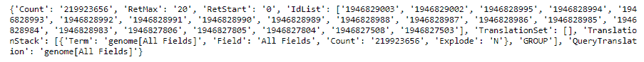
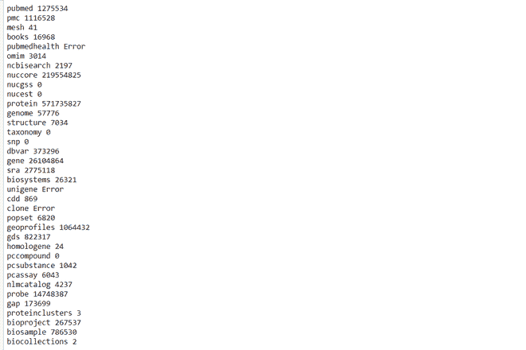

# biotyson–Entrez 数据库搜索操作

> 原文:[https://www . geesforgeks . org/bio Tyson-entrez-database-search-operation/](https://www.geeksforgeeks.org/biopython-entrez-database-search-operation/)

NCBI 提供一个名为 Entrez 的在线搜索系统。这提供了对广泛的分子生物学数据库的访问，并且还提供了支持布尔运算符和字段搜索的集成的全局查询系统。结果是从所有数据库返回的，这些数据库包含诸如点击次数、到原始数据库的链接等来自每个数据库的信息。

### 使用的功能

Biopython Entrez 配备了两种方法来执行数据库搜索操作:

*   Biopython 有一个名为 ***esearch()*** 的 Entrez 特定方法来搜索任何一个 Entrez 数据库。它接受位置参数数据库和我们必须搜索的术语。如果分配了错误的数据库，将会产生错误。

**语法:**

> *Bio.Entrez.* 研究(数据库，术语)

*   要在所有数据库中搜索任何查询，使用 ***egquery()*** 方法。它类似于 *Entrez.esearch()* 方法，除了它只接受跳过数据库参数的术语参数。

**语法:**

> 生物学家。输入. egquery(term)

### 方法

*   导入所需的模块。
*   设置您的电子邮件以识别谁与数据库连接。
*   设置 Entrez 工具参数，默认为 Biopython。
*   使用上面提供的任何具有适当参数的方法。
*   返回的数据将是 XML 格式的，因此要在 python 对象*中获取该数据，需要使用 Entrez.read()* 方法来读取该对象
*   阅读提供的信息。

下面给出了使用这两种方法的实现:

**示例 1:** 使用 esearch()

## 蟒蛇 3

```
# Import libraries
from Bio import Entrez

# Setting email
Entrez.email = 'jeetesh1@yopmail.com'

# Setting Entrez tool parameter
Entrez.tool = 'Demoscript'

# Searching for database
info = Entrez.esearch(db="nucleotide", term="genome")

# reading records
record = Entrez.read(info)

# Showing records
print(record)
```

**输出:**



**示例 2:** 使用 egquery()

## 蟒蛇 3

```
# Import libraries
from Bio import Entrez

# Setting email
Entrez.email = 'jeetesh1@yopmail.com'

# Setting Entrez tool parameter
Entrez.tool = 'Demoscript'

# Searching for database
info = Entrez.egquery(term="genome")

record = Entrez.read(info)
for row in record["eGQueryResult"]:
    print(row["DbName"], row["Count"])
```

**输出:**

