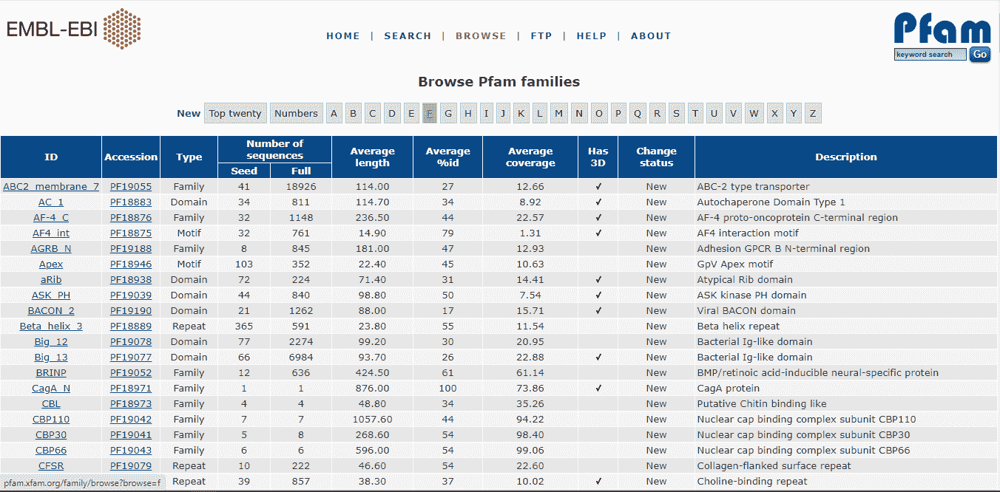
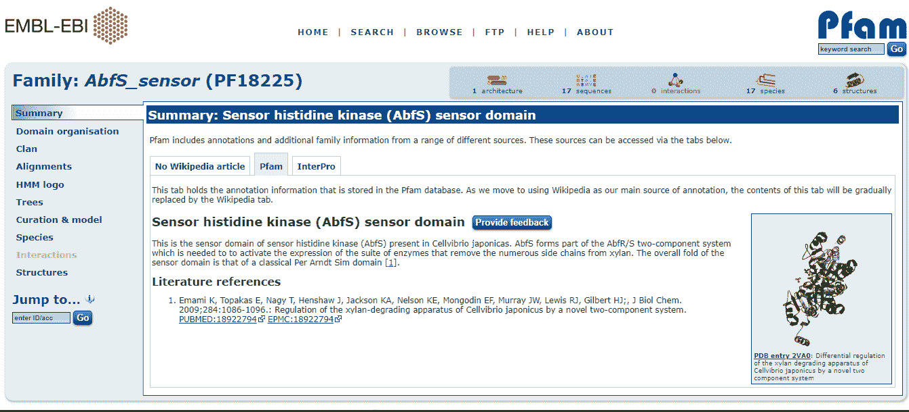
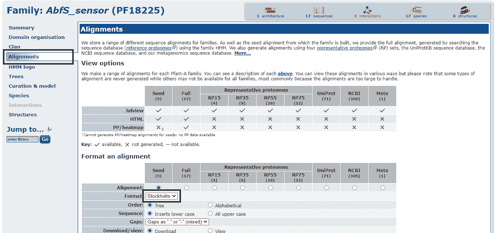

# 生物节律–序列比对

> 原文:[https://www.geeksforgeeks.org/biopython-sequence-alignment/](https://www.geeksforgeeks.org/biopython-sequence-alignment/)

**序列比对**是将两个或两个以上的 DNA、RNA 或蛋白质序列排列在一起，以便特异性地识别它们之间的相似区域的过程。相似性的鉴定提供了很多关于物种间哪些性状是保守的，不同物种在遗传上有多接近，物种如何进化等信息。Biopython 具有广泛的序列比对功能。

**阅读序列比对:** ***生物。Biopython 提供的 AlignIo*** 用于读写序列比对。生物信息学中有很多格式可以指定序列比对数据类似于序列数据。*生物。AlignIO* 的原料药类似于 ***Bio。SeqIO*** ，唯一不同的是 *Bio。SeqIO* 处理序列数据，而*生物。对齐*用于序列数据对齐。以下是下载样本序列比对文件的一些步骤:

*   首先打开浏览器，访问[http://pfam.xfam.org/family/browse](http://pfam.xfam.org/family/browse)，可以按字母顺序看到所有 ***Pfam*** 家庭。



*   现在选择具有较少种子值的任何家族，因为它包含最少的数据并且易于操作。让我们用 PF18225([http://pfam.xfam.org/family/PF18225](http://pfam.xfam.org/family/PF18225))移动一个。



*   点击比对部分，下载斯德哥尔摩格式的所需序列比对文件。



**示例:**

## 蟒蛇 3

```py
# Import libraries
from Bio import AlignIO

# Creating Sequence Alignment
alignment = AlignIO.read(open("PF18225_seed.txt"), "stockholm")

# Print alignment object
print(alignment)

# Show alignment sequence record
print("Showing Alignment Sequence Record")
for align in alignment:
     print(align.seq)
```

**输出:**

> 单字母字母()与 5 行 65 列对齐
> 仍未完成 qqqltqdlrmpnwslrfvydrnnqdllkrplppgim…【nrk B3 pft 7 _ celju/62-126】【nrk B3 pft 7 _ celju/62-126】【naftertefrtphnvfvldgfeidrelpspva…【nrt k4 kem 7 _ simas/61-125】【mqntpapaiskhdinwlldqrlervv】
> 
> 显示校准序列记录
> 【仍未确定 qqqltqdlrmpnwslrfvylvdnkrplppplgivlaprpydkvqdrnrk】
> avnaterefterthtwarrnfvldgfeidrelpspdlmrdldrpfkkknrt
> mqntpapailieskhdinwlldqrgrleqrvpavanqlrsrafrhregp【t】

**读取多比对:**一般来说，大多数序列比对文件都包含单比对数据，其中 **read()** 方法足以解析。在多个序列比对的情况下，将两个以上的序列进行比较，以获得它们之间的最佳序列匹配，并得到具有多个序列比对的单个文件。如果序列比对格式有多个序列比对，则使用 ***parse()*** 方法代替 *read()* ，后者返回一个可迭代的对象，可迭代该对象以获得实际的比对。下面给出了一个基本示例:

## 蟒蛇 3

```py
# Import libraries
from Bio import AlignIO 

# Parsing Sequence Alignment
alignment = AlignIO.parse(open("PF18225_seed.txt"), "stockholm")

# Show alignment generator
print(alignment)

# Printing alignment 
for alignment in alignments: 
    print(alignment)
```

**输出:**

> <generator object="" parse="" at=""></generator>
> 
> 单字母字母()与 5 行 65 列对齐
> 仍未完成 qqqltqdlrmpnwslrfvydrnnqdllkrplppgim…【nrk B3 pft 7 _ celju/62-126】【nrk B3 pft 7 _ celju/62-126】【naftertefrtphnvfvldgfeidrelpspva…【nrt k4 kem 7 _ simas/61-125】【mqntpapaiskhdinwlldqrlervv】