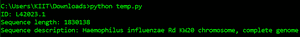
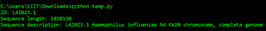

# 生物节律–序列输入/输出

> 原文:[https://www . geesforgeks . org/bio Tyson-sequence-input-output/](https://www.geeksforgeeks.org/biopython-sequence-input-output/)

Biopython 有一个内置的 *Bio。SeqIO* 模块，提供分别从文件读取序列和向文件写入序列的功能。*生物。SeqIO* 支持生物信息学中使用的几乎所有文件处理格式。Biopython 严格遵循单一方法，用*电子病历*对象向用户表示解析后的数据序列。

## **记录**

*电子病历*对象由*生物提供。SeqRecord* 模块保存序列的元数据以及关于序列的信息。下面列出了一些主要数据信息:

<figure class="table">

| **记录** | **描述** |
| --- | --- |
| seq | 要解析的实际序列。 |
| 身份证明（identification） | 序列的主要标识，默认情况下是字符串类型 |
| 名字 | 序列的名称，默认情况下是字符串类型。 |
| 描述 | 以人类可读的格式显示有关序列的信息。 |
| 附注 | 包含与序列相关的附加信息的字典。 |

</figure>

## **读取顺序:**

biophyston*Seq*模块有一个内置的 *read()* 方法，该方法获取一个序列文件，并根据文件格式将其转换为单个 *SeqRecord* 。它能够解析只有一条记录的序列文件，如果文件没有记录或者有多条记录，那么就会引发异常。 *read()* 方法的语法和参数如下:

```
Bio.SeqIO.read(handle, format, alphabet=None)

```

<figure class="table">

| **论据** | **描述** |
| --- | --- |
| 处理 | 文件句柄或将文件名作为字符串(旧版本只接受句柄) |
| 格式 | 文件*；*格式为字符串 |
| 字母表 | 可选参数，当序列类型不是从文件自动推断时使用(例如。 *format = "fasta"* )。 |

</figure>

## 蟒蛇 3

```
# Import libraries
from Bio import SeqIO

# Reading file
record = SeqIO.read("sequence.gb", "genbank")

# Showing records
print("ID: %s" % record.id)
print("Sequence length: %i" % len(record))
print("Sequence description: %s" % record.description)
```

**输出:**



## **练习顺序:**

*生物提供的*解析()*方法。Seq* 模块在我们必须从句柄中读取多条记录时使用。它基本上将序列文件转换成迭代器，迭代器返回 *SeqRecords* 。如果文件包含字符串数据，那么它必须被转换为句柄来解析它。无法确定字母表的文件格式，明确指定字母表(例如。FASTA)。 *parse()* 方法的语法和参数如下:

```
Bio.SeqIO.parse(handle, format, alphabet=None)

```

<figure class="table">

| **论据** | **描述** |
| --- | --- |
| 处理 | 文件句柄或将文件名作为字符串(旧版本只接受句柄) |
| 格式 | 字符串形式的文件格式 |
| 字母表 | 可选参数，当序列类型不是从文件(例如。 *format = "fasta"* )。 |

</figure>

## 蟒蛇 3

```
# Import libraries
from Bio import SeqIO

# Parsing file
filename = "sequence.fasta"
for record in SeqIO.parse(filename, "fasta"):

    # Showing records
    print("ID: %s" % record.id)
    print("Sequence length: %i" % len(record))
    print("Sequence description: %s" % record.description)
```

**输出:**



## **写入序列:**

用于写入文件*生物。Seq* 模块有一个 *write()* 方法，该方法将序列集写入文件，并返回一个代表写入记录数的整数。请确保在调用句柄后关闭该句柄，否则数据将被刷新到磁盘。*写()*方法的语法和论据如下:

```
Bio.SeqIO.write(sequences, handle, format)

```

<figure class="table">

| **论据** | **描述** |
| --- | --- |
| 顺序 | *SeqRecord* 对象的列表或迭代器(或 biotyson 1.54 版或更高版本中的单个 *SeqRecord* |
| 处理 | 文件句柄或将文件名作为字符串(旧版本只接受句柄) |
| 格式 | 以小写字符串形式写入的文件格式 |

</figure>

**注意:**下载文件点击[这里](https://www.ncbi.nlm.nih.gov/nuccore/L42023)

## 蟒蛇 3

```
# Import libraries
from Bio import SeqIO
from Bio.Seq import Seq
from Bio.SeqRecord import SeqRecord

rec1 = SeqRecord(Seq("MMYQQGCFAGGTVLRLAKDLAENNRGARVLVVCSEITAVTFRGPSETHLDSMVGQALFGD"
                     + "GAGAVIVGSDPDLSVERPLYELVWTGATLLPDSEGAIDGHLREVGLTFHLLKDVPGLISK"
                     + "NIEKSLKEAFTPLGISDWNSTFWIAHPGGPAILDQVEAKLGLKEEKMRATREVLSEYGNM"),
                 id="gi|14150838|gb|AAK54648.1|AF376133_1",
                 description="chalcone synthase [Cucumis sativus]")

rec2 = SeqRecord(Seq("MVTVEEFRRAQCAEGPATVMAIGTATPSNCVDQSTYPDYYFRITNSEHKVELKEKFKRMC"
                     + "EKSMIKKRYMHLTEEILKENPNICAYMAPSLDARQDIVVVEVPKLGKEAAQKAIKEWGQP"
                     + "KSKITHLVFCTTSGVDMPGCDYQLTKLLGLRPSVKRFMMYQQGCFAGGTVLRMAKDLAEN"
                     + "NKGARVLVVCSEITAVTFRGPNDTHLDSLVGQALFGDGAAAVIIGSDPIPEVERPLFELV"
                     + "SAAQTLLPDSEGAIDGHLREVGLTFHLLKDVPGLISKNIEKSLVEAFQPLGISDWNSLFW"
                     + "IAHPGGPAILDQVELKLGLKQEKLKATRKVLSNYGNMSSACVLFILDEMRKASAKEGLGT"
                     + "TGEGLEWGVLFGFGPGLTVETVVLHSVAT"),
                 id="gi|13925890|gb|AAK49457.1|",
                 description="chalcone synthase [Nicotiana tabacum]")
sequences = [rec1, rec2]

# Writing to file
with open("example.fasta", "w") as output_handle:
    SeqIO.write(sequences, output_handle, "fasta")

for record in SeqIO.parse("example.fasta", "fasta"):
    print("ID %s" % record.id)
    print("Sequence length %i" % len(record))
```

**输出:**

