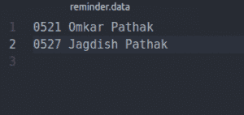

# Python 中的生日提醒应用

> 原文:[https://www . geesforgeks . org/生日-提醒-应用-python/](https://www.geeksforgeeks.org/birthday-reminder-application-python/)

这个应用有助于提醒生日和通知你朋友的生日。这个应用程序使用 Python 和 Ubuntu 通知在系统每次启动时通知用户。

```py
# Python program For
# Birthday Reminder Application

# time module is must as reminder 
# is set with the help of dates
import time

# os module is used to notify user 
# using default "Ubuntu" notification bar
import os

# Birthday file is the one in which the actual birthdays
# and dates are present. This file can be 
# manually edited or can be automated. 
# For simplicity, we will edit it manually.
# Birthdays should be written in this file in
# the format: "MonthDay Name Surname" (Without Quotes)

birthdayFile = '/path/to/birthday/file'

def checkTodaysBirthdays():
    fileName = open(birthdayFile, 'r')
    today = time.strftime('%m%d')
    flag = 0
    for line in fileName:
        if today in line:
            line = line.split(' ')
            flag =1
            # line[1] contains Name and line[2] contains Surname
            os.system('notify-send "Birthdays Today: ' + line[1]
            + ' ' + line[2] + '"')
    if flag == 0:
            os.system('notify-send "No Birthdays Today!"')

if __name__ == '__main__':
    checkTodaysBirthdays()
```

**将脚本添加到启动中**

写完上面的代码，现在是时候将这个 Python 脚本添加到启动中了。这可以在 **Ubuntu** 中完成，如下所示:

1.  首先，我们必须为我们的提醒创建一个可执行文件
2.  这可以通过在终端

    ```py
    sudo chmod +x reminder.py, where reminder.py is our script file name 
    ```

    中键入以下命令来完成
3.  现在我们必须将该文件传输到 Linux 搜索其默认文件的路径:
    在终端键入以下命令:

```py
 sudo cp /path/to/our/reminder.py /usr/bin
```

。这将把我们的可执行脚本添加到/usr/bin 中。

*   在全局搜索中，搜索**启动应用程序***   单击添加，并为您的流程指定所需的名称*   Type in the command. For example, our file name is **reminder.py** then type reminder.py in the command field and Select Add

    **注意**:每次启动系统时，脚本都会自动运行(一旦添加到启动中)。此外，如果您在同一天有两个以上的生日，两个生日都将在通知中得到通知。

    **生日文件应该是什么样子**

    

    **运行脚本后输出**

    

    本文由 **Omkar Pathak** 供稿。如果你喜欢 GeeksforGeeks 并想投稿，你也可以使用[contribute.geeksforgeeks.org](http://contribute.geeksforgeeks.org)写一篇文章或者把你的文章邮寄到 contribute@geeksforgeeks.org。看到你的文章出现在极客博客主页上，帮助其他极客。

    如果你发现任何不正确的地方，或者你想分享更多关于上面讨论的话题的信息，请写评论。