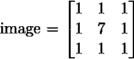
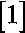
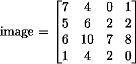
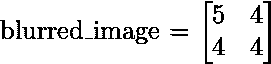

# 方块模糊算法–使用 Python 实现

> 原文:[https://www . geesforgeks . org/box-blur-algorithm-with-python-implementation/](https://www.geeksforgeeks.org/box-blur-algorithm-with-python-implementation/)

图像中的像素表示为整数。模糊后，结果图像的每个像素“x”的值等于包括“x”在内的“x”周围像素的平均值。例如，将 3 * 3 图像视为


然后，模糊后得到的图像是模糊的 _image = 
所以，模糊图像的像素计算为(1 + 1 + 1 + 1 + 7 + 1 + 1 + 1 + 1) / 9 = 1.66666 = 1

## 盒子模糊算法–

**[框模糊](https://en.wikipedia.org/wiki/Box_blur)** 也称为框线性滤镜。框模糊经常用于近似高斯模糊。

框模糊通常被实现为影响整个屏幕的图像效果。当前像素的模糊颜色是当前像素及其 8 个相邻像素的颜色的平均值。

> **注意:**对于每个 3 * 3 像素矩阵，有一个模糊像素，如上计算。

例如，考虑下图。

下面给出它的模糊影像:


**说明:**
上图中有四个 3 * 3 矩阵可能。因此在结果图像中有 4 个模糊像素。这四个矩阵是:

```py
,

,

,
and

```

Python 中的实现:

```py
def square_matrix(square):
    """ This function will calculate the value x 
       (i.e. blurred pixel value) for each 3 * 3 blur image.
    """
    tot_sum = 0

    # Calculate sum of all the pixels in 3 * 3 matrix
    for i in range(3):
        for j in range(3):
            tot_sum += square[i][j]

    return tot_sum // 9     # return the average of the sum of pixels

def boxBlur(image):
    """
    This function will calculate the blurred 
    image for given n * n image. 
    """
    square = []     # This will store the 3 * 3 matrix 
                 # which will be used to find its blurred pixel

    square_row = [] # This will store one row of a 3 * 3 matrix and 
                    # will be appended in square

    blur_row = []   # Here we will store the resulting blurred
                    # pixels possible in one row 
                    # and will append this in the blur_img

    blur_img = [] # This is the resulting blurred image

    # number of rows in the given image
    n_rows = len(image) 

    # number of columns in the given image
    n_col = len(image[0]) 

    # rp is row pointer and cp is column pointer
    rp, cp = 0, 0 

    # This while loop will be used to 
    # calculate all the blurred pixel in the first row 
    while rp <= n_rows - 3: 
        while cp <= n_col-3:

            for i in range(rp, rp + 3):

                for j in range(cp, cp + 3):

                    # append all the pixels in a row of 3 * 3 matrix
                    square_row.append(image[i][j])

                # append the row in the square i.e. 3 * 3 matrix 
                square.append(square_row)
                square_row = []

            # calculate the blurred pixel for given 3 * 3 matrix 
            # i.e. square and append it in blur_row
            blur_row.append(square_matrix(square))
            square = []

            # increase the column pointer
            cp = cp + 1

        # append the blur_row in blur_image
        blur_img.append(blur_row)
        blur_row = []
        rp = rp + 1 # increase row pointer
        cp = 0 # start column pointer from 0 again

    # Return the resulting pixel matrix
    return blur_img

# Driver code
image = [[7, 4, 0, 1], 
        [5, 6, 2, 2], 
        [6, 10, 7, 8], 
        [1, 4, 2, 0]]

print(boxBlur(image))
```

**输出:**

```py
[[5, 4], 
[4, 4]]

```

测试案例 2:

```py
image = [[36, 0, 18, 9], 
         [27, 54, 9, 0], 
         [81, 63, 72, 45]]

print(boxBlur(image))
```

**输出:**

```py
[[40, 30]]
```

**进一步阅读:** [使用 PIL 库| Python](https://www.geeksforgeeks.org/python-pil-boxblur-method/) 进行方块模糊