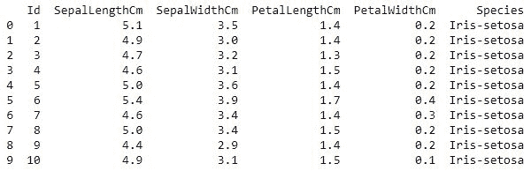
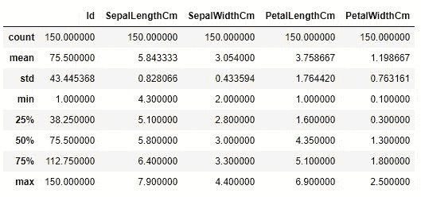
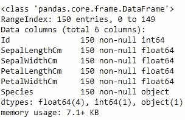
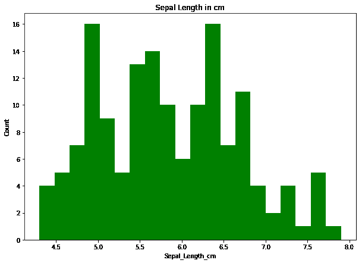
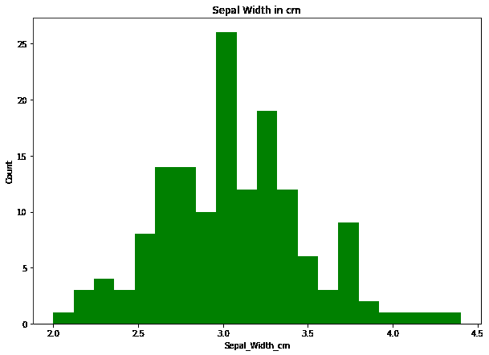
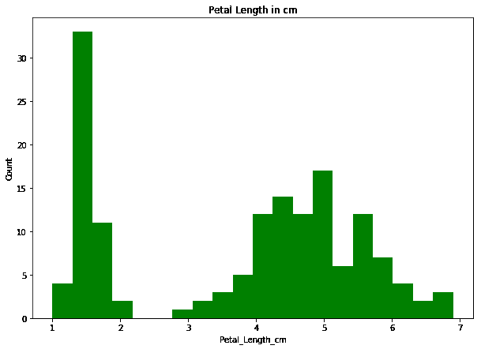
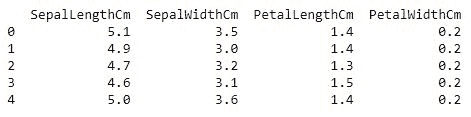

# 虹膜数据的方块图和直方图探索

> 原文:[https://www . geesforgeks . org/box-plot-and-直方图-iris 上的探索-data/](https://www.geeksforgeeks.org/box-plot-and-histogram-exploration-on-iris-data/)

**数据集的属性信息:**

```py
Attribute Information:
   -> sepal length in cm
   -> sepal width in cm
   -> petal length in cm
   -> petal width in cm
   -> class: 
              Iris Setosa
              Iris Versicolour
              Iris Virginica

Number of Instances: 150 

Summary Statistics:
             Min  Max   Mean    SD   Class Correlation
   sepal length: 4.3  7.9   5.84  0.83    0.7826   
    sepal width: 2.0  4.4   3.05  0.43   -0.4194
   petal length: 1.0  6.9   3.76  1.76    0.9490  (high!)
    petal width: 0.1  2.5   1.20  0.76    0.9565  (high!)

Class Distribution: 33.3% for each of 3 classes.

```

要获取虹膜数据，请点击这里的。

**加载库**

```py
import numpy as np
import pandas as pd
import matplotlib.pyplot as plt
```

**加载数据**

```py
data = pd.read_csv("Iris.csv")

print (data.head(10))
```

**输出:**


**描述**

```py
data.describe()
```

**输出:**


**信息**

```py
data.info()
```

**输出:**


**代码#1:** 萼片长度直方图

```py
plt.figure(figsize = (10, 7))
x = data["SepalLengthCm"]

plt.hist(x, bins = 20, color = "green")
plt.title("Sepal Length in cm")
plt.xlabel("Sepal_Length_cm")
plt.ylabel("Count")
```

**输出:**


**代码#2:** 萼片宽度直方图

```py
plt.figure(figsize = (10, 7))
x = data.SepalWidthCm

plt.hist(x, bins = 20, color = "green")
plt.title("Sepal Width in cm")
plt.xlabel("Sepal_Width_cm")
plt.ylabel("Count")

plt.show()
```

**输出:**


**代码#3:** 花瓣长度直方图

```py
plt.figure(figsize = (10, 7))
x = data.PetalLengthCm

plt.hist(x, bins = 20, color = "green")
plt.title("Petal Length in cm")
plt.xlabel("Petal_Length_cm")
plt.ylabel("Count")

plt.show()
```

**输出:**


**代码#4:** 花瓣宽度直方图

```py
plt.figure(figsize = (10, 7))
x = data.PetalWidthCm

plt.hist(x, bins = 20, color = "green")
plt.title("Petal Width in cm")
plt.xlabel("Petal_Width_cm")
plt.ylabel("Count")

plt.show()
```

**输出:**


**代码#5:** 箱线图的数据准备

```py
# removing Id column
new_data = data[["SepalLengthCm", "SepalWidthCm", "PetalLengthCm", "PetalWidthCm"]]
print(new_data.head())
```

**输出:**


**代码#6:** 虹膜数据的方框图

```py
plt.figure(figsize = (10, 7))
new_data.boxplot()
```

**输出:**
