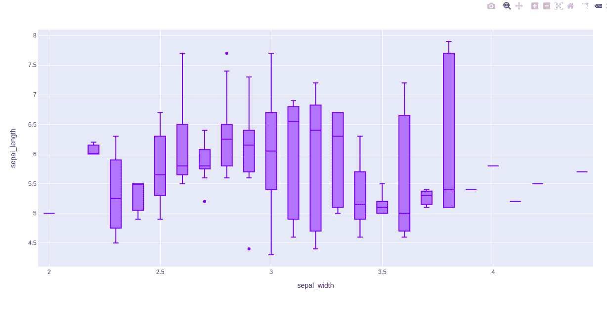
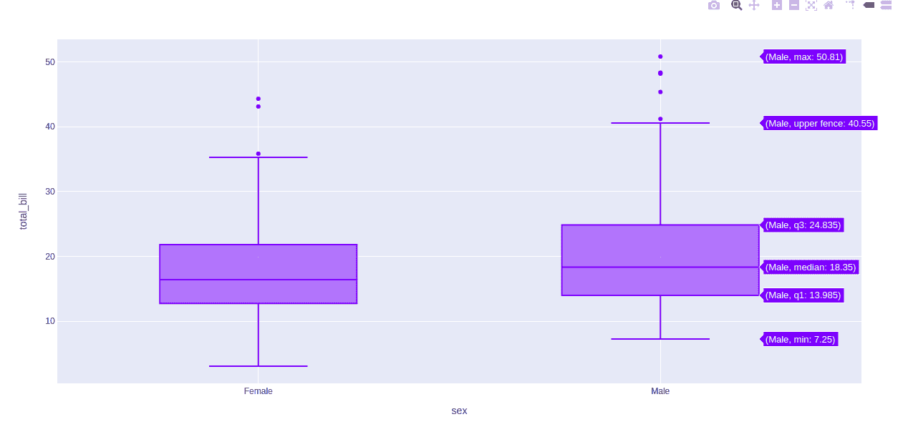
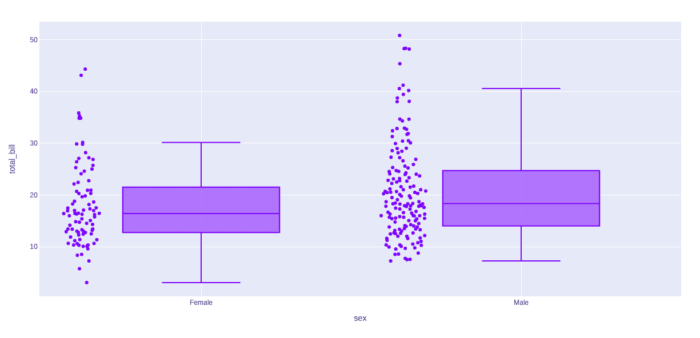

# 使用 Python 中的 Plotly 绘制方框图

> 原文:[https://www . geesforgeks . org/box-plot-use-plot-in-python/](https://www.geeksforgeeks.org/box-plot-using-plotly-in-python/)

[**Plotly**](https://www.geeksforgeeks.org/getting-started-with-plotly-python/) 是一个 Python 库，用来设计图形，尤其是交互图形。它可以绘制各种图形和图表，如直方图、条形图、箱线图、展开图等。它主要用于数据分析以及财务分析。plotly 是一个交互式可视化库。

## 箱线图

一个**方框图**是通过四分位数的数字数据的人口统计学表示。终点和上四分位数用方框表示，而中间值(第二个四分位数)用方框内的一条线表示。Plotly.express 是 Plotly 的一个方便的高级界面，它对各种各样的数据进行操作，并生成一个易于使用的图形。方框对于比较各组数据非常有用。方块图分割约。将 25%的截面数据分成集合，这有助于快速识别值、数据集的离散度和偏斜度的迹象。

> **语法:**plot . express . box(data _ frame =None，x=None，y=None，color=None，facet_row=None，facet_col=None，facet_col_wrap=0，hover_name=None，hover_data=None，custom_data=None，animation_frame=None，animation_group=None，category_orders={}，labels={}，color_discrete_sequence=None，color_discrete_map={}，方位= None，boxmode=None，log_x=False

**参数:**

<figure class="table">

| 名字 | 描述 |
| --- | --- |
| 数据帧 | 需要传递此参数才能使用列名(而不是关键字名)。类数组和字典在内部被转换成熊猫数据帧。可选:如果缺少，则使用其他参数在头罩下构造一个数据帧。 |
| x | 数据框中的列名，熊猫系列或类似数组的对象。此列或 array_like 中的值用于在笛卡尔坐标中沿 x 轴定位标记。x 或 y 可以选择是列引用或 array _ likes 的列表，在这种情况下，数据将被视为“宽”而不是“长”。 |
| y | 数据框中的列名，熊猫系列或类似数组的对象。此列或 array_like 中的值用于在笛卡尔坐标中沿 y 轴定位标记。x 或 y 可以选择是列引用或 array _ likes 的列表，在这种情况下，数据将被视为“宽”而不是“长”。 |
| 颜色 | 数据框中的列名，熊猫系列或类似数组的对象。此列或 array_like 中的值用于为标记指定颜色。 |
| facet_row | 数据框中的列名，熊猫系列或类似数组的对象。此列或 array_like 中的值用于在垂直方向上为多面子图指定标记。 |
| facet_col | 数据框中的列名，熊猫系列或类似数组的对象。此列或 array_like 中的值用于在水平方向上为多面子图指定标记。 |
| facet_col_wrap | 刻面列的最大数量。以此宽度包装列变量，以便列面跨越多行。如果为 0，则忽略；如果设置了 facet_row 或 marginal，则强制为 0。 |
| 悬停名称 | 数据框中的列名，熊猫系列或类似数组的对象。此列或 array_like 中的值在悬停工具提示中以粗体显示。 |
| 悬停数据 | data_frame 中的列名列表，或 pandas Series，或 array_like 对象，或以列名作为键的 dict，值为 True(用于默认格式)False(以便从悬停信息中删除此列)，或格式字符串，例如“:. 3f”或“&#124;%a”或列表状数据出现在悬停工具提示中，或以 bool 或格式字符串作为第一个元素的元组，列表状数据出现在悬停中作为第二个元素这些列中的值作为额外数据出现在悬停工具提示中。 |
| 自定义数据 | data_frame 中的列名、pandas Series 或 array_like 对象这些列中的值都是额外的数据，例如用于小部件或 Dash 回调。用户看不到这些数据，但这些数据包含在人物发出的事件中(套索选择等)。) |
| 动画 _ 帧 | 数据框中的列名，熊猫系列或类似数组的对象。此列或 array_like 中的值用于为动画帧指定标记。 |
| 动画 _ 组 | 数据框中的列名，熊猫系列或类似数组的对象。此列或 array_like 中的值用于跨动画帧提供对象恒定性:具有匹配“动画组”的行将被视为在每个帧中描述了相同的对象。 |
| 类别 _ 订单 | 默认情况下，在 Python 3.6+中，轴、图例和刻面中分类值的顺序取决于这些值在 data_frame 中首次遇到的顺序(在低于 3.6 的 Python 中，默认情况下不保证顺序)。此参数用于强制每列值的特定顺序。这个字典的键应该对应于列名，值应该是对应于特定显示顺序的字符串列表。 |
| 标签 | 默认情况下，图中的列名用于轴标题、图例项和悬停。此参数允许对此进行覆盖。这个字典的键应该对应于列名，值应该对应于需要显示的标签。 |
| 颜色 _ 离散 _ 序列 | 字符串应该定义有效的 CSS 颜色。当设置了颜色并且相应列中的值不是数字时，该列中的值将通过按 category_orders 中描述的顺序在 color _ distributed _ sequence 中循环来分配颜色，除非颜色值是 color _ distributed _ map 中的一个键。plotly.express.colors 子模块中有各种有用的颜色序列，特别是 plotly . express . colors . quantitative。 |
| 颜色 _ 离散 _ 映射 | 字符串值应该定义有效的 CSS 颜色。用于覆盖 color _ distributed _ sequence，以将特定的颜色分配给与特定值对应的标记。color_discrete_map 中的键应该是由颜色表示的列中的值。或者，如果颜色值是有效的颜色，则可以传递字符串“identity”以直接使用它们。 |
| 方向 | (如果提供了 x 和 y 并且都是连续的或者都是分类的，则默认为“v ”,否则为“h ”,如果提供了“x”(“y ”)则为分类的，而 y`(“x ”)则为连续的，否则为“v”`(“h ”),如果只提供了“x”(“y ”) |
| 箱式模式 | “分组”或“叠加”之一在“叠加”模式下，方框会一个接一个地绘制。在“组”模式下，bax 被放置在彼此旁边。 |
| log_x | 如果为真，则 x 轴在笛卡尔坐标中按对数比例缩放。 |
| log_y | 如果为真，则 y 轴在笛卡尔坐标中按对数比例缩放。 |
| 骑警 | 如果提供，将覆盖笛卡尔坐标中 x 轴上的自动缩放。 |
| 骑警 | 如果提供，将覆盖笛卡尔坐标中 y 轴上的自动缩放。 |
| 点 | “异常值”、“可疑输出”、“全部”或“假”之一。如果是“异常值”，则仅显示位于胡须外的样本点。如果“怀疑有异常点”，则显示所有异常点，小于 4*Q1-3*Q3 或大于 4*Q3-3*Q1 的点用标记的“异常点颜色”突出显示。如果是“异常值”，则仅显示位于胡须外的样本点。如果为“全部”，则显示所有样本点。如果为假，则不显示任何样本点，胡须延伸到样本的整个范围。 |
| 有凹口的 | 如果为真，则用凹口绘制方框。 |
| 标题 | 图标题。 |
| 模板 | 图形模板名称(必须是 plotly.io.templates 中的键)或定义。 |
| 宽度 | 以像素为单位的图形宽度。 |
| 高度 | 以像素为单位的图形高度。 |

</figure>

**示例 1:** 使用虹膜数据集

## 蟒蛇 3

```py
import plotly.express as px

df = px.data.iris()

fig = px.box(df, x="sepal_width", y="sepal_length")

fig.show()
```

**输出:**



**示例 2:** 使用 Tips 数据集

## 蟒蛇 3

```py
import plotly.express as px

df = px.data.tips()

fig = px.box(df, x = "sex", y="total_bill")
fig.show()
```

**输出:**



在上面的例子中，让我们以图中的第一个方框图为例，了解这些统计数据:

*   箱线图的底部水平线是最小值
*   箱线图矩形的第一条水平线为第一个四分位数或 25%
*   箱线图矩形的第二条水平线为第二个四分位数或 50%或中间值。
*   箱线图矩形的第三条水平线是第三个四分位数或 75%
*   箱线图矩形顶部水平线为最大值。
*   蓝色方框图的小菱形是异常数据或错误数据。

## 四分位数的变化算法

选择四分位数的算法也可以在 plotly 中选择。默认使用线性算法计算。然而，它提供了另外两种算法来执行同样的操作，即包括和排除。

**示例 1:** 使用包含算法

## 蟒蛇 3

```py
import plotly.express as px

df = px.data.tips()

fig = px.box(df, x = "sex", y="total_bill", points="all")
fig.update_traces(quartilemethod="inclusive")

fig.show()
```

**输出:**



**示例 2:** 使用排他算法

## 蟒蛇 3

```py
import plotly.express as px

df = px.data.tips()

fig = px.box(df, x = "sex", y="total_bill", points="all")
fig.update_traces(quartilemethod="exclusive")

fig.show()
```