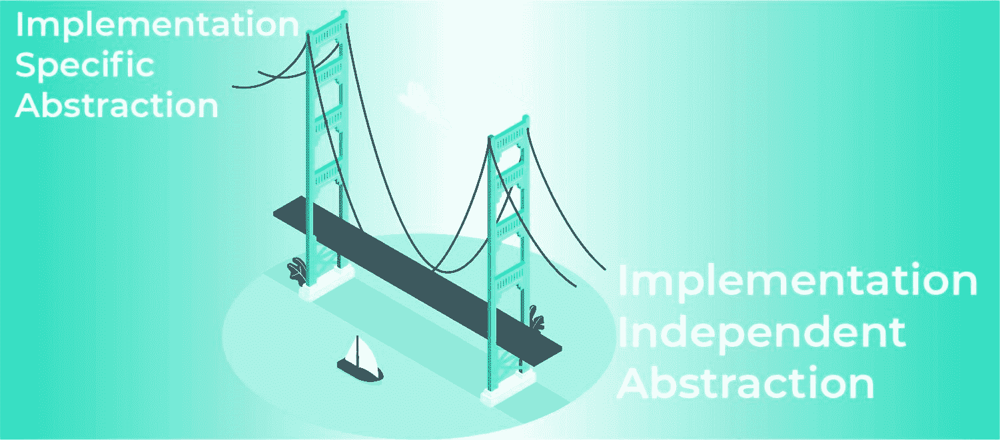
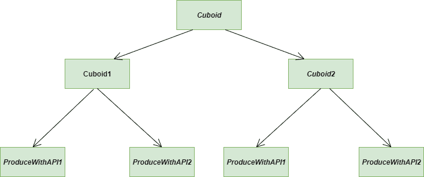
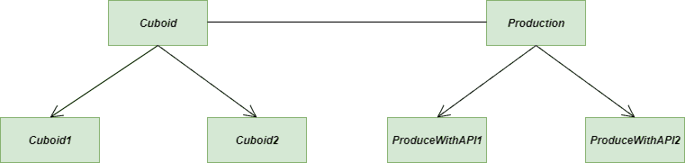
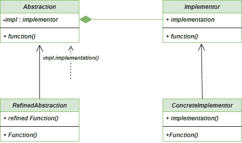

# 桥接方法–Python 设计模式

> 原文:[https://www . geesforgeks . org/bridge-method-python-design-patterns/](https://www.geeksforgeeks.org/bridge-method-python-design-patterns/)

**桥接方法**是一种[结构设计模式](https://www.geeksforgeeks.org/software-design-patterns/)，它允许我们将**实现特定抽象**和**实现独立抽象**彼此分开，并且可以作为单个实体来开发。
桥接法一直被认为是组织类层次结构的最佳方法之一。



桥路法

### 桥梁设计模式的要素

*   **抽象:**是桥梁设计模式的核心，为实现者提供参考。
*   **细化抽象:**它将抽象扩展到新的层次，将更精细的细节提升一个层次，对实现者隐藏更精细的元素。
*   **实现者:**定义实现类的接口。这个接口不需要直接对应抽象接口，可以有很大的不同。
*   **具体实现:**通过具体实现，实现上述实现者。

### 不使用桥接方法的问题

考虑下面这个类**长方体**，它有三个属性分别是**长、宽、**和**高**，三个方法分别是**productewithapi1()，productewithapi2()**和 **expand()** 。
其中，生产方法是特定于实现的，因为我们有两个生产 API 和一个方法，即 expand()方法与实现无关。

到目前为止，我们只有两个特定于实现的方法和一个独立于实现的方法，但是当数量增加时(当然是在大规模项目中)，开发人员处理起来会变得很麻烦。



问题-桥梁-方法

**注意:**下面的代码是不使用 Bridge 方法编写的。

## 蟒蛇 3

```
""" Code without using the bridge method
    We have a class with three attributes
    named as length, breadth, and height and
    three methods named as ProduceWithAPI1(),
    ProduceWithAPI2(), and expand(). Out of these
    producing methods are implementation-specific
    as we have two production APIs"""

class Cuboid:

    class ProducingAPI1:

        """Implementation Specific Implementation"""

        def produceCuboid(self, length, breadth, height):

            print(f'API1 is producing Cuboid with length = {length}, '
                  f' Breadth = {breadth} and Height = {height}')

    class ProducingAPI2:
        """Implementation Specific Implementation"""

        def produceCuboid(self, length, breadth, height):
            print(f'API2 is producing Cuboid with length = {length}, '
                  f' Breadth = {breadth} and Height = {height}')

    def __init__(self, length, breadth, height):

        """Initialize the necessary attributes"""

        self._length = length
        self._breadth = breadth
        self._height = height

    def produceWithAPI1(self):

        """Implementation specific Abstraction"""

        objectAPIone = self.ProducingAPI1()
        objectAPIone.produceCuboid(self._length, self._breadth, self._height)

    def producewithAPI2(self):

        """Implementation specific Abstraction"""

        objectAPItwo = self.ProducingAPI2()
        objectAPItwo.produceCuboid(self._length, self._breadth, self._height)

    def expand(self, times):

        """Implementation imdependent Abstraction"""

        self._length = self._length * times
        self._breadth = self._breadth * times
        self._height = self._height * times

# Instantiate a Cubiod
cuboid1 = Cuboid(1, 2, 3)

# Draw it using APIone
cuboid1.produceWithAPI1()

# Instantiate another Cuboid
cuboid2 = Cuboid(19, 20, 21)

# Draw it using APItwo
cuboid2.producewithAPI2()
```

### 使用桥接方法的解决方案

现在我们来看看上述问题的解决方案。**桥接法**是解决此类问题的最佳方案之一。我们的主要目的是分离出**实现特定抽象**和**实现独立抽象**的代码。



解决方案-桥梁-方法

**注:**以下代码采用桥接法编写

## 蟒蛇 3

```
"""Code implemented with Bridge Method.
   We have a Cuboid class having three attributes
   named as length, breadth, and height and three
   methods named as produceWithAPIOne(), produceWithAPItwo(),
   and expand(). Our purpose is to separate out implementation
   specific abstraction from implementation-independent
   abstraction"""

class ProducingAPI1:

    """Implementation specific Abstraction"""

    def produceCuboid(self, length, breadth, height):

        print(f'API1 is producing Cuboid with length = {length}, '
              f' Breadth = {breadth} and Height = {height}')

class ProducingAPI2:

    """Implementation specific Abstraction"""

    def produceCuboid(self, length, breadth, height):

        print(f'API2 is producing Cuboid with length = {length}, '
              f' Breadth = {breadth} and Height = {height}')

class Cuboid:

    def __init__(self, length, breadth, height, producingAPI):

        """Initialize the necessary attributes
           Implementation independent Abstraction"""

        self._length = length
        self._breadth = breadth
        self._height = height

        self._producingAPI = producingAPI

    def produce(self):

        """Implementation specific Abstraction"""

        self._producingAPI.produceCuboid(self._length, self._breadth, self._height)

    def expand(self, times):

        """Implementation independent Abstraction"""

        self._length = self._length * times
        self._breadth = self._breadth * times
        self._height = self._height * times

"""Instantiate a cuboid and pass to it an
   object of ProducingAPIone"""

cuboid1 = Cuboid(1, 2, 3, ProducingAPI1())
cuboid1.produce()

cuboid2 = Cuboid(19, 19, 19, ProducingAPI2())
cuboid2.produce()
```

### 桥梁方法的 UML 图

以下是桥接方法
的 UML 图



UML-图-桥-方法

### 优势

*   **单一责任原则:**桥接方法显然遵循单一责任原则，因为它将抽象与其实现解耦，以便两者可以独立变化。
*   **开/闭原则:**它不违反开/闭原则，因为在任何时候我们都可以独立地引入新的抽象和实现
*   **平台无关特性:**桥接法可以很容易地实现平台无关特性。

### 不足之处

*   **复杂性:**我们的代码在应用**桥接方法**之后可能会变得复杂，因为我们正在入侵新的抽象类和接口。
*   **双间接:**桥方法可能对性能有轻微的负面影响，因为抽象需要传递消息以及操作的实现来执行。
*   **只有一个实现的接口:**如果我们只有有限的接口，那就没问题了，但是如果你有一组分解的接口，只有最少的或者只有一个实现，那就很难管理了

### 适应性

*   **运行时绑定:**一般用 Bridge 方法提供实现的运行时绑定，这里的运行时绑定是指我们可以在运行时调用一个方法，而不是在编译时调用。
*   **映射类:**桥方法用于映射正交类层次
*   **UI 环境:**在 UI 环境中的形状定义中使用了 Bridge 方法的实际应用

**进一步阅读:** [爪哇](https://www.geeksforgeeks.org/bridge-design-pattern/)桥法