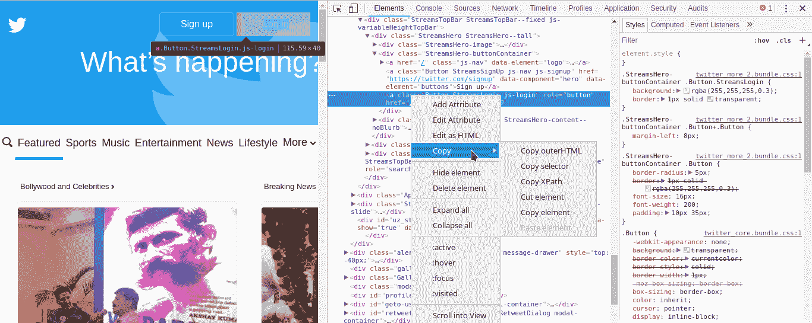

# 使用硒的浏览器自动化

> 原文:[https://www . geesforgeks . org/browser-automation-use-selenium/](https://www.geeksforgeeks.org/browser-automation-using-selenium/)

Selenium 是通过程序控制网络浏览器的强大工具。它适用于所有浏览器，适用于所有主要操作系统，其脚本是用各种语言编写的，如 Python、Java、C#等，我们将使用 Python。

掌握 Selenium 将帮助您自动化日常任务，如控制您的推文、Whatsapp 短信，甚至只是谷歌搜索，而无需实际打开浏览器，只需 15-30 行 python 代码。自动化的极限是无限的硒。

**安装**

**1.1 Python 中的 Selenium 绑定**
Selenium Python 绑定提供了一个方便的 API 来访问像 Firefox、Chrome 等 Selenium Web Driver。

```py
Pip install Selenium 

```

**1.2 网络驱动程序**
Selenium 需要一个网络驱动程序来与所选的浏览器交互。Web 驱动程序是一个与 web 浏览器交互的包。它通过通用的有线协议与网络浏览器或远程网络服务器进行交互。您可以签出并安装您选择的网络驱动程序。

```py
Chrome:    https://sites.google.com/a/chromium.org/chromedriver/downloads
Firefox: https://github.com/mozilla/geckodriver/releases
Safari:    https://webkit.org/blog/6900/webdriver-support-in-safari-10/

```

**入门**

```py
from selenium import webdriver     

# For using sleep function because selenium 
# works only when the all the elements of the 
# page is loaded.
import time 

from selenium.webdriver.common.keys import Keys 

# Creating an instance webdriver
browser = webdriver.Firefox() 
browser.get('https://www.twitter.com')

# Let's the user see and also load the element 
time.sleep(2)

login = browser.find_elements_by_xpath('//*[@id="doc"]/div[1]/div/div[1]/div[2]/a[3]')

# using the click function which is similar to a click in the mouse.
login[0].click()

print("Login in Twitter")

user = browser.find_elements_by_xpath('//*[@id="login-dialog-dialog"]/div[2]/div[2]/div[2]/form/div[1]/input')

# Enter User Name
user[0].send_keys('USER-NAME')

user = browser.find_element_by_xpath('//*[@id="login-dialog-dialog"]/div[2]/div[2]/div[2]/form/div[2]/input')

# Reads password from a text file because
# saving the password in a script is just silly.
with open('test.txt', 'r') as myfile:  
    Password = myfile.read().replace('\n', '')
user.send_keys(Password)

LOG = browser.find_elements_by_xpath('//*[@id="login-dialog-dialog"]/div[2]/div[2]/div[2]/form/input[1]')
LOG[0].click()
print("Login Successful")
time.sleep(5)

elem = browser.find_element_by_name("q")
elem.click()
elem.clear()

elem.send_keys("Geeks for geeks ")

# using keys to send special KEYS 
elem.send_keys(Keys.RETURN) 

print("Search Successful")

# closing the browser
browser.close() 
```

**剖析代码**

上面的脚本是用于登录 twitter 和搜索极客的极客处理。
那么我们来看看它是如何工作的:
1。打开浏览器
2。创建浏览器实例并使用。获取连接网站的功能。
3。找到元素这可以是找到输入框或按钮并使用 selenium 函数(如 click()、send_keys()等)与元素交互的任何事情。
4。关闭浏览器

到目前为止，您一定已经意识到这个自动化脚本以一种**迭代**的方式工作，寻找一个元素并与之交互。在网页中找到一个元素有多种方法，你只需右击并检查元素，然后通过名称、css 选择器或 xpath 复制元素。

[](https://media.geeksforgeeks.org/wp-content/uploads/Screenshot_20170419_203546.png)

基本上就是这样，使用这个你可以为每一个网站创建一个定制的自动脚本，或者为你所有的社交媒体创建一个通用脚本，它可以自动执行你的所有操作。
自动化没有极限，以上只是一个让大家入门的例子。如此快乐的编码！

**相关帖子:**
[Whatsapp 使用 Python！](https://www.geeksforgeeks.org/whatsapp-using-python/)

本文由 **Pradhvan Bisht** 供稿。如果你喜欢 GeeksforGeeks 并想投稿，你也可以使用[contribute.geeksforgeeks.org](http://www.contribute.geeksforgeeks.org)写一篇文章或者把你的文章邮寄到 contribute@geeksforgeeks.org。看到你的文章出现在极客博客主页上，帮助其他极客。

如果你发现任何不正确的地方，或者你想分享更多关于上面讨论的话题的信息，请写评论。