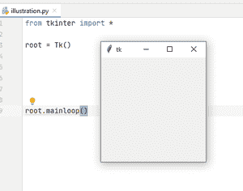
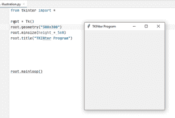
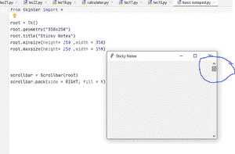
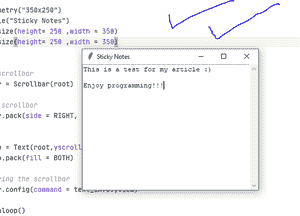

# 使用 Python 中的 Tkinter 构建一个基本的文本编辑器

> 原文:[https://www . geesforgeks . org/build-a-basic-text-editor-using-tkinter-in-python/](https://www.geeksforgeeks.org/build-a-basic-text-editor-using-tkinter-in-python/)

Tkinter 是一个用于创建图形用户界面应用程序的 Python 包。Python 有很多图形用户界面框架，但这是 Python 标准库中唯一内置的框架。它有几个优点；它是跨平台的，所以同样的代码可以在 Windows、macOS 和 Linux 上运行。与其他框架相比，它是轻量级的，使用起来相对轻松。这使得它成为用 Python 构建图形用户界面应用程序的一个引人注目的选择，尤其是对于那些不需要现代光芒的应用程序，并且当务之急是快速构建功能性和跨平台的东西。

让我们快速开始与 Tkinter 合作

## **让我们了解基础知识**

首先，Tkinter 是一个在大多数 IDE 中都可用的模块。让我们把开头分成几个部分:

1.  正在导入 Tkit 模块。
2.  创建一个程序执行的窗口。它也被称为“根窗口”。
3.  最后，使用一个函数来执行被称为“mainloop()”的代码。

## 蟒蛇 3

```py
# import all things from tkinter
from tkinter import *

# create root window 
root = Tk() 

# widgets,buttons,etc here
root.mainloop()
```

**输出:**



“*”实现了 Tkinter 的所有功能

这就是你如何用三行简单的代码来构建一个窗口！

**注意:**请不要将“tkinter”拼写为大写“T”，因为这不会导入模块，并且您很可能会遇到错误消息！！！

## **设计我们的图形用户界面窗口**

这是简单的一步！所以我们将基本上使用这些电源功能:-

1.  几何(“AAAxBBB”)
2.  明尺寸(高度= AAA，宽度= BBB)
3.  最大尺寸(高度= AAA，宽度= BBB)
4.  标题(“期望标题”)

## 蟒蛇 3

```py
from tkinter import *

# root
root = Tk()

# design
root.geometry("300x300")
root.minsize(height=560)
root.title("TKINter Program")

# execute
root.mainloop()
```

**输出:**



## **创建基本记事本**

**记事本**是每个拥有桌面的人常用的一个东西。它是一个快捷工具，可以将重要信息保存在小便笺中，以供临时使用等。让我们用 Tkinter 制作自己的记事本。

首先，让我们键入前面讨论过的基本代码。

## 蟒蛇 3

```py
from tkinter import *

# create root window
root = Tk()

# design
root.geometry("300x300")
root.minsize(height=560)
root.title("Notepad")

# running the program
root.mainloop()
```

好的，让我们假设我们需要一个<u>文本</u>功能和一个<u>滚动条</u>来滚动文本，如果它超过了窗口的尺寸。此外，我们还学习了 grid()和 pack()。它们用于将功能打包在窗口中，没有它们，按钮、文本、框架将不会显示在窗口中。

**注:**我们可以任意使用。网格()或。为我们的程序打包()。但是，在同一个文件中使用这两者是行不通的，因为 Tkinter 不接受这一点，您会得到一个错误。你可以用。包装()以实现高效包装

**现在让我们添加一个滚动条:** 我们将发明一个变量称为滚动条，并将其等同于 scroll(根)。将 root 添加到括号中很重要，这样可以将滚动条功能集成到主 root 循环中。

**现在让我们打包滚动条:** 我们调用变量名并附加上”。包装()。我们使用 side = RIGHT 将滚动条添加到窗口的右侧，使用 fill = Y 或 fill =“Y”(使用任何人)将滚动条填充到整个 Y 轴。

## 蟒蛇 3

```py
from tkinter import *

root = Tk()
root.geometry("300x300")
root.minsize(height=560,
             width=560)
root.title("Notepad")

# implementing scrollbar functionality
scrollbar = Scrollbar(root)

# packing the scrollbar function
scrollbar.pack(side=RIGHT,
               fill=Y)

root.mainloop()
```

**输出:**



**现在我们来添加文本:**我们将使用文本功能并打包它。此外，我们将配置滚动条的功能。我们将添加一个名为“yscrollcommand”的命令，它将文本和滚动条功能连接在一起，并将为文本添加滚动选项。

## 蟒蛇 3

```py
from tkinter import *

root = Tk()
root.geometry("350x250")
root.title("Sticky Notes")
root.minsize(height=250, width=350)
root.maxsize(height=250, width=350)

# adding scrollbar
scrollbar = Scrollbar(root)

# packing scrollbar
scrollbar.pack(side=RIGHT,
               fill=Y)

text_info = Text(root,
                 yscrollcommand=scrollbar.set)
text_info.pack(fill=BOTH)

# configuring the scrollbar
scrollbar.config(command=text_info.yview)

root.mainloop()
```

**输出:**

