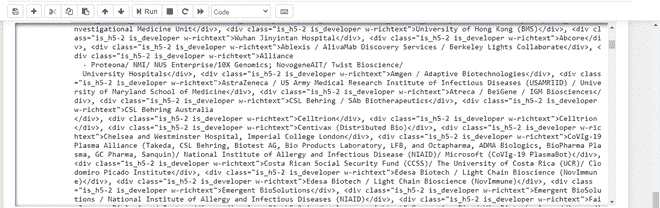
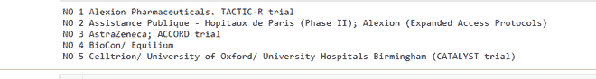

# 使用 Python 构建 COVID19 疫苗跟踪器

> 原文:[https://www . geesforgeks . org/build-a-co vid 19-疫苗-跟踪器-使用-python/](https://www.geeksforgeeks.org/build-a-covid19-vaccine-tracker-using-python/)

众所周知，世界正面临着前所未有的挑战，世界各地的社区和经济都受到了 COVID19 的影响。所以，我们将在这段时间通过追踪他们的疫苗来做一些有趣的事情。让我们看一个简单的 Python 脚本来改进对 COVID19 疫苗的跟踪。

### 需要的模块

*   **bs4** :美人汤(bs4)是一个从 HTML 和 XML 文件中拉出数据的 Python 库。这个模块没有内置 Python。要安装此软件，请在终端中键入以下命令。

```py
pip install bs4
```

*   **请求** : Requests 可以让你极其轻松的发送 HTTP/1.1 请求。该模块也没有内置 Python。要安装此软件，请在终端中键入以下命令。

```py
pip install requests
```

**进场:**

*   从给定的网址提取数据
*   借助请求和靓汤刮数据
*   将数据转换成 html 代码。
*   找到所需的详细信息并进行筛选。

**我们来看看脚本的分步执行**

**第一步:**导入所有依赖

## 蟒蛇 3

```py
import requests
from bs4 import BeautifulSoup
```

**步骤 2:** 创建一个 URL 获取函数

## 蟒蛇 3

```py
def getdata(url):
    r = requests.get(url)
    return r.text
```

**步骤 3:** 现在将 URL 传递给 getdata 函数，并将该数据转换为 HTML 代码

## 蟒蛇 3

```py
htmldata = getdata("https://covid-19tracker.milkeninstitute.org/")
soup = BeautifulSoup(htmldata, 'html.parser')
res = soup.find_all("div", class_="is_h5-2 is_developer w-richtext")
print(str(res))
```

**输出:**



**注意:**这些脚本将只给你字符串格式的原始数据，你必须根据你的需要打印你的数据。

**完整代码:**

## 蟒蛇 3

```py
import requests
from bs4 import BeautifulSoup

def getdata(url):
    r = requests.get(url)
    return r.text

htmldata = getdata("https://covid-19tracker.milkeninstitute.org/")
soup = BeautifulSoup(htmldata, 'html.parser')
result = str(soup.find_all("div", class_="is_h5-2 is_developer w-richtext"))

print("NO 1 " + result[46:86])
print("NO 2 "+result[139:226])
print("NO 3 "+result[279:305])
print("NO 4 "+result[358:375])
print("NO 5 "+result[428:509])
```

**输出:**

