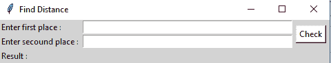

# 使用 Python 构建一个 GUI 应用程序来获取两个地方之间的距离

> 原文:[https://www . geeksforgeeks . org/build-a-GUI-application-to-get-two-place-distance-using-python/](https://www.geeksforgeeks.org/build-a-gui-application-to-get-distance-between-two-places-using-python/)

**先决条件:**[Tkit](https://www.geeksforgeeks.org/python-gui-tkinter/)

在本文中，我们将编写一个 python 脚本来获取两个位置之间的距离，并将其与 GUI 应用程序绑定。要安装 GeoPy 模块，请在您的终端中运行以下命令。

> pip 安装地质图

**采用的方法:**

*   导入地理模块。
*   初始化 Indigm API 以从输入字符串中获取位置。
*   通过地理编码获取纬度和经度()。
*   用地球物理学中的 distance()方法求距离。

图形用户界面如下所示:



**下面是实现:**

## 蟒蛇 3

```
# import module
from geopy.geocoders import Nominatim
from geopy import distance

# initialize Nominatim API
geolocator = Nominatim(user_agent="geoapiExercises")

# place input
Input_place1 = "delhi"
Input_place2 = "patna"

# Get location of the input strings
place1 = geolocator.geocode(Input_place1)
place2 = geolocator.geocode(Input_place2)

# Get latitude and longitude
Loc1_lat, Loc1_lon = (place1.latitude), (place1.longitude)
Loc2_lat, Loc2_lon = (place2.latitude), (place2.longitude)

location1 = (Loc1_lat, Loc1_lon)
location2 = (Loc2_lat, Loc2_lon)

# display the distance
print(distance.distance(location1, location2).km, " kms")
```

**输出:**

```
852.5518024607962  kms
```

**用 Tkit 测量距离的图形用户界面应用程序:**

## 蟒蛇 3

```
# import modules
from tkinter import *
from geopy.geocoders import Nominatim
from geopy import distance

# user defined function
def get_dis():
    try:

        geolocator = Nominatim(user_agent="geoapiExercises")

        place1 = geolocator.geocode(str(e1.get()))
        place2 = geolocator.geocode(str(e2.get()))

        Loc1_lat,Loc1_lon = (place1.latitude),(place1.longitude)
        Loc2_lat,Loc2_lon = (place2.latitude),(place2.longitude)

        location1=(Loc1_lat,Loc1_lon)
        location2=(Loc2_lat,Loc2_lon)

        res = (str(distance.distance(location1, location2).km)+" Km")

        result.set(res)
    except:
        result.set("something went wrong")

# object of tkinter
# with background set to light grey
master = Tk()
master.configure(bg='light grey')
master.title("Find Distance")

# Variable Classes in tkinter
result = StringVar();

# Creating label for each information
# name using widget Label
Label(master, text="Enter first place : " , bg = "light grey").grid(row=1, sticky=W)
Label(master, text="Enter second place : " , bg = "light grey").grid(row=2, sticky=W)

Label(master, text="Result :", bg = "light grey").grid(row=3, sticky=W)

# Creating label for class variable
# name using widget Entry
Label(master, text="", textvariable=result,bg = "light grey").grid(row=3,column=1, sticky=W)

e1 = Entry(master,width = 50)
e1.grid(row=1, column=1)
e2 = Entry(master,width = 50)
e2.grid(row=2, column=1)

# creating a button using the widget 
b = Button(master, text="Check", command=get_dis, bg = "white")
b.grid(row=1, column=2,columnspan=2, rowspan=2,padx=5, pady=5,)

mainloop()
```

**输出:**

<video class="wp-video-shortcode" id="video-485441-1" width="640" height="360" preload="metadata" controls=""><source type="video/mp4" src="https://media.geeksforgeeks.org/wp-content/uploads/20210118174812/FreeOnlineScreenRecorderProject8.mp4?_=1">[https://media.geeksforgeeks.org/wp-content/uploads/20210118174812/FreeOnlineScreenRecorderProject8.mp4](https://media.geeksforgeeks.org/wp-content/uploads/20210118174812/FreeOnlineScreenRecorderProject8.mp4)</video>