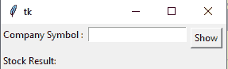

# 使用 Python 构建图形用户界面应用程序获取实时股价

> 原文:[https://www . geesforgeks . org/build-a-GUI-application-get-live-stock-price-use-python/](https://www.geeksforgeeks.org/build-a-gui-application-to-get-live-stock-price-using-python/)

股票价格是某人愿意为股票支付的最高金额。在本文中，我们将编写代码来获取每家公司的实时股价，并将其与图形用户界面应用程序绑定。

### 需要模块

**Yahoo_fin:** 该模块用于刮取历史股价数据，以及提供当前市值、股息收益率和哪些股票组成主要交易所的信息。要安装此模块，请在终端中键入以下命令。

```py
pip install yahoo_fin
```

**下面是 GUI 的样子:-**



**我们写代码获取股票数据。**

导入 yahoo_fin 模块。

## 蟒蛇 3

```py
from yahoo_fin import stock_info
```

使用**stock _ info . get _ live _ price()**方法获取 live 股价。

## 蟒蛇 3

```py
stock_info.get_live_price("AMZN")
```

**输出:**

```py
3198.93994140625
```

**注:**请访问本 [**网站**](https://www.marketwatch.com/tools/quotes/lookup.asp?siteID=mktw&Lookup=RELANCE&Country=all&Type=All) 获取公司符号如亚马逊是 AMZN，信实是 RELFF。

#### **与 Tkinter 的股价应用**

该脚本将上述实现实现到一个图形用户界面中。

## 蟒蛇 3

```py
from yahoo_fin import stock_info
from tkinter import *

def stock_price():

    price = stock_info.get_live_price(e1.get())
    Current_stock.set(price)

master = Tk()
Current_stock = StringVar()

Label(master, text="Company Symbol : ").grid(row=0, sticky=W)
Label(master, text="Stock Result:").grid(row=3, sticky=W)

result2 = Label(master, text="", textvariable=Current_stock,
                ).grid(row=3, column=1, sticky=W)

e1 = Entry(master)
e1.grid(row=0, column=1)

b = Button(master, text="Show", command=stock_price)
b.grid(row=0, column=2, columnspan=2, rowspan=2, padx=5, pady=5)

mainloop()
```

**输出:**

<video class="wp-video-shortcode" id="video-482867-1" width="640" height="360" preload="metadata" controls=""><source type="video/mp4" src="https://media.geeksforgeeks.org/wp-content/uploads/20210118175729/FreeOnlineScreenRecorderProject10.mp4?_=1">[https://media.geeksforgeeks.org/wp-content/uploads/20210118175729/FreeOnlineScreenRecorderProject10.mp4](https://media.geeksforgeeks.org/wp-content/uploads/20210118175729/FreeOnlineScreenRecorderProject10.mp4)</video>