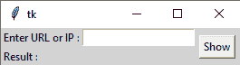

# 使用 Python 构建一个图形用户界面应用程序来 ping 主机

> 原文:[https://www . geesforgeks . org/build-a-GUI-application-to-ping-host-use-python/](https://www.geeksforgeeks.org/build-a-gui-application-to-ping-the-host-using-python/)

**先决条件:** [Python 图形用户界面–](https://www.geeksforgeeks.org/python-gui-tkinter/)Tkinter

在本文中，我们将看到如何使用 python 中的 python ping 模块来 ping 带有 URL 或 IP 的主机。本模块提供了一种简单的 python ping 方法。它检查主机是否可用，并测量响应需要多长时间。

在开始之前，我们需要将此模块安装到您的系统中。

```py
pip install pythonping
```

图形用户界面如下所示:



> **语法:** ping(网址或 IP)
> 
> **参数:**
> 
> *   详细:启用详细模式，将输出打印到流中
> *   超时 : 是在假设目标无法到达之前，您希望等待响应的秒数
> *   有效载荷 : 允许你使用特定的有效载荷(字节)
> *   大小 : 是一个整数，允许你指定你想要的 ICMP 有效负载的大小

**代号:**

## 蟒蛇 3

```py
# import module
from pythonping import ping

# pinging the host
ping('www.google.com', verbose=True)
```

**输出:**

```py
Reply from 142.250.71.4, 9 bytes in 61.09ms
Reply from 142.250.71.4, 9 bytes in 60.24ms
Reply from 142.250.71.4, 9 bytes in 60.22ms
Reply from 142.250.71.4, 9 bytes in 60.04ms
Reply from 142.250.71.4, 9 bytes in 61.09ms
Reply from 142.250.71.4, 9 bytes in 60.24ms
Reply from 142.250.71.4, 9 bytes in 60.22ms
Reply from 142.250.71.4, 9 bytes in 60.04ms

Round Trip Times min/avg/max is 60.04/60.4/61.09 ms
```

**图形用户界面的实现:**

用 Pinging 图形用户界面应用程序

## 蟒蛇 3

```py
# import modules
from tkinter import *
from pythonping import ping

def get_ping():
    result = ping(e.get(), verbose=True)
    res.set(result)

# object of tkinter
# and background set for light grey
master = Tk()
master.configure(bg='light grey')

# Variable Classes in tkinter
res = StringVar()

# Creating label for each information
# name using widget Label
Label(master, text="Enter URL or IP :",
      bg="light grey").grid(row=0, sticky=W)
Label(master, text="Result :", bg="light grey").grid(row=1, sticky=W)

# Creating label for class variable
# name using widget Entry
Label(master, text="", textvariable=res, bg="light grey").grid(
    row=1, column=1, sticky=W)

e = Entry(master)
e.grid(row=0, column=1)

# creating a button using the widget
# Button that will call the submit function
b = Button(master, text="Show", command=get_ping)
b.grid(row=0, column=2, columnspan=2, rowspan=2, padx=5, pady=5)

mainloop()
```

**输出:**

<video class="wp-video-shortcode" id="video-505079-1" width="640" height="360" preload="metadata" controls=""><source type="video/mp4" src="https://media.geeksforgeeks.org/wp-content/uploads/20210118173156/FreeOnlineScreenRecorderProject5.mp4?_=1">[https://media.geeksforgeeks.org/wp-content/uploads/20210118173156/FreeOnlineScreenRecorderProject5.mp4](https://media.geeksforgeeks.org/wp-content/uploads/20210118173156/FreeOnlineScreenRecorderProject5.mp4)</video>