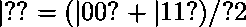
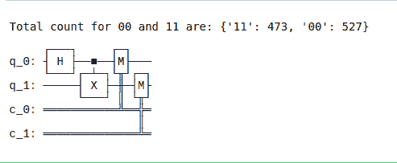
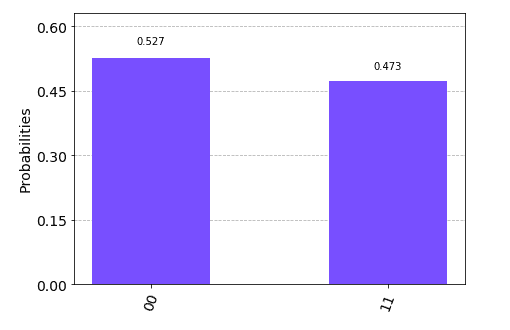

# 用 Python 中的 IBM Qiskit 构建一个简单的量子电路

> 原文:[https://www . geesforgeks . org/build-a-simple-quantum-circuit-use-IBM-qiskit-in-python/](https://www.geeksforgeeks.org/build-a-simple-quantum-circuit-using-ibm-qiskit-in-python/)

**Qiskit** 是量子计算的开源框架。它提供了创建和操作量子程序的工具，并在 IBM Q Experience 上的原型量子设备或本地计算机上的模拟器上运行这些程序。让我们看看如何创建简单的量子电路，并在真正的量子计算机上进行测试，或者在我们的计算机上进行本地模拟。Python 是理解量子程序的必要前提，因为**奇斯基**本身就是使用 Python 开发的。

进入主题之前，首先也是最重要的部分是安装**齐斯基特**和**蟒蛇。**水蟒安装步骤指南请参考以下文章。

*   [如何在 windows 上安装 Anaconda？](https://www.geeksforgeeks.org/how-to-install-anaconda-on-windows/)
*   [如何在 Linux 上安装 Anaconda？](https://www.geeksforgeeks.org/how-to-install-anaconda-on-linux/)

#### 装置

要安装 qiskit，请遵循以下步骤:

*   打开蟒蛇提示并键入

```py
pip install qiskit

```

*   就这样，这将安装所有必要的软件包。
*   接下来，打开 Jupyter 笔记本。
*   使用以下命令导入 qiskit。

```py
import qiskit

```

**进入 IBM 量子系统:**

1.  [创建一个免费的 IBM 量子体验账号。](https://quantum-computing.ibm.com/login)
2.  导航至**我的账户。**
3.  点击**复制令牌**将令牌复制到剪贴板(令牌代表访问 IBM Quantum 设备的 API)。
4.  运行以下命令(Jupyter Notebook)将您的 API 令牌存储在本地，以便以后在名为 ***qiskitrc*** 的配置文件中使用。将 ***MY_API_TOKEN*** 替换为 API token。

```py
from qiskit import IBMQ
IBMQ.save_account('MY_API_TOKEN')

```

## 入门指南

首先，我们将进口必要的包装。导入行导入程序所需的基本元素(包和函数)。

代码示例中使用的导入包括:

*   ***量子电路:*** 保存你所有的量子操作；量子系统的指令
*   ***执行*** :运行你的电路
*   ***Aer*** :处理模拟器后端
*   ***qiskit . visualization:***启用数据可视化，如***plot _ 直方图***

## **初始化变量**

在下一行代码中，你初始化了两个处于零状态的量子比特，和两个处于零状态的经典比特，在量子电路中称为 ***电路。**T3】*

## **添加闸门**

接下来的三行代码，从 ***电路*** 开始。，在你的电路中加入操纵量子位的门。

*详解*

*   ***quantum circuit . h(0***):量子位*上的哈达玛门 **0*** ，使其进入**叠加状态**
*   ***QuantumCircuit.cx(0，1*** ):对控制量子位***【0】***和目标量子位 ***1*** 的受控非操作(*)*
*   ***quantum Circuit . measure(【0，1】，【0，1】***):第一个参数索引量子位，第二个参数索引经典位。第 *n* 个量子比特的测量结果将存储在第 *n* 个经典比特中。

这三个特殊的门一个接一个地加入电路，形成了贝尔态



在这种状态下，有 50%的机会发现两个量子位都为零，有 50%的机会发现两个量子位都为一。

## **模拟实验**

下一行代码调用一个特定的模拟器框架——在这种情况下，它调用 Qiskit Aer，这是一个高性能模拟器，提供[几个后端](https://quantum-computing.ibm.com/docs/qiskit/apidoc/qiskit-aer/aer_provider#simulator-backends)来实现不同的模拟目标。在本程序中，我们将使用 ***qasm_simulator*** 。该电路的每次运行将产生位串***【00】***或***【11】***。程序在 execute 方法的 ***shots*** 参数中指定运行电路的次数( ***job = execute(电路，模拟器，shots=1000)*** )。模拟的拍摄次数设置为 **1000** (默认为 ***1024*** )。一旦有了 ***结果*** 对象，就可以通过***get _ counts(circuit)***方法访问计数。这就给了你实验的总体结果。输出位串大约有 50%的时间是***【00】***。这个模拟器不模拟噪音。任何偏离 50%的情况都是由于样本量小。

## **可视化电路**

***quantum circuit . draw()***(代码中由 ***circuit.draw()*** 调用)以教科书和研究文章中使用的[各种样式之一](https://quantum-computing.ibm.com/docs/qiskit/apidoc/stubs/qiskit.circuit.QuantumCircuit#qiskit.circuit.QuantumCircuit.draw)显示您的电路。在可视化命令后获得的电路中，量子位是有序的，量子位 0 在顶部，量子位 1 在底部。电路从左到右读取，代表时间的流逝。

## **可视化结果**

Qiskit 提供[多种可视化](https://quantum-computing.ibm.com/docs/qiskit/apidoc/qiskit-terra/visualization)，包括功能***plot _ 直方图*** ，查看你的结果。

```py
plot_histogram(counts)

```

观察|00 的概率(相对频率)？和|11？状态的计算方法是取相应的计数，除以拍摄的总次数。

**下面是实现。**

## 蟒蛇 3

```py
# python program to create a simple Quantum circuit

%matplotlib inline
from qiskit import QuantumCircuit, execute, Aer, IBMQ
from qiskit.compiler import transpile, assemble
from qiskit.tools.jupyter import *
from qiskit.visualization import *

# Loading your IBM Q account(s)
provider = IBMQ.load_account()

# Create a Quantum Circuit acting
# on the q register
circuit = QuantumCircuit(2, 2)

# Add a H gate on qubit 0
circuit.h(0)

# Add a CX (CNOT) gate on control 
# qubit 0 and target qubit 1
circuit.cx(0, 1)

# Map the quantum measurement to the
# classical bits
circuit.measure([0,1], [0,1])

# Use Aer's qasm_simulator
simulator = Aer.get_backend('qasm_simulator')

# Execute the circuit on the qasm
# simulator
job = execute(circuit, simulator, shots=1000)

# Grab results from the job
result = job.result()

# Return counts
counts = result.get_counts(circuit)
print("\nTotal count for 00 and 11 are:",counts)

# Draw the circuit
circuit.draw()
```

**输出:**



**绘制直方图**

## 蟒蛇 3

```py
# Plot a histogram
plot_histogram(counts)
```

**输出:**

