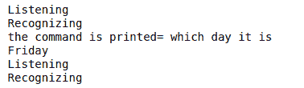

# 使用 Python 构建虚拟助手

> 原文:[https://www . geeksforgeeks . org/build-a-virtual-assistant-use-python/](https://www.geeksforgeeks.org/build-a-virtual-assistant-using-python/)

虚拟桌面助手是一个很棒的东西。如果你想让你的机器按照你的命令运行，就像贾维斯为托尼做的那样。是的，这是可能的。使用 Python 是可能的。Python 提供了一个很好的主库，所以我们可以用它来制作一个虚拟助手。Windows 有 Sapi5，Linux 有 Espeak，可以帮助我们从机器上获得声音。它是一个弱人工智能

### 需要的模块

*   **pyttsx3:** pyttsx 是一个跨平台的文本到语音库，与平台无关。使用这个库进行文本到语音转换的主要优点是它可以脱机工作。要安装此模块，请在终端中键入以下命令。

```py
pip install pyttsx3
```

*   **语音识别:**它允许我们将音频转换成文本进行进一步处理。要安装此模块，请在终端中键入以下命令。

```py
pip install SpeechRecognition
```

*   **网络浏览器:**它提供了一个高级界面，允许向用户显示基于网络的文档。要安装此模块，请在终端中键入以下命令。

```py
pip install webbrowser
```

*   **维基百科:**用于从维基百科网站获取各种信息。要安装此模块，请在终端中键入以下命令。

```py
pip install wikipedia
```

## 虚拟助手使用的方法

#### 1)说话方法

说话方法将帮助我们从机器中提取声音。下面是 Speak 方法的代码解释

## 蟒蛇 3

```py
def speak(audio):

    engine = pyttsx3.init()
    # getter method(gets the current value
    # of engine property)
    voices = engine.getProperty('voices')

    # setter method .[0]=male voice and 
    # [1]=female voice in set Property.
    engine.setProperty('voice', voices[0].id)

    # Method for the speaking of the the assistant
    engine.say(audio)  

    # Blocks while processing all the currently
    # queued commands
    engine.runAndWait()
```

#### **2)采取查询方式**

该方法将检查条件。如果条件为真，它将返回输出。如果条件满足，我们可以添加任何数字，如果条件满足，我们将得到期望的输出。

## 蟒蛇 3

```py
def Take_query():

    # calling the Hello function for 
    # making it more interactive
    Hello()

    # This loop is infinite as it will take
    # our queries continuously until and unless
    # we do not say bye to exit or terminate 
    # the program
    while(True):

        # taking the query and making it into
        # lower case so that most of the times 
        # query matches and we get the perfect 
        # output
        query = takeCommand().lower()
        if "open geeksforgeeks" in query:
            speak("Opening GeeksforGeeks ")

            # in the open method we just to give the link
            # of the website and it automatically open 
            # it in your default browser
            webbrowser.open("www.geeksforgeeks.com")
            continue

        elif "open google" in query:
            speak("Opening Google ")
            webbrowser.open("www.google.com")
            continue

        elif "which day it is" in query:
            tellDay()
            continue

        elif "tell me the time" in query:
            tellTime()
            continue

        # this will exit and terminate the program
        elif "bye" in query:
            speak("Bye. Check Out GFG for more exicting things")
            exit()

        elif "from wikipedia" in query:

            # if any one wants to have a information
            # from wikipedia
            speak("Checking the wikipedia ")
            query = query.replace("wikipedia", "")

            # it will give the summary of 4 lines from 
            # wikipedia we can increase and decrease 
            # it also.
            result = wikipedia.summary(query, sentences=4)
            speak("According to wikipedia")
            speak(result)

        elif "tell me your name" in query:
            speak("I am Jarvis. Your deskstop Assistant")
```

#### 3)采取命令方式

该方法用于从语音识别模块获取命令并识别命令

## 蟒蛇 3

```py
# this method is for taking the commands
# and recognizing the command from the
# speech_Recognition module we will use
# the recongizer method for recognizing
def takeCommand():

    r = sr.Recognizer()

    # from the speech_Recognition module 
    # we will use the Microphone module
    # for listening the command
    with sr.Microphone() as source:
        print('Listening')

        # seconds of non-speaking audio before 
        # a phrase is considered complete
        r.pause_threshold = 0.7
        audio = r.listen(source)

        # Now we will be using the try and catch
        # method so that if sound is recognized 
        # it is good else we will have exception 
        # handling
        try:
            print("Recognizing")

            # for Listening the command in indian
            # english we can also use 'hi-In' 
            # for hindi recognizing
            Query = r.recognize_google(audio, language='en-in')
            print("the command is printed=", Query)

        except Exception as e:
            print(e)
            print("Say that again sir")
            return "None"

        return Query
```

#### *)信号时间方法

## 蟒蛇 3

```py
# code
def tellTime(self):
# This method will give the time
    time = str(datetime.datetime.now())
      # the time will be displayed like this "2020-06-05 17:50:14.582630"
    # nd then after slicing we can get time
    print(time)
    hour = time[11:13]
    min = time[14:16]
    self.Speak(self, "The time is sir" + hour + "Hours and" + min + "Minutes")     
"""
 This method will take time and slice it "2020-06-05 17:50:14.582630" from 11 to 12 for hour
 and 14-15 for min and then speak function will be called and then it will speak the current 
 time
 """
```

#### 4) Hello 方法

这只是用来问候用户的问候信息。

## 蟒蛇 3

```py
def Hello():
    # This function is for when the assistant 
    # is called it will say hello and then 
    # take query
    speak("hello sir I am your desktop assistant. /
          Tell me how may I help you")
```

#### 5)主要方法

Main 方法是执行所有文件的方法，因此我们将在这里调用 Take_query 方法，这样它就可以识别并告诉或给我们所需的输出。

## 蟒蛇 3

```py
if __name__ == '__main__':

    # main method for executing
    # the functions
    Take_query()
```

**完整代码:**

## 蟒蛇 3

```py
import pyttsx3
import speech_recognition as sr
import webbrowser  
import datetime  
import wikipedia 

# this method is for taking the commands
# and recognizing the command from the
# speech_Recognition module we will use
# the recongizer method for recognizing
def takeCommand():

    r = sr.Recognizer()

    # from the speech_Recognition module 
    # we will use the Microphone module
    # for listening the command
    with sr.Microphone() as source:
        print('Listening')

        # seconds of non-speaking audio before 
        # a phrase is considered complete
        r.pause_threshold = 0.7
        audio = r.listen(source)

        # Now we will be using the try and catch
        # method so that if sound is recognized 
        # it is good else we will have exception 
        # handling
        try:
            print("Recognizing")

            # for Listening the command in indian
            # english we can also use 'hi-In' 
            # for hindi recognizing
            Query = r.recognize_google(audio, language='en-in')
            print("the command is printed=", Query)

        except Exception as e:
            print(e)
            print("Say that again sir")
            return "None"

        return Query

def speak(audio):

    engine = pyttsx3.init()
    # getter method(gets the current value
    # of engine property)
    voices = engine.getProperty('voices')

    # setter method .[0]=male voice and 
    # [1]=female voice in set Property.
    engine.setProperty('voice', voices[0].id)

    # Method for the speaking of the the assistant
    engine.say(audio)  

    # Blocks while processing all the currently
    # queued commands
    engine.runAndWait()

def tellDay():

    # This function is for telling the
    # day of the week
    day = datetime.datetime.today().weekday() + 1

    #this line tells us about the number 
    # that will help us in telling the day
    Day_dict = {1: 'Monday', 2: 'Tuesday', 
                3: 'Wednesday', 4: 'Thursday', 
                5: 'Friday', 6: 'Saturday',
                7: 'Sunday'}

    if day in Day_dict.keys():
        day_of_the_week = Day_dict[day]
        print(day_of_the_week)
        speak("The day is " + day_of_the_week)

def tellTime():

    # This method will give the time
    time = str(datetime.datetime.now())

    # the time will be displayed like 
    # this "2020-06-05 17:50:14.582630"
    #nd then after slicing we can get time
    print(time)
    hour = time[11:13]
    min = time[14:16]
    speak(self, "The time is sir" + hour + "Hours and" + min + "Minutes")    

def Hello():

    # This function is for when the assistant 
    # is called it will say hello and then 
    # take query
    speak("hello sir I am your desktop assistant. /
          Tell me how may I help you")

def Take_query():

    # calling the Hello function for 
    # making it more interactive
    Hello()

    # This loop is infinite as it will take
    # our queries continuously until and unless
    # we do not say bye to exit or terminate 
    # the program
    while(True):

        # taking the query and making it into
        # lower case so that most of the times 
        # query matches and we get the perfect 
        # output
        query = takeCommand().lower()
        if "open geeksforgeeks" in query:
            speak("Opening GeeksforGeeks ")

            # in the open method we just to give the link
            # of the website and it automatically open 
            # it in your default browser
            webbrowser.open("www.geeksforgeeks.com")
            continue

        elif "open google" in query:
            speak("Opening Google ")
            webbrowser.open("www.google.com")
            continue

        elif "which day it is" in query:
            tellDay()
            continue

        elif "tell me the time" in query:
            tellTime()
            continue

        # this will exit and terminate the program
        elif "bye" in query:
            speak("Bye. Check Out GFG for more exicting things")
            exit()

        elif "from wikipedia" in query:

            # if any one wants to have a information
            # from wikipedia
            speak("Checking the wikipedia ")
            query = query.replace("wikipedia", "")

            # it will give the summary of 4 lines from 
            # wikipedia we can increase and decrease 
            # it also.
            result = wikipedia.summary(query, sentences=4)
            speak("According to wikipedia")
            speak(result)

        elif "tell me your name" in query:
            speak("I am Jarvis. Your deskstop Assistant")

if __name__ == '__main__':

    # main method for executing
    # the functions
    Take_query()
```

**输出:**

