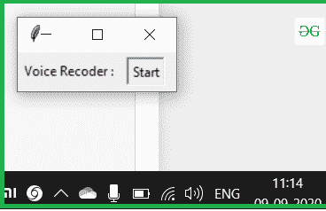

# 使用 Python 构建录音机 GUI

> 原文:[https://www . geesforgeks . org/build-a-voice-recorder-GUI-use-python/](https://www.geeksforgeeks.org/build-a-voice-recorder-gui-using-python/)

**先决条件:** [Python 图形用户界面–tkinter](https://www.geeksforgeeks.org/python-gui-tkinter/)[使用 Python 创建录音机](https://www.geeksforgeeks.org/create-a-voice-recorder-using-python/)

Python 提供了各种工具，可以用于各种目的。其中一个目的就是录音。可以使用**音响设备**模块完成。这个录制的文件可以使用**声音文件**模块保存

### 需要模块

*   **sound device**:sound device 模块提供了 PortAudio 库的绑定和一些便利功能，可以播放和录制包含音频信号的 NumPy 数组。要安装此软件，请在终端中键入以下命令。

```py
pip install sounddevice

```

*   **SoundFile:** SoundFile 可以读写声音文件。要安装此软件，请在终端中键入以下命令。

```py
pip install SoundFile

```

**进场:**

*   导入所需的模块。
*   设置频率和持续时间。
*   在 NumPy 数组中记录语音数据，可以使用 rec()。
*   使用 soundfile.write()存储到文件中。

**实施:**

**步骤 1:** 导入模块

```py
import sounddevice as sd
import soundfile as sf
```

**第二步:**设置频率和时长，在 NumPy 数组中记录语音数据，可以使用 rec()

```py
fs = 48000
duration = 5 
myrecording = sd.rec(int(duration * fs), samplerate=fs,
                     channels=2)
```

**注:** fs 为录音的采样率(通常为 44100 或 44800 Hz)

**步骤 3:** 现在将这些数组存储到音频文件中。

```py
# Save as FLAC file at correct sampling rate
sf.write('My_Audio_file.flac', myrecording, fs)
```

让我们为其创建一个图形用户界面应用程序。我们将使用[Tkit](https://www.geeksforgeeks.org/python-gui-tkinter/)进行同样的操作。

## 蟒蛇 3

```py
import sounddevice as sd
import soundfile as sf
from tkinter import *

def Voice_rec():
    fs = 48000

    # seconds
    duration = 5
    myrecording = sd.rec(int(duration * fs), 
                         samplerate=fs, channels=2)
    sd.wait()

    # Save as FLAC file at correct sampling rate
    return sf.write('my_Audio_file.flac', myrecording, fs)

master = Tk()

Label(master, text=" Voice Recoder : "
     ).grid(row=0, sticky=W, rowspan=5)

b = Button(master, text="Start", command=Voice_rec)
b.grid(row=0, column=2, columnspan=2, rowspan=2,
       padx=5, pady=5)

mainloop()
```

**输出:**

