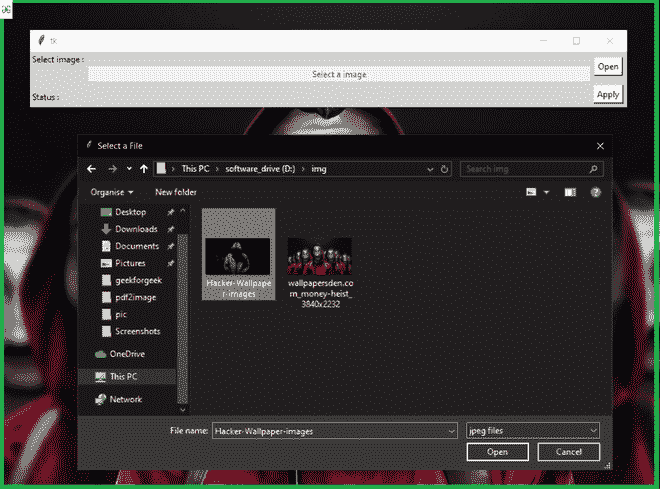
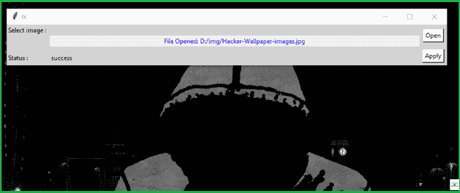

# 使用 Python 构建一个更改电脑壁纸的应用程序

> 原文:[https://www . geeksforgeeks . org/build-a-application-for-changing-PCs-壁纸-使用-python/](https://www.geeksforgeeks.org/build-an-application-for-changing-pcs-wallpaper-using-python/)

**先决条件:** [Python 图形用户界面–tkinter](https://www.geeksforgeeks.org/python-gui-tkinter/)

在本文中，我们将使用 Python 中的 **py-wallpaper** 模块为后台更改应用程序编写一个脚本。**py-壁纸**模块用于更换背景壁纸。在开始之前，我们需要安装 py-壁纸。

**安装:**

要安装此软件，请在终端中键入以下命令。

```
pip install py-wallpaper
```

### 入门指南

导入模块。

## 蟒蛇 3

```
# import modules
from wallpaper import set_wallpaper, get_wallpaper
```

现在，您可以使用 get _ 壁纸属性获取当前背景图像位置，并且可以使用 set _ 壁纸进行更改。

## 蟒蛇 3

```
# get current wallpaper's path
print(get_wallpaper())

# set your photo
set_wallpaper("location/to/image.jpg")
```

**输出:**

```
D:\img\wallpapersden.com_money-heist_3840x2232.jpg
```

**带有**[**Tkit**](https://www.geeksforgeeks.org/python-gui-tkinter/)**的后台转换器应用程序:**该脚本将上述实现实现到一个图形用户界面中。

## 蟒蛇 3

```
# import modules
from tkinter import *
from tkinter import filedialog
from wallpaper import set_wallpaper

# user define function
def change_wall():

    # set your photo
    try:
        set_wallpaper(str(path.get()))
        check = "success"

    except:

        check = "Wallpaper not found !"
    result.set(check)

def browseFiles():
    filename = filedialog.askopenfilename(initialdir="/",
                                          title="Select a File",
                                          filetypes=(("jpeg files", "*.jpg"), ("all files", "*.*")))
    path.set(filename)

    # Change label contents
    label_file_explorer.configure(text="File Opened: "+filename)
    return filename

# object of tkinter
# and background set for red
master = Tk()
master.configure(bg='light grey')

# Variable Classes in tkinter
result = StringVar()
path = StringVar()

label_file_explorer = Label(
    master, text="Select a image", width=100, fg="blue")

# Creating label for each information
# name using widget Label
Label(master, text="Select image : ", bg="light grey").grid(row=0, sticky=W)
Label(master, text="Status :", bg="light grey").grid(row=3, sticky=W)

# Creating label for class variable
# name using widget Entry
Label(master, text="", textvariable=result,
      bg="light grey").grid(row=3, column=1, sticky=W)

# creating a button using the widget
# Button that will call the submit function
b = Button(master, text="Open", command=browseFiles, bg="white")
b.grid(row=0, column=2, columnspan=2, rowspan=2, padx=5, pady=5,)

label_file_explorer.grid(column=1, row=1)

c = Button(master, text="Apply", command=change_wall, bg="white")
c.grid(row=2, column=2, columnspan=2, rowspan=2, padx=5, pady=5,)

mainloop()
```

**输出:**



选中这张壁纸后。

