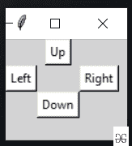

# 使用 Python 构建屏幕旋转应用程序

> 原文:[https://www . geeksforgeeks . org/build-a-application-for-screen-rotation-use-python/](https://www.geeksforgeeks.org/build-an-application-for-screen-rotation-using-python/)

在本文中，我们将为屏幕旋转编写一个 python 脚本，并用 GUI 实现它。

使用*旋转屏幕*模块中的一些方法，可以将显示屏修改为四个方向，这是一个用于在系统中旋转屏幕的小 Python 包。

### **安装:**

```
pip install rotate-screen
```

### **进场:**

**步骤 1)** 导入 python 脚本中需要的模块。

## 蟒蛇 3

```
# Import required module
import rotatescreen
```

**步骤 2)** 创建一个*的对象 rotatescreen . get _ primary _ display()*进入系统主屏幕。

## 蟒蛇 3

```
# Accessing the main screen
rotate_screen = rotatescreen.get_primary_display()
```

**步骤 3)** 现在使用各种方法旋转屏幕。

*   *设置 _ 横向()*，向上旋转
*   *设置 _ 纵向 _ 翻转()*，向左旋转
*   *设置 _ 横向 _ 翻转()，*向下旋转
*   *set _ 人像()*，向右旋转

## 蟒蛇 3

```
# Methods to change orientation

# for landscape
rotate_screen.set_landscape()

# portrait at left
rotate_screen.set_portrait_flipped()

# landscape at down
rotate_screen.set_landscape_flipped()

# portrait at right
rotate_screen.set_portrait()
```

下面是上述方法的完整程序以及图形用户界面的实现。

## 蟒蛇 3

```
# Import required modules
from tkinter import *
import rotatescreen

# User defined function
# for rotating screen
def Screen_rotation(temp):
    screen = rotatescreen.get_primary_display()
    if temp == "up":
        screen.set_landscape()
    elif temp == "right":
        screen.set_portrait_flipped()
    elif temp == "down":
        screen.set_landscape_flipped()
    elif temp == "left":
        screen.set_portrait()

# Creating tkinter object
master = Tk()
master.geometry("100x100")
master.title("Screen Rotation")
master.configure(bg='light grey')

# Variable classes in tkinter
result = StringVar()

# Creating buttons to change orientation
Button(master, text="Up", command=lambda: Screen_rotation(
    "up"), bg="white").grid(row=0, column=3)
Button(master, text="Right", command=lambda: Screen_rotation(
    "right"), bg="white").grid(row=1, column=6)
Button(master, text="Left", command=lambda: Screen_rotation(
    "left"), bg="white").grid(row=1, column=2)
Button(master, text="Down", command=lambda: Screen_rotation(
    "down"), bg="white").grid(row=3, column=3)

mainloop()

# this code belongs to Satyam kumar (ksatyam858)
```

**输出:**

